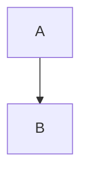

# Claude Rules for Andrew's Obsidian Vault

## General Principles
- Language: **Ukrainian** with English technical terminology (no translation of terms)
- Style: Structured, detailed, practical with examples
- Focus: Knowledge management for technical topics

## Vault Structure

```
obsidian-kb/
├── knowledge-database/     → Technical notes, frameworks, methodologies
├── guides/                 → Step-by-step guides, tutorials, how-tos
├── claude.md              → Claude rules for content creation
└── README.md              → Vault overview and navigation
```

**Directory Purposes:**
- **`/knowledge-database/`** - Core technical knowledge: frameworks, methodologies, technologies, concepts
- **`/guides/`** - Practical tutorials and deployment guides
- **Root level** - Configuration files and vault documentation

## Note Format

### Frontmatter (required)
```yaml
---
tags:
  - category1
  - category2
  - specific-topic
aliases:
  - Українська назва
  - English Name
  - Alternative name
created: YYYY-MM-DD
topic: Broader Category
---
```

### Document Structure

1. **# Title** (H1 - only one per document)

2. **TL;DR Summary Block** (always at the beginning):
```markdown
> [!SUMMARY] TL;DR
> Brief summary (2-4 sentences)
> **Key idea:** core essence of the topic
```

3. **Main Sections** (numbered):
   - ## 1. Fundamental Theory
   - ## 2. Structure/Components
   - ## 3. Visualization (diagrams, schemas)
   - ## 4. Practical Examples
   - ## 5. Comparison (if relevant)
   - ## 6. Problems/Anti-patterns
   - ## 7. Useful Links

4. **Next Actions** (optional):
```markdown
**Next Actions:**
- [ ] Action item 1
- [ ] Action item 2
```

## Callout Blocks (use actively)

- `[!SUMMARY]` — TL;DR at the beginning
- `[!INFO]` — Additional information, historical facts
- `[!TIP]` — Practical tips, best practices
- `[!WARNING]` — Warnings, anti-patterns
- `[!EXAMPLE]` — Detailed examples with code/calculations

## Content Elements

### Tables
Use for comparisons, characteristics:
```markdown
| Characteristic | Option 1 | Option 2 |
| :--- | :--- | :--- |
| Parameter | Value | Value |
```

### Code Blocks
With explicit language specification:
```python
# Example code
def function():
    pass
```

### Diagrams (Mermaid)
For processes, architecture:


### LaTeX Formulas
For mathematical expressions:
```
$$ formula $$
or $ inline $
```

### Internal Links
- Use `[[Page Name]]` for links between notes
- Create new notes for separate concepts (Product Owner, Sprint, etc.)
- Don't overload one note - better to split into related ones

## Naming Conventions

### Files
- **In English** for technical topics: `Scrum.md`, `SDLC.md`
- **CamelCase** or **PascalCase**: `ProductOwner.md`, `SprintPlanning.md`
- **Kebab-case** for multi-word: `machine-learning-basics.md`

### Tags
- Lowercase with hyphens: `project-management`, `agile`, `framework`
- Hierarchy: general → specific

## When to Create New Note vs Expand Existing

**New Note:**
- Separate concept/term that can be referenced
- Topic deserves detailed coverage (500+ words)
- Will be used in multiple contexts

**Expand Existing:**
- Additional details to main topic
- Examples/cases for illustration
- Short explanations (< 300 words)

## Creation Examples

### Request: "Create a note about REST API"
→ Will create `/knowledge-database/REST-API.md` with:
- Frontmatter (tags: api, rest, web, http)
- TL;DR about what REST is
- Sections: Principles, HTTP Methods, Status Codes, Examples, Best Practices
- Code examples (curl, Python requests)
- Comparison with GraphQL/SOAP
- Request/response flow diagram

### Request: "Add info about OAuth to REST API note"
→ If OAuth is a separate large topic:
- Will create `/knowledge-database/OAuth.md`
- In REST-API.md will add link: "For authentication, see [[OAuth]]"

→ If just an example:
- Will add "Authentication" section in REST-API.md with OAuth flow example

## Writing Style

- **Concise but comprehensive** - no fluff, but with details
- **Structured** - clear heading hierarchy
- **With examples** - always code/real-world examples
- **Practical** - not just theory, but how to use
- **Visual** - tables, diagrams, callouts for better perception

## Using Context7 MCP for Up-to-Date Documentation

**IMPORTANT:** When writing or editing files about technologies, frameworks, libraries, or tools - always use Context7 MCP to get up-to-date documentation.

**When to use Context7:**
- Creating notes about specific technologies (React, Django, Docker, etc.)
- Adding code examples with APIs
- Verifying syntax and best practices currency
- Clarifying versions and deprecated features

**Process:**
1. First `Context7:resolve-library-id` to find the needed library
2. Then `Context7:get-library-docs` with library ID to get documentation
3. Include up-to-date information in the note with version indication

**Example:**
```markdown
# React Hooks

> [!INFO] Version
> Information is current for React 18.x (as of 2025-01-10)
> Source: official documentation via Context7

## useState
[up-to-date information from Context7]
```

**What NOT to do:**
- ❌ Rely only on Claude's knowledge (may be outdated)
- ❌ Copy old examples without verification
- ❌ Ignore versions and breaking changes

**What to do:**
- ✅ Verify syntax through Context7
- ✅ Specify technology versions
- ✅ Mark deprecated features
- ✅ Add links to official documentation

## Using Icons from MCP Servers

**IMPORTANT:** When creating, editing, or updating articles - always search for and insert relevant icons to improve visual perception.

**Available MCP servers for icons:**
1. **Hugeicons** - large collection of icons in various styles
2. **Icons8** - over 130 icon styles (Windows Metro, Gradient Line, Simple Small, etc.)

**When to use icons:**
- ✅ At the beginning of document (near H1 heading) - main topic icon
- ✅ In sections for visual content separation
- ✅ In callout blocks to reinforce meaning
- ✅ In lists for better readability
- ✅ In tables for categories/types

**Process of adding icons:**

1. **Determine theme/context:**
   - What is the article about? (technology, methodology, tool)
   - What key concepts need illustration?

2. **Search for icons:**
   ```
   Hugeicons: mcp_hugeicons_search_icons(query="search term")
   Icons8: mcp_icons8mcp_search_icons(query="search term")
   ```

3. **Get icon:**
   ```
   Hugeicons: mcp_hugeicons_get_icon_glyphs(icon_name="icon-name")
   Icons8: mcp_icons8mcp_get_icon_png_url(icon_id="id", size=24)
   ```

4. **Insert into document:**
   - For Hugeicons: use Unicode symbol (glyph)
   - For Icons8: insert as image ``

**Usage Examples:**

### Icon in Heading
```markdown
# 🚀 React Hooks

or

# ⚛️ React Hooks
```

### Icons in Sections
```markdown
## 📚 1. Fundamental Theory
## 🏗️ 2. Structure/Components
## 🎨 3. Visualization
## 💡 4. Practical Examples
## ⚖️ 5. Comparison
## ⚠️ 6. Problems/Anti-patterns
## 🔗 7. Useful Links
```

### Icons in Callouts
```markdown
> [!TIP] 💡 Tip
> Use useState for simple state

> [!WARNING] ⚠️ Warning
> Don't mutate state directly
```

### Icons in Lists
```markdown
**Advantages:**
- ✅ Easy to use
- ✅ Good documentation
- ✅ Large community

**Disadvantages:**
- ❌ Learning curve
- ❌ Overhead for small projects
```

**Style Recommendations:**
- Use icons moderately - don't overload the document
- Choose icons that match the context and theme
- Maintain consistency of icon style within one document
- For technical topics, prefer simple, clear icons

**What NOT to do:**
- ❌ Use icons instead of text (icons are supplementary)
- ❌ Mix different icon styles chaotically
- ❌ Add icons "for beauty" without semantic meaning
- ❌ Overload every line with icons

**What to do:**
- ✅ Search for icons that match the article topic
- ✅ Use icons to improve navigation
- ✅ Add icons to important sections and callouts
- ✅ Maintain balance between text and visual elements

---
