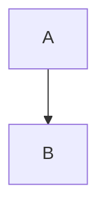

# Claude Rules для Andrew's Obsidian Vault

## Загальні принципи
- Мова: **Українська** з англійською технічною термінологією (без перекладу термінів)
- Стиль: Структурований, детальний, практичний з прикладами
- Фокус: Knowledge management для технічних тем

## Структура Vault
```
/knowledge-database/  → Технічні нотатки, фреймворки, методології
```

## Формат нотаток

### Frontmatter (обов'язковий)
```yaml
---
tags:
  - category1
  - category2
  - specific-topic
aliases:
  - Українська назва
  - English Name
  - Альтернативна назва
created: YYYY-MM-DD
topic: Broader Category
---
```

### Структура документа

1. **# Заголовок** (H1 - лише один на документ)

2. **TL;DR Summary Block** (завжди на початку):
```markdown
> [!SUMMARY] TL;DR
> Короткий виклад (2-4 речення)
> **Ключова ідея:** основна суть теми
```

3. **Основні секції** (numbered):
   - ## 1. Фундаментальна теорія
   - ## 2. Структура/Компоненти
   - ## 3. Візуалізація (діаграми, схеми)
   - ## 4. Практичні приклади
   - ## 5. Порівняння (якщо релевантно)
   - ## 6. Проблеми/Анти-патерни
   - ## 7. Корисні посилання

4. **Next Actions** (опціонально):
```markdown
**Next Actions:**
- [ ] Action item 1
- [ ] Action item 2
```

## Callout Blocks (використовувати активно)

- `[!SUMMARY]` — TL;DR на початку
- `[!INFO]` — Додаткова інформація, історичні факти
- `[!TIP]` — Практичні поради, best practices
- `[!WARNING]` — Застереження, анти-патерни
- `[!EXAMPLE]` — Розгорнуті приклади з кодом/розрахунками

## Контент-елементи

### Tables
Використовувати для порівнянь, характеристик:
```markdown
| Характеристика | Варіант 1 | Варіант 2 |
| :--- | :--- | :--- |
| Параметр | Значення | Значення |
```

### Code Blocks
З явною вказівкою мови:
```python
# Example code
def function():
    pass
```

### Діаграми (Mermaid)
Для процесів, архітектури:


### LaTeX формули
Для математичних виразів:
```
$$ formula $$
або $ inline $
```

### Internal Links
- Використовувати `[[Page Name]]` для зв'язків між нотатками
- Створювати нові нотатки для окремих концепцій (Product Owner, Sprint, etc.)
- Не перевантажувати одну нотатку - краще розбити на пов'язані

## Naming Conventions

### Файли
- **Англійською** для технічних тем: `Scrum.md`, `SDLC.md`
- **CamelCase** або **PascalCase**: `ProductOwner.md`, `SprintPlanning.md`
- **Kebab-case** для багатослівних: `machine-learning-basics.md`

### Tags
- Lowercase з дефісами: `project-management`, `agile`, `framework`
- Ієрархія: загальне → специфічне

## Коли створювати нову нотатку vs розширювати існуючу

**Нова нотатка:**
- Окрема концепція/термін, на який можна посилатися
- Тема заслуговує на детальне висвітлення (500+ слів)
- Буде використовуватися в multiple contexts

**Розширення існуючої:**
- Додаткові деталі до основної теми
- Приклади/кейси для ілюстрації
- Короткі роз'яснення (< 300 слів)

## Приклади створення

### Запит: "Створи нотатку про REST API"
→ Створю `/knowledge-database/REST-API.md` з:
- Frontmatter (tags: api, rest, web, http)
- TL;DR про що таке REST
- Секції: Principles, HTTP Methods, Status Codes, Examples, Best Practices
- Code приклади (curl, Python requests)
- Порівняння з GraphQL/SOAP
- Діаграма request/response flow

### Запит: "Додай інфо про OAuth до REST API нотатки"
→ Якщо OAuth - це окрема велика тема:
- Створю `/knowledge-database/OAuth.md`
- В REST-API.md додам посилання: "For authentication, see [[OAuth]]"

→ Якщо просто приклад:
- Додам секцію "Authentication" в REST-API.md з прикладом OAuth flow

## Стиль написання

- **Лаконічно але вичерпно** - без води, але з деталями
- **Структуровано** - чітка ієрархія заголовків
- **З прикладами** - завжди code/real-world examples
- **Практично** - не тільки теорія, а й як використовувати
- **Візуально** - таблиці, діаграми, callouts для кращого сприйняття

## Використання Context7 MCP для актуальної документації

**ВАЖЛИВО:** При написанні або редагуванні файлів про технології, фреймворки, бібліотеки чи інструменти - завжди використовуй Context7 MCP для отримання актуальної документації.

**Коли використовувати Context7:**
- Створення нотаток про конкретні технології (React, Django, Docker, etc.)
- Додавання прикладів коду з APIs
- Перевірка актуальності синтаксису та best practices
- Уточнення версій та deprecated features

**Процес:**
1. Спочатку `Context7:resolve-library-id` для знаходження потрібної бібліотеки
2. Потім `Context7:get-library-docs` з library ID для отримання документації
3. Включити актуальну інформацію в нотатку з вказанням версії

**Приклад:**
```markdown
# React Hooks

> [!INFO] Version
> Інформація актуальна для React 18.x (станом на 2025-01-10)
> Джерело: офіційна документація через Context7

## useState
[актуальна інформація з Context7]
```

**Що НЕ робити:**
- ❌ Покладатися тільки на знання Claude (може бути outdated)
- ❌ Копіювати старі приклади без перевірки
- ❌ Ігнорувати версії та breaking changes

**Що робити:**
- ✅ Перевіряти синтаксис через Context7
- ✅ Вказувати версії технологій
- ✅ Позначати deprecated features
- ✅ Додавати посилання на офіційну документацію

---
