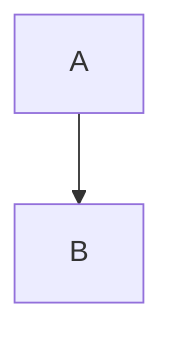

# Claude Rules for Andrew's Obsidian Vault

## General Principles
- Language: **Ukrainian** with English technical terminology (no translation of terms)
- Style: Structured, detailed, practical with examples
- Focus: Knowledge management for technical topics

## Vault Structure

```
obsidian-kb/
├── knowledge-database/     → Technical notes, frameworks, methodologies
├── guides/                 → Step-by-step guides, tutorials, how-tos
├── claude.md              → Claude rules for content creation
└── README.md              → Vault overview and navigation
```

**Directory Purposes:**
- **`/knowledge-database/`** - Core technical knowledge: frameworks, methodologies, technologies, concepts
- **`/guides/`** - Practical tutorials and deployment guides
- **Root level** - Configuration files and vault documentation

## Note Format

### Frontmatter (required)
```yaml
---
tags:
  - category1
  - category2
  - specific-topic
aliases:
  - Українська назва
  - English Name
  - Alternative name
created: YYYY-MM-DD
topic: Broader Category
---
```

### Document Structure

1. **# Title** (H1 - only one per document)

2. **TL;DR Summary Block** (always at the beginning):
```markdown
> [!SUMMARY] TL;DR
> Brief summary (2-4 sentences)
> **Key idea:** core essence of the topic
```

3. **Main Sections** (numbered):
   - ## 1. Fundamental Theory
   - ## 2. Structure/Components
   - ## 3. Visualization (diagrams, schemas)
   - ## 4. Practical Examples
   - ## 5. Comparison (if relevant)
   - ## 6. Problems/Anti-patterns
   - ## 7. Useful Links

4. **Next Actions** (optional):
```markdown
**Next Actions:**
- [ ] Action item 1
- [ ] Action item 2
```

## Callout Blocks (use actively)

- `[!SUMMARY]` — TL;DR at the beginning
- `[!INFO]` — Additional information, historical facts
- `[!TIP]` — Practical tips, best practices
- `[!WARNING]` — Warnings, anti-patterns
- `[!EXAMPLE]` — Detailed examples with code/calculations

## Content Elements

### Tables
Use for comparisons, characteristics:
```markdown
| Characteristic | Option 1 | Option 2 |
| :--- | :--- | :--- |
| Parameter | Value | Value |
```

### Code Blocks
With explicit language specification:
```python
# Example code
def function():
    pass
```

### Diagrams (Mermaid)
For processes, architecture:


### LaTeX Formulas
For mathematical expressions:
```
$$ formula $$
or $ inline $
```

### Internal Links
- Use `[[Page Name]]` for links between notes
- Create new notes for separate concepts (Product Owner, Sprint, etc.)
- Don't overload one note - better to split into related ones

## Naming Conventions

### Files
- **In English** for technical topics: `Scrum.md`, `SDLC.md`
- **CamelCase** or **PascalCase**: `ProductOwner.md`, `SprintPlanning.md`
- **Kebab-case** for multi-word: `machine-learning-basics.md`

### Tags
- Lowercase with hyphens: `project-management`, `agile`, `framework`
- Hierarchy: general → specific

## When to Create New Note vs Expand Existing

**New Note:**
- Separate concept/term that can be referenced
- Topic deserves detailed coverage (500+ words)
- Will be used in multiple contexts

**Expand Existing:**
- Additional details to main topic
- Examples/cases for illustration
- Short explanations (< 300 words)

## Creation Examples

### Request: "Create a note about REST API"
→ Will create `/knowledge-database/REST-API.md` with:
- Frontmatter (tags: api, rest, web, http)
- TL;DR about what REST is
- Sections: Principles, HTTP Methods, Status Codes, Examples, Best Practices
- Code examples (curl, Python requests)
- Comparison with GraphQL/SOAP
- Request/response flow diagram

### Request: "Add info about OAuth to REST API note"
→ If OAuth is a separate large topic:
- Will create `/knowledge-database/OAuth.md`
- In REST-API.md will add link: "For authentication, see [[OAuth]]"

→ If just an example:
- Will add "Authentication" section in REST-API.md with OAuth flow example

## Writing Style

- **Concise but comprehensive** - no fluff, but with details
- **Structured** - clear heading hierarchy
- **With examples** - always code/real-world examples
- **Practical** - not just theory, but how to use
- **Visual** - tables, diagrams, callouts for better perception

## Using Context7 MCP for Up-to-Date Documentation

**IMPORTANT:** When writing or editing files about technologies, frameworks, libraries, or tools - always use Context7 MCP to get up-to-date documentation.

**When to use Context7:**
- Creating notes about specific technologies (React, Django, Docker, etc.)
- Adding code examples with APIs
- Verifying syntax and best practices currency
- Clarifying versions and deprecated features

**Process:**
1. First `Context7:resolve-library-id` to find the needed library
2. Then `Context7:get-library-docs` with library ID to get documentation
3. Include up-to-date information in the note with version indication

**Example:**
```markdown
# React Hooks

> [!INFO] Version
> Information is current for React 18.x (as of 2025-01-10)
> Source: official documentation via Context7

## useState
[up-to-date information from Context7]
```

**What NOT to do:**
- ❌ Rely only on Claude's knowledge (may be outdated)
- ❌ Copy old examples without verification
- ❌ Ignore versions and breaking changes

**What to do:**
- ✅ Verify syntax through Context7
- ✅ Specify technology versions
- ✅ Mark deprecated features
- ✅ Add links to official documentation

## Using Icons from MCP Servers

**IMPORTANT:** When creating, editing, or updating articles - always search for and insert relevant **original icons** via MCP to improve visual perception and maintain professional appearance.

**Available MCP server:**
- **Icons8 MCP** - over 130 icon styles (iOS, Fluent, Color, Material, Office, etc.)

**When to use Icons8 MCP:**
- ✅ **For tools and applications** - search for original brand icons (Docker, React, Python, VS Code, etc.)
- ✅ **For technologies** - find official logos and symbols
- ✅ **For concepts** - use unified style icons in consistent platform (e.g., all in "ios-filled" or "fluent")
- ✅ **For methodologies** - abstract concepts with matching style

**Style Consistency Rules:**
- **Choose ONE platform/style** for the entire document (e.g., "ios-filled", "fluent", "color", "office")
- **For technical documentation** - prefer professional styles: "fluent", "ios-filled", "color"
- **For creative/design topics** - can use: "doodle", "cotton", "stickers"
- **For minimalist docs** - use: "ios-glyphs", "material-outlined", "sf-black"

**Process of adding icons:**

1. **Determine topic and required style:**
   - Article about tool/app → search for original icon
   - Need unified look → choose platform (e.g., "fluent") and use it consistently

2. **Explore available platforms:**
   ```
   mcp_icons8mcp_list_platforms()
   ```
   Reviews available styles: ios, fluent, color, material, office, etc.

3. **Search for icons:**
   ```
   mcp_icons8mcp_search_icons(
       query="docker",
       platform="fluent",  // optional - for style filtering
       amount=10
   )
   ```

4. **Get icon URL:**
   ```
   mcp_icons8mcp_get_icon_png_url(
       icon_id="found_icon_id",
       size=48  // 24, 48, 96 depending on usage
   )
   ```

5. **Insert into document:**
   ```markdown
   
   ```

**Usage Examples:**

### Icon for Tool/Technology in Heading
```markdown
#  Docker Best Practices

or for text-only support:

# 🐳 Docker Best Practices
```

### Unified Style Icons in Sections (all from "fluent" platform)
```markdown
##  1. Fundamental Theory
##  2. Structure/Components
##  3. Visualization
##  4. Practical Examples
```

### Original Brand Icons for Technologies
```markdown
**Tech Stack:**
-  React 18.x
-  Docker 24.x
-  PostgreSQL 15.x
```

### Consistent Style for Abstract Concepts
```markdown
> [!TIP]  Tip
> Use hooks for state management

> [!WARNING]  Warning
> Avoid prop drilling
```

**Style Recommendations:**

**For Tools & Applications:**
- ✅ **Search for ORIGINAL icons** via Icons8 (Docker, VS Code, GitHub, etc.)
- ✅ Use "color" platform for branded icons
- ✅ Keep size consistent (48-64px for headings, 24-32px for lists)

**For Unified Document Style:**
- ✅ Choose ONE platform at document start (e.g., "fluent" or "ios-filled")
- ✅ Use ONLY this platform for all icons in document
- ✅ Maintain visual harmony and professional appearance

**For Abstract Concepts:**
- ✅ Use same platform as main document style
- ✅ Search by concept: "settings", "security", "performance", etc.

**What NOT to do:**
- ❌ Mix emoji (🚀) with Icons8 images chaotically
- ❌ Use different platforms in one document (fluent + office + doodle)
- ❌ Use low-quality icons when original ones exist in Icons8
- ❌ Add icons without semantic meaning
- ❌ Use random sizes (24px in heading, 96px in list)

**What to do:**
- ✅ **ALWAYS search Icons8 MCP** for tools/apps before using emoji
- ✅ Choose consistent platform for unified style
- ✅ Use original brand icons for technologies
- ✅ Maintain size consistency throughout document
- ✅ Balance text and visual elements

**Example Workflow for Article about Docker:**
1. Search for Docker icon: `mcp_icons8mcp_search_icons(query="docker", platform="color")`
2. Get Docker icon URL for header (size=64)
3. Choose "fluent" platform for other icons (book, warning, tip, etc.)
4. Search and insert ALL section icons from "fluent" platform
5. Result: Professional look with original Docker branding + consistent style

---
