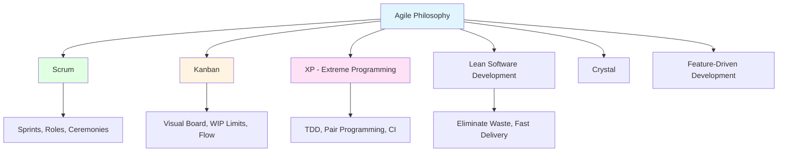
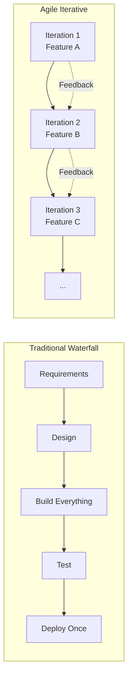

---
tags:
  - agile
  - methodology
  - iterative
  - project-management
  - scrum
  - kanban
aliases:
  - Agile
  - Agile Methodology
  - Гнучка методологія
  - Agile Development
created: 2026-01-10
topic: Software Development Methodologies
---

# Agile Methodology

> [!SUMMARY] TL;DR
> Agile — це набір принципів та практик для ітеративної розробки ПЗ з фокусом на швидке delivery, адаптацію до змін та тісну collaboration з клієнтом. Замість великих releases раз на рік — малі increments кожні 1-4 тижні. Замість детальних планів на місяці вперед — adaptive planning з regular feedback loops.
> **Ключова ідея:** "Embrace change" — зміни — це нормально і навіть бажано, якщо вони ведуть до кращого продукту.

## 1. Фундаментальна теорія

**Agile** — це не конкретна методологія, а філософія та набір цінностей для розробки ПЗ, викладених у **Agile Manifesto** (2001 рік). Agile включає різні frameworks: [[Scrum]], Kanban, XP (Extreme Programming), Lean, Crystal та інші.

**Історія виникнення:**
У 2001 році 17 software developers (включно з Ken Schwaber, Jeff Sutherland, Martin Fowler) зібралися у Snowbird, Utah та сформулювали Agile Manifesto як відповідь на heavyweight процеси типу [[Waterfall-Model]].

> [!INFO] Agile Manifesto
> **4 Core Values:**
> 1. **Individuals and interactions** over processes and tools
> 2. **Working software** over comprehensive documentation
> 3. **Customer collaboration** over contract negotiation
> 4. **Responding to change** over following a plan
> 
> **Важливо:** Речі праворуч мають цінність, але речі ліворуч — більш цінні.

**12 Principles Agile Manifesto:**

1. Highest priority — satisfy customer через early та continuous delivery цінного ПЗ
2. Welcome changing requirements, навіть late у development
3. Deliver working software frequently (weeks, not months)
4. Business people та developers працюють разом daily
5. Build projects навколо motivated individuals
6. Face-to-face conversation — найефективніший спосіб комунікації
7. Working software — primary measure of progress
8. Sustainable development — constant pace indefinitely
9. Continuous attention до technical excellence та good design
10. Simplicity — maximize amount of work NOT done
11. Self-organizing teams produce best results
12. Regular reflection та adjustment (retrospectives)

**Коли застосовується:**
- Innovative products з uncertain requirements
- Startups та швидко мінливі ринки
- Projects де user feedback критичний
- Складні problem domains де solution не clear заздалегідь
- Коли потрібен швидкий time-to-market
- Teams які можуть працювати closely з client

## 2. Agile Frameworks та підходи

Agile — це umbrella term, під яким існують різні frameworks:

### Популярні Agile Frameworks:



### Порівняння головних frameworks:

| Framework | Focus | Best For | Key Practices | Prescriptiveness |
| :--- | :--- | :--- | :--- | :---: |
| **[[Scrum]]** | Iterative development у fixed sprints | Teams <10, clear product vision | Sprints, Daily standups, Retrospectives | High |
| **Kanban** | Continuous flow, visualize work | Maintenance, support, operations | Visual board, WIP limits, Pull system | Low |
| **XP** | Technical excellence, code quality | Teams з tight collaboration | TDD, Pair programming, Refactoring | Very High |
| **Lean** | Eliminate waste, maximize value | Efficiency optimization | Value stream mapping, Just-in-time | Medium |
| **Scrumban** | Hybrid Scrum + Kanban | Transition from Scrum, flexible flow | Sprints + Kanban board | Medium |

> [!TIP] Framework Selection
> - **Новий product?** → Start з Scrum (structured, easy to learn)
> - **Support/Maintenance work?** → Kanban (continuous flow)
> - **High technical complexity?** → XP (technical practices)
> - **Optimization focus?** → Lean (waste reduction)
> - **Mature team?** → Scrumban або custom hybrid

## 3. Core Agile Concepts

### Iterative та Incremental Development

**Iterative** — повторення циклів development з improvement кожної ітерації  
**Incremental** — додавання functionality поступово, not all at once



### User Stories

Замість детальних вимог (як у [[Waterfall-Model]]) — короткі описи functionality з точки зору користувача.

**Format:**
```
As a [type of user],
I want [some goal],
So that [some reason/value].
```

**Приклад:**
```
As an online shopper,
I want to save items to a wishlist,
So that I can easily find and purchase them later.
```

**Acceptance Criteria (Definition of Done):**
```
✓ User can add items to wishlist from product page
✓ Wishlist persists across sessions
✓ User can view and remove items from wishlist
✓ Wishlist icon shows item count
```

> [!TIP] INVEST Criteria для хороших User Stories
> - **I**ndependent — можна реалізувати окремо
> - **N**egotiable — details можна discuss
> - **V**aluable — приносить цінність user
> - **E**stimable — team може оцінити effort
> - **S**mall — fits у один sprint/iteration
> - **T**estable — є чіткі acceptance criteria

### Backlog Management

**Product Backlog** — prioritized список всіх features, bug fixes, technical work.

```
Priority | Story ID | User Story | Story Points | Status
---------|----------|------------|--------------|--------
   1     | US-101   | User login | 5            | In Progress
   2     | US-102   | Checkout   | 8            | Ready
   3     | US-103   | Wishlist   | 3            | Ready
   4     | US-104   | Reviews    | 5            | Backlog
```

**Backlog Grooming (Refinement):**
- Regular sessions (1-2 годин на тиждень)
- Clarify stories, add details, estimate effort
- Ensure top items "sprint-ready"

### Velocity та Planning

**Velocity** — кількість work (story points) яку team завершує за sprint.

**Приклад розрахунку:**
```
Sprint 1: 23 story points completed
Sprint 2: 27 story points completed
Sprint 3: 25 story points completed

Average Velocity = (23 + 27 + 25) / 3 = 25 points per sprint
```

**Planning next sprint:**
- Team має capacity 25 points
- Беремо top priority items з backlog поки не досягнемо ~25 points
- Commitment на sprint goal

## 4. Agile Ceremonies (Events)

Хоча кожен framework має свої events, більшість включають:

### Sprint Planning (у Scrum)
- **Коли:** Початок кожного sprint
- **Тривалість:** 2-4 години (для 2-week sprint)
- **Мета:** Визначити sprint goal та відібрати items з backlog
- **Учасники:** Вся команда, Product Owner
- **Output:** Sprint backlog з конкретними tasks

### Daily Standup (Daily Scrum)
- **Коли:** Кожен робочий день
- **Тривалість:** 15 хвилин (timeboxed!)
- **Мета:** Синхронізація команди, identify blockers
- **Format:** Кожен відповідає:
  - Що зробив вчора?
  - Що робитиму сьогодні?
  - Чи є blockers?
- **НЕ status meeting для менеджера!**

### Sprint Review (Demo)
- **Коли:** Кінець sprint
- **Тривалість:** 1-2 години
- **Мета:** Показати working software стейкхолдерам
- **Учасники:** Team + stakeholders + customers
- **Output:** Feedback для backlog

### Retrospective
- **Коли:** Після sprint review
- **Тривалість:** 1-1.5 години
- **Мета:** Team reflection — що пішло добре, що покращити
- **Format:** 
  - What went well? (continue doing)
  - What didn't go well? (stop doing)
  - What can we improve? (start doing)
- **Output:** Action items для наступного sprint

> [!TIP] Retrospective Techniques
> - **Start-Stop-Continue** — прості категорії
> - **4Ls** — Liked, Learned, Lacked, Longed for
> - **Sailboat** — Wind (що допомагає), Anchor (що гальмує), Island (goals)
> - **Mad-Sad-Glad** — емоційна ретроспектива

### Backlog Refinement
- **Коли:** 1-2 рази на тиждень
- **Тривалість:** 1 година
- **Мета:** Prepare backlog items для майбутніх sprints
- **Активності:** Story breakdown, estimation, clarification

## 5. Практичні приклади

### Приклад 1: Spotify (успішний Agile at scale)

**Контекст:**
Spotify почав як startup з Scrum, але масштабувався до 100+ teams. Traditional Scrum став bottleneck.

**Spotify Model (Tribes, Squads, Chapters, Guilds):**

```
Organization Structure:
├─ Tribe (~100 people, mission-oriented)
│  ├─ Squad 1 (6-12 people, like Scrum team, autonomous)
│  ├─ Squad 2
│  └─ Squad 3
│
├─ Chapters (Backend devs across squads — functional expertise)
└─ Guilds (Communities of interest, e.g. "Testing Guild")
```

**Key Principles:**
- **Autonomy** — кожен squad обирає свої tools та practices
- **Aligned autonomy** — clear mission, але flexibility у execution
- **Fail fast** — experimentation encouraged
- **Think it, Build it, Ship it, Tweak it** — full ownership

**Результат:**
✅ Швидкі releases (кілька разів на день)  
✅ Innovation через autonomy  
✅ Scale без bureaucracy  
⚠️ **НО:** Model працює для Spotify culture, not universal solution

> [!WARNING] "Spotify Model" Misunderstanding
> Багато компаній copy Spotify structure але без underlying culture (autonomy, trust, transparency). Result — chaos замість agility. **Spotify Model — це не framework для copy-paste, а приклад adaptation Agile principles.**

### Приклад 2: Python приклад — Sprint Simulation

```python
from dataclasses import dataclass, field
from typing import List, Optional
from enum import Enum
from datetime import datetime, timedelta

class StoryStatus(Enum):
    TODO = "To Do"
    IN_PROGRESS = "In Progress"
    CODE_REVIEW = "Code Review"
    TESTING = "Testing"
    DONE = "Done"

@dataclass
class UserStory:
    """User story у Sprint Backlog"""
    story_id: str
    title: str
    description: str
    story_points: int
    assignee: Optional[str] = None
    status: StoryStatus = StoryStatus.TODO
    tasks: List[str] = field(default_factory=list)
    acceptance_criteria: List[str] = field(default_factory=list)
    
    def start(self, developer: str):
        """Start working on story"""
        if self.status != StoryStatus.TODO:
            raise ValueError(f"Cannot start story in {self.status.value} status")
        self.assignee = developer
        self.status = StoryStatus.IN_PROGRESS
        
    def complete_task(self, task: str):
        """Mark task as completed"""
        if task not in self.tasks:
            raise ValueError(f"Task '{task}' not found in story")
        # In real app — track completed tasks separately
        print(f"✓ Task completed: {task}")
        
    def move_to_review(self):
        """Move to code review"""
        if self.status != StoryStatus.IN_PROGRESS:
            raise ValueError("Story must be IN_PROGRESS to move to review")
        self.status = StoryStatus.CODE_REVIEW
        
    def approve(self):
        """Approve after review and testing"""
        self.status = StoryStatus.DONE
        
    def is_done(self) -> bool:
        return self.status == StoryStatus.DONE

@dataclass
class Sprint:
    """Sprint — time-boxed iteration (1-4 weeks)"""
    sprint_number: int
    start_date: datetime
    duration_days: int = 14  # Default 2-week sprint
    goal: str = ""
    backlog: List[UserStory] = field(default_factory=list)
    velocity_target: int = 0  # Story points team plans to complete
    
    @property
    def end_date(self) -> datetime:
        return self.start_date + timedelta(days=self.duration_days)
        
    def add_story(self, story: UserStory):
        """Add story to sprint backlog"""
        self.backlog.append(story)
        
    def get_committed_points(self) -> int:
        """Total story points committed for sprint"""
        return sum(story.story_points for story in self.backlog)
        
    def get_completed_points(self) -> int:
        """Story points actually completed (Done)"""
        return sum(
            story.story_points 
            for story in self.backlog 
            if story.is_done()
        )
        
    def get_completion_rate(self) -> float:
        """Sprint completion percentage"""
        committed = self.get_committed_points()
        if committed == 0:
            return 0.0
        return (self.get_completed_points() / committed) * 100
        
    def get_burndown_data(self) -> dict:
        """
        Burndown chart data — скільки work залишилося щодня
        (Simplified version — у реальності tracking по днях)
        """
        total_points = self.get_committed_points()
        completed_points = self.get_completed_points()
        remaining_points = total_points - completed_points
        
        return {
            "total_points": total_points,
            "completed_points": completed_points,
            "remaining_points": remaining_points,
            "ideal_remaining": total_points * 0.5  # Simplified - середина sprint
        }
        
    def sprint_report(self) -> str:
        """Generate sprint summary report"""
        report = f"""
{'='*60}
SPRINT {self.sprint_number} REPORT
{'='*60}
Sprint Goal: {self.goal}
Duration: {self.start_date.date()} to {self.end_date.date()} ({self.duration_days} days)

COMMITMENT:
  Committed Story Points: {self.get_committed_points()}
  Stories in Sprint: {len(self.backlog)}

COMPLETION:
  Completed Story Points: {self.get_completed_points()}
  Completion Rate: {self.get_completion_rate():.1f}%
  
STORY BREAKDOWN:
"""
        for story in self.backlog:
            status_icon = "✓" if story.is_done() else "○"
            report += f"  {status_icon} [{story.story_points}pts] {story.story_id}: {story.title} ({story.status.value})\n"
            
        return report

class AgileTeam:
    """Agile team managing multiple sprints"""
    
    def __init__(self, team_name: str):
        self.team_name = team_name
        self.sprints: List[Sprint] = []
        self.velocity_history: List[int] = []
        
    def start_sprint(self, goal: str, duration_days: int = 14) -> Sprint:
        """Start new sprint"""
        sprint_number = len(self.sprints) + 1
        start_date = datetime.now()
        
        sprint = Sprint(
            sprint_number=sprint_number,
            start_date=start_date,
            duration_days=duration_days,
            goal=goal
        )
        
        self.sprints.append(sprint)
        print(f"\n🚀 Started Sprint {sprint_number}")
        print(f"Goal: {goal}")
        print(f"Duration: {duration_days} days")
        
        return sprint
        
    def complete_sprint(self, sprint: Sprint):
        """Complete sprint and update velocity"""
        completed_points = sprint.get_completed_points()
        self.velocity_history.append(completed_points)
        
        print(f"\n✓ Sprint {sprint.sprint_number} Completed!")
        print(sprint.sprint_report())
        
    def get_average_velocity(self) -> float:
        """Calculate team's average velocity (last 3 sprints)"""
        if not self.velocity_history:
            return 0.0
        
        recent_sprints = self.velocity_history[-3:]  # Last 3 sprints
        return sum(recent_sprints) / len(recent_sprints)
        
    def forecast_capacity(self) -> int:
        """Forecast how many points team can commit to next sprint"""
        avg_velocity = self.get_average_velocity()
        # Add 10% buffer for uncertainty
        return int(avg_velocity * 0.9)

# Приклад використання
if __name__ == "__main__":
    # Create team
    team = AgileTeam("Python Backend Squad")
    
    # Sprint 1
    sprint1 = team.start_sprint(
        goal="Implement user authentication and basic API endpoints",
        duration_days=14
    )
    
    # Add stories to sprint
    story1 = UserStory(
        story_id="US-101",
        title="User Registration API",
        description="As a new user, I want to register with email/password",
        story_points=5,
        tasks=[
            "Design database schema",
            "Implement registration endpoint",
            "Add email validation",
            "Write unit tests"
        ],
        acceptance_criteria=[
            "User can register with valid email/password",
            "Duplicate emails are rejected",
            "Password is hashed before storage"
        ]
    )
    
    story2 = UserStory(
        story_id="US-102",
        title="User Login API",
        description="As a registered user, I want to login and receive JWT token",
        story_points=3,
        tasks=[
            "Implement login endpoint",
            "Generate JWT tokens",
            "Add token expiration"
        ],
        acceptance_criteria=[
            "Valid credentials return JWT token",
            "Invalid credentials return 401 error",
            "Token expires after 24 hours"
        ]
    )
    
    story3 = UserStory(
        story_id="US-103",
        title="Protected Endpoints Middleware",
        description="As a system, I want to verify JWT tokens for protected routes",
        story_points=5,
        tasks=[
            "Create authentication middleware",
            "Add token verification",
            "Handle expired tokens"
        ],
        acceptance_criteria=[
            "Middleware validates JWT on protected routes",
            "Expired tokens are rejected",
            "Missing tokens return 401"
        ]
    )
    
    sprint1.add_story(story1)
    sprint1.add_story(story2)
    sprint1.add_story(story3)
    
    print(f"\n📋 Sprint Backlog: {sprint1.get_committed_points()} story points committed")
    
    # Simulate sprint work
    print("\n--- Sprint Execution ---")
    
    # Day 3: Start working on stories
    story1.start("Alice")
    print(f"Alice started working on {story1.story_id}")
    
    story2.start("Bob")
    print(f"Bob started working on {story2.story_id}")
    
    # Day 7: Complete some tasks
    story1.complete_task("Design database schema")
    story1.complete_task("Implement registration endpoint")
    
    # Day 10: Story 2 done
    story2.move_to_review()
    print(f"{story2.story_id} moved to Code Review")
    story2.approve()
    print(f"✓ {story2.story_id} completed!")
    
    # Day 12: Story 1 done
    story1.move_to_review()
    story1.approve()
    print(f"✓ {story1.story_id} completed!")
    
    # Day 14: Story 3 in progress (not completed)
    story3.start("Charlie")
    print(f"Charlie started {story3.story_id} (late in sprint)")
    
    # Sprint end
    team.complete_sprint(sprint1)
    
    # Sprint 2 planning
    print(f"\n📊 Team Velocity History: {team.velocity_history}")
    print(f"Average Velocity: {team.get_average_velocity():.1f} points")
    print(f"Forecasted Capacity for Sprint 2: {team.forecast_capacity()} points")
    
    sprint2 = team.start_sprint(
        goal="Complete middleware and add password reset flow",
        duration_days=14
    )
    
    # Carry over incomplete story
    sprint2.add_story(story3)  # Carry over from Sprint 1
    print(f"\n⚠️  Carried over {story3.story_id} from previous sprint")
    
    # Burndown data
    burndown = sprint1.get_burndown_data()
    print(f"\n📉 Sprint 1 Burndown:")
    print(f"  Total Points: {burndown['total_points']}")
    print(f"  Completed: {burndown['completed_points']}")
    print(f"  Remaining: {burndown['remaining_points']}")
```

**Output приклад:**
```
🚀 Started Sprint 1
Goal: Implement user authentication and basic API endpoints
Duration: 14 days

📋 Sprint Backlog: 13 story points committed

--- Sprint Execution ---
Alice started working on US-101
Bob started working on US-102
✓ Task completed: Design database schema
✓ Task completed: Implement registration endpoint
US-102 moved to Code Review
✓ US-102 completed!
✓ US-101 completed!
Charlie started US-103 (late in sprint)

✓ Sprint 1 Completed!
============================================================
SPRINT 1 REPORT
============================================================
Sprint Goal: Implement user authentication and basic API endpoints
Duration: 2026-01-10 to 2026-01-24 (14 days)

COMMITMENT:
  Committed Story Points: 13
  Stories in Sprint: 3

COMPLETION:
  Completed Story Points: 8
  Completion Rate: 61.5%
  
STORY BREAKDOWN:
  ✓ [5pts] US-101: User Registration API (Done)
  ✓ [3pts] US-102: User Login API (Done)
  ○ [5pts] US-103: Protected Endpoints Middleware (In Progress)
```

**Trade-offs:**
- ✅ Realistic sprint simulation з velocity tracking
- ✅ Story lifecycle (Todo → In Progress → Review → Done)
- ✅ Capacity forecasting based на historical velocity
- ❌ Simplified burndown (real implementation — daily tracking)
- ❌ No team member capacity modeling (vacation, sick days)

### Приклад 3: Failed Agile Transformation

**Контекст:**
Велика корпорація вирішила "стати Agile" — запровадили Scrum у 50 teams одночасно.

**Що пішло не так:**

1. **Agile Theater** — ceremonies без understanding:
   - Daily standups стали status reports для managers
   - Retrospectives — формальна галочка без real improvements
   - Sprint reviews без client participation

2. **Waterfall у Agile packaging:**
   - Requirements збирали на квартал вперед
   - "Sprints" були simply 2-week reporting periods
   - No real iterative development

3. **Lack of empowerment:**
   - Teams не могли приймати technical рішення
   - Product Owners були фактично project managers без authority
   - Change requests проходили через 5 approval levels

4. **Metrics misuse:**
   - Velocity став metric для performance reviews
   - Teams inflating estimates щоб виглядати productive
   - Focus на story points замість delivered value

**Наслідки:**
❌ Frustration у teams (більше meetings, less autonomy)  
❌ No improvement у time-to-market  
❌ Technical debt зріс (rushing через "sprint commitments")  
❌ Rollback до previous processes через 18 місяців  

> [!WARNING] Common Agile Transformation Mistakes
> **Top anti-patterns:**
> - Imposing Agile top-down без buy-in
> - Copying practices без understanding principles
> - Keeping command-and-control culture
> - Measuring wrong metrics (velocity, not value)
> - Не investing у training та coaching
> - Expecting instant results (transformation takes 1-2 years)
> 
> **Better approach:**
> - Start з pilot team (volunteers)
> - Coach and support continuously
> - Focus на outcomes, not processes
> - Adapt framework до organization culture
> - Be patient — cultural change is slow

## 6. Agile vs Traditional: порівняння

| Аспект | Agile | [[Waterfall-Model]] / [[V-Model]] |
| :--- | :--- | :--- |
| **Planning** | Adaptive, just-in-time | Upfront, detailed |
| **Requirements** | Evolving user stories | Fixed specifications |
| **Changes** | Embraced continuously | Avoided or expensive |
| **Delivery** | Incremental (weeks) | Big bang (months/years) |
| **Feedback** | Continuous (every sprint) | Late (after deployment) |
| **Documentation** | Minimal, just enough | Comprehensive |
| **Team structure** | Cross-functional, self-organizing | Specialized, hierarchical |
| **Risk** | Mitigated early (iterations) | High (late discovery) |
| **Client involvement** | Continuous | Start and end |
| **Success metric** | Working software, value delivery | Meeting plan/specs |
| **Best for** | Innovation, uncertain requirements | Stable requirements, regulated |

### Коли НЕ використовувати Agile:

❌ **Agile не підходить якщо:**
- Fixed price/scope contracts з penalties за changes
- Distributed teams без можливості daily communication
- Highly regulated industries з mandatory waterfall process (деякі FDA, aviation projects)
- Client unavailable для regular feedback
- Team не має необхідних skills для cross-functional work
- Organization culture fundamentally hierarchical та resistant до change

✅ **Альтернатива:** Розглянь hybrid approach або traditional methodologies

## 7. Agile Best Practices та Anti-Patterns

### Best Practices:

✅ **Do's:**

**Team Practices:**
- **Cross-functional teams** — всі skills needed для delivery story
- **Co-location** (якщо можливо) — face-to-face communication
- **Collective ownership** — будь-хто може працювати над будь-яким code
- **Sustainable pace** — no overtime як norm, prevent burnout

**Technical Practices:**
- **Test-Driven Development (TDD)** — write tests before code
- **Continuous Integration** — integrate code кілька разів на день
- **Refactoring** — continuous improvement code quality
- **Pair programming** (optional) — knowledge sharing, fewer bugs

**Process Practices:**
- **Definition of Done** — clear criteria коли story complete
- **Timeboxing** — strict time limits для meetings
- **Visualize work** — Kanban boards, burndown charts
- **Regular retrospectives** — continuous improvement

**Product Practices:**
- **Small releases** — deliver value часто
- **Early and continuous delivery** — working software перша пріоритет
- **User feedback** — involve users regularly
- **Prioritize ruthlessly** — focus на highest value first

### Anti-Patterns:

> [!WARNING] Scrum Master as Project Manager
> **Проблема:** Treating Scrum Master як traditional PM що assigns tasks та tracks progress.
> 
> **Чому погано:**
> - Підриває self-organization
> - Teams не розвивають autonomy
> - Scrum Master стає bottleneck
> 
> **Правильно:** Scrum Master — servant leader що removes impediments та coaches team.

> [!WARNING] Story Points Inflation
> **Проблема:** Teams inflating estimates щоб показати higher velocity.
> 
> **Чому погано:**
> - Velocity стає meaningless metric
> - Focus на points замість value
> - Planning стає unreliable
> 
> **Правильно:** Story points — relative estimates, not performance metric. Focus на completed value, not velocity numbers.

> [!WARNING] Sprint Zero Anti-Pattern
> **Проблема:** "Sprint 0" де nothing delivered — тільки planning/setup.
> 
> **Чому погано:**
> - Postpones value delivery
> - Returns до waterfall thinking
> - Creates false sense of preparation
> 
> **Правильно:** Start delivering value з Sprint 1, навіть якщо мінімальне. Setup can happen incrementally.

> [!WARNING] Fixed Scope Sprints
> **Проблема:** Treating sprint commitment як fixed contract, no flexibility.
> 
> **Чому погано:**
> - Teams rush та cut quality щоб meet commitment
> - Fear приймати feedback що suggests changes
> - Technical debt accumulates
> 
> **Правильно:** Sprint goal important, але specific stories can be adjusted based на learnings.

## 8. Scaling Agile

Коли organization росте, single-team Agile стає insufficient. Існують frameworks для scaling:

### SAFe (Scaled Agile Framework)

**Structure:**
- **Team Level** — Scrum/Kanban teams
- **Program Level** — Agile Release Train (ART) — 50-125 людей
- **Portfolio Level** — strategic themes та funding

**Pros:** Comprehensive, good для enterprises  
**Cons:** Heavy, bureaucratic, expensive training  

### LeSS (Large-Scale Scrum)

**Principles:**
- More with less — minimize processes
- Whole product focus — всі teams працюють на one product backlog
- Systems thinking

**Pros:** Lightweight, true до Scrum principles  
**Cons:** Requires high organizational maturity  

### Spotify Model

Детально описано у Прикладі 1 вище.

**Pros:** Autonomy, innovation, flexibility  
**Cons:** Потребує strong culture, not prescriptive framework  

> [!TIP] Вибір Scaling Framework
> - **SAFe** — якщо потрібна структура та compliance (великі корпорації)
> - **LeSS** — якщо хочете simplicity та minimal overhead
> - **Spotify Model** — якщо організація має culture autonomy та trust
> - **Custom Hybrid** — most companies adapt frameworks до своїх потреб

## 9. Agile Metrics та KPIs

### Team-Level Metrics:

**Velocity**
- Story points completed per sprint
- **Use:** Forecasting capacity
- **Warning:** Don't compare velocities між teams!

**Burndown Chart**
- Remaining work кожного дня sprint
- **Use:** Track sprint progress, identify risks early
- **Warning:** Ideal burndown — рідко досягається

**Cycle Time**
- Час від початку роботи до delivery
- **Use:** Identify bottlenecks у process
- **Lower is better** (faster delivery)

**Lead Time**
- Час від request до delivery
- **Use:** Measure responsiveness до customer needs
- **Include:** Time in backlog + cycle time

### Product-Level Metrics:

**Customer Satisfaction (NPS, CSAT)**
- Are we building the right thing?
- **Use:** Validate product decisions

**Business Value Delivered**
- Revenue, user engagement, conversions
- **Use:** Real measure of success, not just output

**Defect Rate / Escaped Bugs**
- Bugs found у production
- **Use:** Track quality trend

**Deployment Frequency**
- How often deploy до production
- **Use:** Measure agility (higher = more agile)

> [!TIP] Focus на Outcomes, Not Output
> **Bad metrics:**
> - Lines of code written
> - Story points delivered (as performance metric)
> - Number of features shipped
> 
> **Good metrics:**
> - User satisfaction
> - Time to market
> - Business value delivered
> - Defect rate trends
> - Team happiness

## 10. Корисні посилання

**Foundational Resources:**
- **Agile Manifesto** — https://agilemanifesto.org/ (must-read, 5 хвилин)
- **Scrum Guide** — офіційний guide від Ken Schwaber та Jeff Sutherland
- **Kanban Guide** — https://kanban.university/

**Books:**
- "User Stories Applied" by Mike Cohn — деталі про writing good user stories
- "The Phoenix Project" by Gene Kim — DevOps novel що ілюструє agile principles
- "Scrum: The Art of Doing Twice the Work in Half the Time" by Jeff Sutherland

**Online Courses:**
- Certified Scrum Master (CSM) — 2-day course з official certification
- Professional Scrum Master (PSM) — online assessment-based certification
- Agile courses на Coursera, Udemy

**Communities:**
- Agile Alliance — https://www.agilealliance.org/
- Scrum Alliance — training та certification body
- Local Agile meetups — networking та learning

**Tools:**
- Jira — most popular для Agile project management
- Trello — simple Kanban boards
- Azure DevOps — Microsoft's solution для Agile teams
- Linear — modern, developer-focused tool

**Related Notes:**
- [[Scrum]] — найпопулярніший Agile framework
- [[Waterfall-Model]] — traditional approach для порівняння
- [[V-Model]] — alternative structured approach
- [[SDLC]] — broader context software development lifecycle
- [[CI-CD]] — technical practices що підтримують Agile

---

**Next Actions:**
- [ ] Додати детальний breakdown Kanban method
- [ ] Створити template для Sprint Planning meeting
- [ ] Розширити секцію про Agile metrics dashboard
- [ ] Додати case study з failed transformation та lessons learned
- [ ] Створити checklist для "Are we really Agile?" self-assessment
