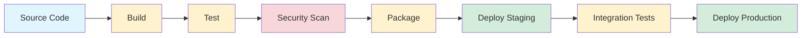

---
tags:
  - devops
  - ci-cd
  - automation
  - deployment
  - pipeline
aliases:
  - Continuous Integration
  - Continuous Deployment
  - Continuous Delivery
  - CI/CD Pipeline
created: 2025-01-10
topic: DevOps
---

# CI/CD

> [!SUMMARY] TL;DR
> CI/CD — це практика автоматизації побудови, тестування та deployment коду. Continuous Integration забезпечує часту інтеграцію змін у спільний репозиторій, Continuous Delivery готує код до релізу, а Continuous Deployment автоматично деплоїть кожну зміну в production. Це дозволяє швидше доставляти фічі, зменшує ризики та покращує якість коду.
> 
> **Ключова ідея:** Автоматизуй все, що можна автоматизувати, щоб люди могли фокусуватись на важливих рішеннях, а не на рутинних операціях.

## 1. Фундаментальна теорія

### 1.1. Що таке CI/CD?

**Continuous Integration (CI)** — практика, при якій розробники часто (декілька разів на день) інтегрують свій код у спільну гілку. Кожна інтеграція автоматично перевіряється білдом та тестами, що дозволяє швидко виявляти проблеми.

**Continuous Delivery (CD)** — розширення CI, при якому код завжди знаходиться в стані, готовому до deployment в production. Deployment виконується вручну після підтвердження.

**Continuous Deployment** — наступний крок після Continuous Delivery, де кожна зміна, що пройшла всі етапи pipeline, автоматично деплоїться в production без ручного втручання.

### 1.2. Чому це важливо?

> [!TIP] Переваги CI/CD
> - **Швидкість доставки:** Фічі доходять до користувачів за години/дні, а не тижні/місяці
> - **Менше багів:** Автоматичне тестування виявляє проблеми раніше
> - **Менший ризик:** Маленькі зміни легше відкатити, ніж великі релізи
> - **Кращий feedback loop:** Швидше бачимо результати змін
> - **Економія часу:** Автоматизація рутинних операцій

### 1.3. Ключові принципи

1. **Єдине джерело істини** — всі зміни проходять через систему контролю версій
2. **Автоматизація** — максимум процесів автоматизовані
3. **Швидкий feedback** — розробник дізнається про проблеми за хвилини
4. **Якість вбудована** — тести та перевірки є частиною процесу, а не окремим етапом
5. **Маленькі батчі** — часті маленькі зміни краще рідких великих
6. **Все як код** — інфраструктура, конфігурація, pipeline — все в репозиторії

## 2. Структура CI/CD Pipeline

### 2.1. Основні етапи



| Етап | Призначення | Типові дії |
| :--- | :--- | :--- |
| **Source** | Trigger pipeline | Git push, PR, scheduled |
| **Build** | Компіляція коду | Компілювання, збірка залежностей |
| **Test** | Перевірка коду | Unit, integration, e2e tests |
| **Security Scan** | Перевірка безпеки | SAST, DAST, dependency scanning |
| **Package** | Створення артефактів | Docker image, JAR, ZIP |
| **Deploy Staging** | Deployment в тестове середовище | Копіювання файлів, оновлення контейнерів |
| **Integration Tests** | Тести на staging | API tests, smoke tests |
| **Deploy Production** | Deployment в production | Blue-green, canary, rolling update |

### 2.2. Додаткові етапи

> [!INFO] Optional Pipeline Stages
> - **Code Quality** — SonarQube, ESLint, Pylint
> - **Performance Testing** — JMeter, k6, Gatling
> - **Approval Gates** — manual review перед production
> - **Rollback** — автоматичний rollback при помилках
> - **Notifications** — Slack, email, PagerDuty
> - **Monitoring Setup** — оновлення dashboards, alerts

## 3. Популярні платформи

### 3.1. Порівняння основних інструментів

| Характеристика | GitHub Actions | GitLab CI/CD | Jenkins | CircleCI |
| :--- | :--- | :--- | :--- | :--- |
| **Hosting** | Cloud / Self-hosted | Cloud / Self-hosted | Self-hosted | Cloud / Self-hosted |
| **Configuration** | YAML (.github/workflows) | YAML (.gitlab-ci.yml) | Groovy (Jenkinsfile) | YAML (.circleci/config.yml) |
| **Pricing** | 2000 хв/міс free | 400 хв/міс free | Безкоштовно (self-hosted) | 6000 хв/міс free |
| **Learning Curve** | Низька | Середня | Висока | Середня |
| **Екосистема** | GitHub Marketplace | Built-in + templates | 2000+ plugins | Orbs marketplace |
| **Performance** | Добрий | Відмінний | Залежить від setup | Добрий |
| **Docker Support** | Native | Native | Через плагіни | Native |

> [!INFO] Версії та актуальність
> Інформація актуальна станом на січень 2025. GitHub Actions використовує v5 actions (checkout@v5, cache@v4), GitLab CI/CD працює зі специфікаціями `spec:inputs` для reusable workflows.

### 3.2. GitHub Actions

**Коли використовувати:** Якщо проект вже на GitHub, для open-source, для простих CI/CD потреб.

**Приклад базового workflow:**

```yaml
# .github/workflows/ci.yml
name: CI Pipeline

on:
  push:
    branches: [ main, develop ]
  pull_request:
    branches: [ main ]

jobs:
  test:
    runs-on: ubuntu-latest
    
    steps:
      - uses: actions/checkout@v5
      
      - name: Setup Node.js
        uses: actions/setup-node@v4
        with:
          node-version: '20'
          cache: 'npm'
      
      - name: Install dependencies
        run: npm ci
      
      - name: Run tests
        run: npm test
      
      - name: Build
        run: npm run build
```

> [!TIP] GitHub Actions Best Practices
> - **Використовуй caching** для node_modules через `actions/cache@v4`
> - **Pin actions до SHA** для безпеки: `actions/checkout@8f4b7f84...`
> - **Matrix strategy** для тестування на кількох версіях
> - **Concurrency groups** для cancel in-progress builds
> - **Reusable workflows** для спільної логіки

### 3.3. GitLab CI/CD

**Коли використовувати:** Self-hosted рішення, складні pipelines з child/parent workflows, повна інтеграція з GitLab ecosystem.

**Приклад базового .gitlab-ci.yml:**

```yaml
stages:
  - build
  - test
  - deploy

variables:
  NODE_VERSION: "20"

build:
  stage: build
  image: node:${NODE_VERSION}
  script:
    - npm ci
    - npm run build
  artifacts:
    paths:
      - dist/
    expire_in: 1 hour
  cache:
    key: ${CI_COMMIT_REF_SLUG}
    paths:
      - node_modules/

test:
  stage: test
  image: node:${NODE_VERSION}
  dependencies:
    - build
  script:
    - npm run test
  coverage: '/Lines\s*:\s*(\d+\.\d+)%/'

deploy:
  stage: deploy
  dependencies:
    - build
  script:
    - echo "Deploying..."
  only:
    - main
```

> [!TIP] GitLab CI/CD Best Practices
> - **Використовуй `extends`** та YAML anchors для DRY
> - **`needs` keyword** замість stages для швидших pipelines
> - **Rules over only/except** — сучасний спосіб control
> - **Child pipelines** для monorepo структур

### 3.4. Jenkins

**Коли використовувати:** Legacy systems, повний контроль, складні custom workflows, enterprise tools.

**Приклад Jenkinsfile:**

```groovy
pipeline {
    agent any
    
    environment {
        NODE_VERSION = '20'
    }
    
    stages {
        stage('Build') {
            steps {
                nodejs(nodeJSInstallationName: "Node-${NODE_VERSION}") {
                    sh 'npm ci'
                    sh 'npm run build'
                }
            }
        }
        
        stage('Test') {
            steps {
                nodejs(nodeJSInstallationName: "Node-${NODE_VERSION}") {
                    sh 'npm test'
                }
            }
        }
        
        stage('Deploy') {
            when {
                branch 'main'
            }
            steps {
                sh 'echo "Deploying..."'
            }
        }
    }
}
```

> [!WARNING] Jenkins Considerations
> - **Складна настройка** — requires Java, plugins, UI config
> - **Security** — потребує постійних updates
> - **Resource intensive** — потужний сервер для parallel jobs
> - **Maintenance overhead** — self-hosted означає updates, backups

## 4. Best Practices

### 4.1. Pipeline Configuration

> [!TIP] Загальні рекомендації
> 
> **DRY (Don't Repeat Yourself):**
> - GitHub Actions: Reusable workflows, composite actions
> - GitLab: `extends`, YAML anchors, child pipelines
> - Jenkins: Shared libraries
> 
> **Security:**
> - Never hardcode credentials
> - Використовуй secrets management
> - Scan dependencies (Dependabot, Renovate)
> - SAST/DAST в pipeline
> 
> **Performance:**
> - Cache dependencies
> - Parallel jobs де можливо
> - Artifact management — cleanup old artifacts
> - Conditional execution
> 
> **Reliability:**
> - Idempotent pipelines
> - Timeouts на jobs
> - Retry mechanisms для flaky tests
> - Health checks перед deployment

### 4.2. Deployment Strategies

**Blue-Green Deployment:**
- Дві ідентичні production середовища
- Deploy на "green" environment
- Switch traffic після перевірки
- "Blue" залишається для швидкого rollback

**Canary Deployment:**
- Поступовий rollout нової версії
- Спочатку 5-10% трафіку
- Моніторинг метрик
- Якщо все добре — збільшення до 100%

**Rolling Update:**
- Поступова заміна старих instances
- Мінімум downtime
- Kubernetes native approach

### 4.3. Secrets Management

> [!WARNING] Критично важливо
> **Ніколи не комітити:**
> - API keys
> - Database passwords  
> - Private keys
> - OAuth tokens
> - Any credentials

**GitHub Actions Secrets:**
```yaml
steps:
  - name: Use secret
    env:
      API_KEY: ${{ secrets.API_KEY }}
    run: echo "Deploying..."
```

**GitLab Variables:**
```yaml
deploy:
  script:
    - echo "Using $DATABASE_URL"
  variables:
    DEPLOY_ENV: production
```

**External Secrets (HashiCorp Vault):**
```yaml
- name: Import from Vault
  uses: hashicorp/vault-action@v2
  with:
    secrets: |
      secret/data/db password | DB_PASSWORD
```

## 5. Проблеми та Anti-patterns

> [!WARNING] Типові помилки
> 
> **Pipeline Anti-patterns:**
> - ❌ **Monolithic pipeline** — один величезний job
>   - ✅ Розділяй на stages та jobs
> 
> - ❌ **No caching** — щоразу install з нуля
>   - ✅ Cache dependencies, build outputs
> 
> - ❌ **Flaky tests** — tests що randomly fail
>   - ✅ Fix tests, не ignore їх
> 
> - ❌ **Long-running pipelines** — 30+ хвилин
>   - ✅ Parallel jobs, optimize tests
> 
> - ❌ **Manual steps** — "just SSH and fix it"
>   - ✅ Automate everything
> 
> - ❌ **No rollback plan**
>   - ✅ Automated rollback mechanisms
> 
> - ❌ **Ignore security**
>   - ✅ Security scanning в кожному PR

### 5.1. Performance Issues

```yaml
# ❌ BAD: No parallelization
test-unit:
  needs: [build]
test-integration:
  needs: [test-unit]  # Unnecessarily sequential!

# ✅ GOOD: Parallel execution
test-unit:
  stage: test
test-integration:
  stage: test  # Runs in parallel
```

### 5.2. Security Issues

```yaml
# ❌ BAD: Credentials in code
deploy:
  script:
    - ssh user@server "password123" deploy.sh

# ✅ GOOD: Proper secrets
deploy:
  script:
    - eval $(ssh-agent -s)
    - echo "$SSH_PRIVATE_KEY" | ssh-add -
    - ssh user@server deploy.sh
```

### 5.3. Cost Optimization

**GitHub Actions:**
- Public repos: Безкоштовно
- Private: 2000 хв/міс free
- Linux: 1x, Windows: 2x, macOS: 10x multiplier

**Tips:**
```yaml
# Run expensive jobs only on main
jobs:
  expensive:
    if: github.ref == 'refs/heads/main'
    runs-on: ubuntu-latest  # Not macOS
```

## 6. Практичні приклади

### 6.1. Python + FastAPI

```yaml
name: Python CI

on: [push, pull_request]

jobs:
  test:
    runs-on: ubuntu-latest
    
    steps:
      - uses: actions/checkout@v5
      
      - uses: actions/setup-python@v5
        with:
          python-version: '3.11'
          cache: 'pip'
      
      - run: |
          pip install -r requirements.txt
          pip install pytest ruff
      
      - run: ruff check .
      - run: pytest --cov
```

### 6.2. Frontend (React)

```yaml
name: Frontend CI

jobs:
  test:
    runs-on: ubuntu-latest
    
    steps:
      - uses: actions/checkout@v5
      
      - uses: actions/setup-node@v4
        with:
          node-version: '20'
          cache: 'npm'
      
      - run: npm ci
      - run: npm run lint
      - run: npm test
      - run: npm run build
```

### 6.3. Docker Build & Push

```yaml
build:
  steps:
    - uses: docker/login-action@v3
      with:
        registry: ghcr.io
        username: ${{ github.actor }}
        password: ${{ secrets.GITHUB_TOKEN }}
    
    - uses: docker/build-push-action@v5
      with:
        push: true
        tags: ghcr.io/${{ github.repository }}:latest
```

## 7. Корисні посилання

**Документація:**
- [GitHub Actions](https://docs.github.com/en/actions)
- [GitLab CI/CD](https://docs.gitlab.com/ee/ci/)
- [Jenkins](https://www.jenkins.io/doc/)

**Інструменти:**
- [act](https://github.com/nektos/act) — Run GitHub Actions locally
- [gitlab-runner](https://docs.gitlab.com/runner/)
- [Jenkins X](https://jenkins-x.io/)

**Learning:**
- [GitHub Actions Starter Workflows](https://github.com/actions/starter-workflows)
- [Awesome CI/CD](https://github.com/cicdops/awesome-ciandcd)

---

**Next Actions:**
- [ ] Set up basic CI/CD для свого проекту
- [ ] Add security scanning
- [ ] Implement staging environment
- [ ] Set up monitoring and alerts
- [ ] Test rollback scenarios