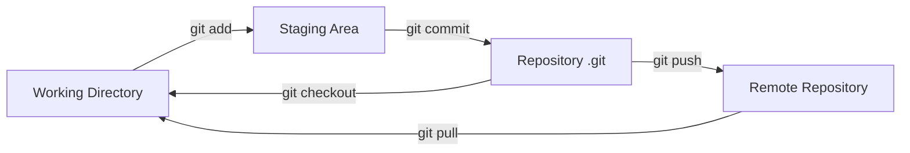
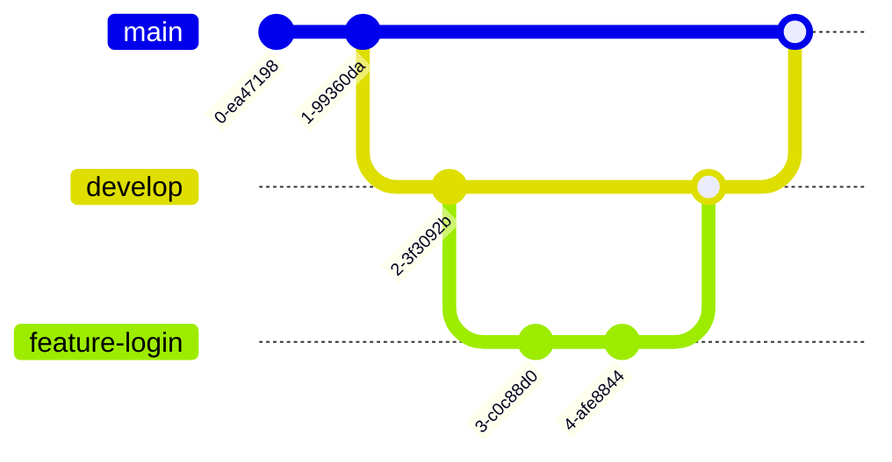
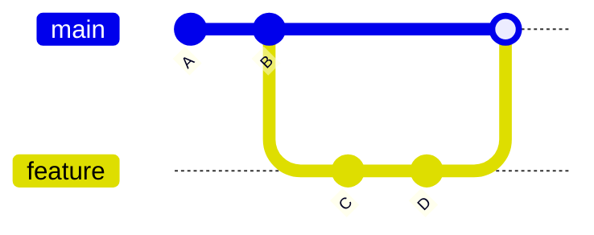
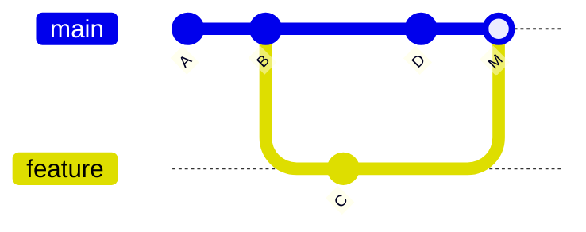
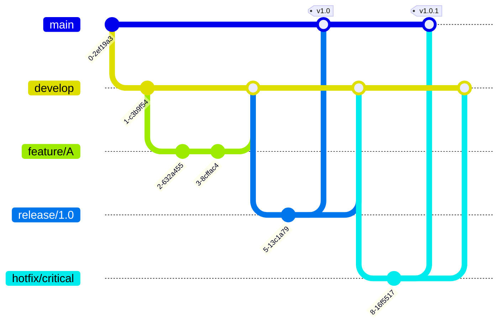

---
tags:
  - git
  - version-control
  - devops
  - collaboration
aliases:
  - Git Version Control
  - Система контролю версій
  - VCS
created: 2025-01-10
topic: DevOps
---

# Git & Version Control

> [!SUMMARY] TL;DR
> Git - розподілена система контролю версій, яка дозволяє відстежувати зміни в коді, працювати паралельно в команді, повертатися до попередніх версій та зберігати історію проекту. Кожен розробник має повну копію репозиторію локально.
> **Ключова ідея:** Git забезпечує безпечну колаборацію, можливість експериментувати через branches та повну історію змін проекту.

## 1. Фундаментальна теорія

### Що таке Version Control?

**Version Control System (VCS)** - система яка записує зміни файлів щоб можна було:
- Повернутись до попередніх версій
- Побачити хто, коли і що змінив
- Працювати паралельно над різними features
- Об'єднувати зміни від різних людей

### Типи VCS

| Тип | Приклади | Архітектура | Переваги/Недоліки |
| :--- | :--- | :--- | :--- |
| **Local** | RCS | Локальна БД версій | ✅ Простий ❌ Не для команд |
| **Centralized** | SVN, CVS | Центральний сервер | ✅ Простий ❌ Single point of failure |
| **Distributed** | Git, Mercurial | Повна копія у кожного | ✅ Надійний ✅ Offline work |

### Чому Git?

**Переваги:**
- ✅ Розподілена система - кожен має full backup
- ✅ Branching and merging - дуже швидкі та легкі операції
- ✅ Staging area - можна вибирати що commit'ити
- ✅ Performance - більшість операцій локальні
- ✅ Cryptographic integrity - SHA-1 hash для кожного commit
- ✅ Industry standard - використовується всюди

> [!INFO] Історія
> Git створив Linus Torvalds у 2005 році для розробки Linux kernel. Назва "Git" - британський сленг для "неприємна людина" 😄

## 2. Основні концепції

### 2.1 Repository (Репозиторій)

**Що це:** Директорія з файлами проекту + прихована `.git/` папка з історією

```bash
# Ініціалізувати новий репозиторій
git init

# Клонувати існуючий
git clone https://github.com/user/repo.git
```

**Структура .git/ папки:**
```
.git/
├── HEAD              # Вказівник на поточну branch
├── config            # Конфігурація репозиторію
├── objects/          # База даних всіх об'єктів (commits, files)
├── refs/             # Вказівники на commits (branches, tags)
├── index             # Staging area
└── hooks/            # Scripts для автоматизації
```

---

### 2.2 Three States of Git



**1. Working Directory (Робоча директорія)**
- Файли з якими ти працюєш зараз
- Зміни ще не tracked

**2. Staging Area (Index)**
- Проміжна зона для підготовки commit'а
- Можна вибрати які зміни включити в commit

**3. Repository (.git directory)**
- База даних з історією всіх commits
- Permanentне сховище

> [!TIP] Чому Staging Area корисна?
> Можеш зробити багато змін, але commit'нути тільки частину - наприклад, bug fix окремо від refactoring'у

**Перевірка стану:**
```bash
git status

# Output приклад:
On branch main
Changes to be committed:  # ← Staging area
  modified:   file1.py

Changes not staged:       # ← Working directory
  modified:   file2.py

Untracked files:
  newfile.py
```

---

### 2.3 Commits

**Commit** - snapshot файлів в певний момент часу + метадата

**Що містить commit:**
- Дерево файлів та їх зміст
- Автор та email
- Дата та час
- Commit message
- Вказівник на parent commit(s)
- SHA-1 hash (унікальний ID)

```bash
# Створити commit
git add .                          # Додати всі зміни в staging
git add file1.py file2.py          # Додати конкретні файли
git add -p                         # Інтерактивно вибрати частини файлу

git commit -m "Add user authentication"
git commit -m "feat: add OAuth login

- Implement Google OAuth
- Add session management
- Update UI for login page

Closes #123"
```

> [!WARNING] Що НЕ commit'ити
> - **Sensitive data:** API keys, passwords, certificates
> - **Generated files:** `node_modules/`, `__pycache__/`, build artifacts
> - **IDE settings:** `.idea/`, `.vscode/` (unless shared in team)
> - **OS files:** `.DS_Store`, `Thumbs.db`
> 
> Використовуй `.gitignore` для виключення!

---

### 2.4 Branches

**Branch** - це просто вказівник на commit. Дозволяє працювати над features незалежно.

```bash
# Створити нову branch
git branch feature-login
git checkout feature-login
# АБО коротше:
git checkout -b feature-login

# Переключитись між branches
git checkout main

# Подивитись всі branches
git branch                    # локальні
git branch -a                # включаючи remote
```

**Typical branch structure:**


**Naming conventions:**
- `main` / `master` - основна production branch
- `develop` - development branch
- `feature/user-auth` - нова фича
- `bugfix/login-error` - виправлення бага
- `hotfix/security-patch` - термінове виправлення в prod
- `release/v1.2.0` - release preparation

---

### 2.5 Merging

**Merge** - об'єднання змін з однієї branch в іншу

**Типи merge:**

**1. Fast-Forward Merge**
```bash
# Якщо в target branch не було нових commits
git checkout main
git merge feature-login

# Git просто пересуває pointer вперед
```



**2. Three-Way Merge**
```bash
# Якщо в обох branches були зміни
git checkout main
git merge feature-login

# Git створює merge commit
```



**3. Rebase (альтернатива merge)**
```bash
git checkout feature-login
git rebase main

# Переносить commits з feature-login на top of main
```

> [!WARNING] Golden Rule of Rebase
> **Ніколи не rebase публічні branches!** Rebase змінює історію, що може зруйнувати роботу колег.

---

### 2.6 Merge Conflicts

**Конфлікт виникає** коли дві branches змінили одні й ті самі лінії коду.

```bash
git merge feature-login

# Output:
Auto-merging auth.py
CONFLICT (content): Merge conflict in auth.py
Automatic merge failed; fix conflicts and then commit the result.
```

**Файл з конфліктом:**
```python
def login(username, password):
<<<<<<< HEAD
    # Версія з поточної branch (main)
    return authenticate_v2(username, password)
=======
    # Версія з feature branch
    return oauth_login(username, password)
>>>>>>> feature-login
```

**Як вирішити:**
1. Відкрити файл з конфліктом
2. Вибрати яку версію залишити (або об'єднати обидві)
3. Видалити markers (`<<<<<<<`, `=======`, `>>>>>>>`)
4. Зберегти файл
5. `git add auth.py`
6. `git commit`

**Tools для merge conflicts:**
- VS Code built-in merge editor
- `git mergetool` - візуальний інструмент
- GitKraken, SourceTree - GUI clients

## 3. Remote Repositories

### 3.1 Основні поняття

**Remote** - версія репозиторію на сервері (GitHub, GitLab, Bitbucket)

```bash
# Подивитись remotes
git remote -v

# Output:
origin  https://github.com/user/repo.git (fetch)
origin  https://github.com/user/repo.git (push)

# Додати новий remote
git remote add upstream https://github.com/original/repo.git

# Видалити remote
git remote remove origin
```

---

### 3.2 Push & Pull

```bash
# PUSH - відправити локальні commits на remote
git push origin main
git push -u origin feature-login    # -u встановлює tracking

# PULL - завантажити зміни з remote
git pull origin main
# Еквівалентно:
# git fetch origin
# git merge origin/main

# FETCH - завантажити зміни БЕЗ merge
git fetch origin
git log origin/main    # подивитись що змінилось
```

**Push force (небезпечно!):**
```bash
git push --force origin main         # ⚠️ Перезаписує remote історію
git push --force-with-lease origin main  # ✅ Безпечніша версія
```

> [!WARNING] Force Push
> Force push можна використовувати **тільки** на feature branches, де ти працюєш один! На `main`/`develop` - ніколи!

---

### 3.3 GitHub/GitLab Workflow

**Fork → Clone → Branch → Commit → Push → Pull Request**

```bash
# 1. Fork repo на GitHub (через UI)

# 2. Clone свій fork
git clone https://github.com/YOUR_USERNAME/repo.git
cd repo

# 3. Додати original repo як upstream
git remote add upstream https://github.com/ORIGINAL_OWNER/repo.git

# 4. Створити feature branch
git checkout -b feature-amazing-feature

# 5. Зробити зміни та commit
git add .
git commit -m "feat: add amazing feature"

# 6. Push в свій fork
git push origin feature-amazing-feature

# 7. Створити Pull Request на GitHub
# (через UI: Compare & pull request)

# 8. Після merge, синхронізувати з upstream
git checkout main
git pull upstream main
git push origin main
```

## 4. Практичні приклади

### 4.1 Daily Workflow

```bash
# Початок дня - отримати останні зміни
git checkout main
git pull origin main

# Створити feature branch
git checkout -b feature/user-profile

# Працювати над feature
# ... edit files ...

# Перевірити що змінилось
git status
git diff

# Додати зміни в staging
git add src/components/UserProfile.js
git add src/styles/profile.css

# Commit
git commit -m "feat(profile): add user profile component

- Create UserProfile component
- Add profile styling
- Implement avatar upload

Relates to #42"

# Push на remote
git push origin feature/user-profile

# Створити Pull Request на GitHub

# Після code review та merge
git checkout main
git pull origin main
git branch -d feature/user-profile    # видалити локальну branch
git push origin --delete feature/user-profile  # видалити remote branch
```

---

### 4.2 Hotfix Workflow

```bash
# Терміновий bug в production!

# 1. Створити hotfix branch з main
git checkout main
git pull origin main
git checkout -b hotfix/security-vulnerability

# 2. Виправити bug
# ... fix code ...

# 3. Commit and push
git add .
git commit -m "fix: patch security vulnerability CVE-2024-1234"
git push origin hotfix/security-vulnerability

# 4. Створити PR в main (для негайного deploy)

# 5. ВАЖЛИВО: також merge в develop щоб fix не загубився
git checkout develop
git merge hotfix/security-vulnerability
git push origin develop

# 6. Cleanup
git branch -d hotfix/security-vulnerability
```

---

### 4.3 Переглянути історію

```bash
# Лог commits
git log
git log --oneline                    # компактний вигляд
git log --graph --all --decorate     # візуалізація branches
git log --author="Andrew"            # commits певного автора
git log --since="2 weeks ago"        # за період
git log -- file.py                   # історія конкретного файлу

# Подивитись конкретний commit
git show abc123

# Порівняти versions
git diff                             # working directory vs staging
git diff --staged                    # staging vs last commit
git diff main feature-login          # між branches
git diff abc123 def456               # між commits
```

---

### 4.4 Відмінити зміни

```bash
# UNSTAGE файл (зберігаючи зміни)
git restore --staged file.py

# ВІДМІНИТИ зміни в working directory (небезпечно - незворотньо!)
git restore file.py
git checkout -- file.py              # старий синтаксис

# AMEND останній commit (змінити message або додати файл)
git commit --amend -m "New message"
git add forgotten_file.py
git commit --amend --no-edit         # додати файл без зміни message

# REVERT commit (створює новий commit що відміняє)
git revert abc123                    # безпечний спосіб

# RESET (НЕБЕЗПЕЧНО - змінює історію)
git reset --soft HEAD~1              # відмінити commit, зміни в staging
git reset --mixed HEAD~1             # відмінити commit та staging
git reset --hard HEAD~1              # ⚠️ ВИДАЛЯЄ ВСЕ (commit + зміни)

# RESET до конкретного commit
git reset --hard abc123
```

> [!WARNING] git reset --hard
> Використовуй `--hard` тільки якщо впевнений що хочеш видалити всі зміни назавжди! Це НЕЗВОРОТНЬО (ну майже, є git reflog але складно).

## 5. Best Practices

### 5.1 Commit Messages

**Conventional Commits format:**
```
<type>(<scope>): <short description>

<body - optional>

<footer - optional>
```

**Types:**
- `feat:` - нова фіча
- `fix:` - bug fix
- `docs:` - документація
- `style:` - форматування, semicolons (не змінює логіку)
- `refactor:` - рефакторинг (не feat, не fix)
- `test:` - додавання тестів
- `chore:` - рутинні завдання (build, dependencies)

**Приклади:**
```bash
git commit -m "feat(auth): implement OAuth2 login"
git commit -m "fix(api): handle null response from payment gateway"
git commit -m "docs(readme): add installation instructions"
git commit -m "refactor(db): optimize query performance"
```

**7 правил good commit message:**
1. Відділяй subject від body порожнім рядком
2. Subject max 50 символів
3. Subject з великої літери
4. Без крапки в кінці subject
5. Imperative mood ("Add feature", not "Added feature")
6. Body wrap at 72 characters
7. Body пояснює "що" та "чому", не "як"

---

### 5.2 Branching Strategy

**Git Flow:**


**GitHub Flow (простіший):**
- `main` - завжди deployable
- Feature branches з `main`
- Pull Requests для code review
- Merge в `main` = deploy

---

### 5.3 .gitignore

**Приклад для Python/Node.js проекту:**
```gitignore
# Python
__pycache__/
*.py[cod]
*.so
.Python
env/
venv/
.env

# Node.js
node_modules/
npm-debug.log
yarn-error.log

# IDE
.vscode/
.idea/
*.swp

# OS
.DS_Store
Thumbs.db

# Build
dist/
build/
*.egg-info/

# Secrets
.env.local
secrets.json
*.pem
```

> [!TIP] gitignore.io
> [gitignore.io](https://gitignore.io/) - генератор .gitignore для різних технологій

---

### 5.4 Git Hooks

**Автоматизація через scripts в `.git/hooks/`**

**Приклад pre-commit hook (Python linting):**
```bash
#!/bin/sh
# .git/hooks/pre-commit

# Run linter
pylint src/
if [ $? -ne 0 ]; then
    echo "❌ Linting failed! Fix issues before commit."
    exit 1
fi

# Run tests
pytest tests/
if [ $? -ne 0 ]; then
    echo "❌ Tests failed! Fix tests before commit."
    exit 1
fi

echo "✅ All checks passed!"
exit 0
```

**Популярні hooks:**
- `pre-commit` - перед commit (linting, formatting)
- `commit-msg` - валідація commit message
- `pre-push` - перед push (запустити тести)

**Tools:**
- [pre-commit framework](https://pre-commit.com/) - керування hooks
- [husky](https://typicode.github.io/husky/) - для Node.js проектів

## 6. Проблеми та рішення

> [!WARNING] Типові проблеми

### Проблема 1: "Accidentally committed to main instead of feature branch"

```bash
# Рішення:
# 1. Створити нову branch з цим commit
git branch feature-my-feature

# 2. Reset main до попереднього commit
git reset --hard HEAD~1

# 3. Переключитись на feature branch
git checkout feature-my-feature
```

### Проблема 2: "Need to undo last commit but keep changes"

```bash
git reset --soft HEAD~1
# Зміни залишаться в staging area
```

### Проблема 3: "Merge conflict is too complex"

```bash
# Відмінити merge
git merge --abort

# АБО відмінити rebase
git rebase --abort
```

### Проблема 4: "Committed sensitive data (password, API key)"

```bash
# ⚠️ Якщо ще НЕ push'нув:
git reset --soft HEAD~1
# Видали sensitive data з файлів
git add .
git commit -m "Fixed commit"

# ⚠️ Якщо вже push'нув - складніше:
# 1. BFG Repo-Cleaner або git-filter-branch для очистки історії
# 2. Force push
# 3. Rotate credentials негайно!
```

> [!WARNING] Якщо зробив leak credentials
> 1. **Rotate secrets негайно** - вважай що leaked
> 2. Очисти Git history
> 3. Включи secret scanning (GitHub Advanced Security)

### Проблема 5: "Lost commits after git reset --hard"

```bash
# Git reflog показує ВСІ операції, навіть після reset
git reflog

# Знайди SHA потрібного commit
git checkout abc123

# Або створи branch
git branch recovery-branch abc123
```

## 7. Корисні посилання

**Документація:**
- [Pro Git Book](https://git-scm.com/book) - офіційна книга (безкоштовна)
- [Git Documentation](https://git-scm.com/docs)
- [GitHub Guides](https://guides.github.com/)
- [Atlassian Git Tutorials](https://www.atlassian.com/git/tutorials)

**Interactive Learning:**
- [Learn Git Branching](https://learngitbranching.js.org/) - інтерактивна візуалізація
- [Oh Shit, Git!?!](https://ohshitgit.com/) - як виправити типові помилки

**Tools:**
- [GitHub Desktop](https://desktop.github.com/) - GUI client
- [GitKraken](https://www.gitkraken.com/) - візуальний Git client
- [Sourcetree](https://www.sourcetreeapp.com/) - безкоштовний Git GUI
- [Git Graph](https://marketplace.visualstudio.com/items?itemName=mhutchie.git-graph) - VS Code extension

**Hosting:**
- [GitHub](https://github.com) - найпопулярніший
- [GitLab](https://gitlab.com) - з вбудованим CI/CD
- [Bitbucket](https://bitbucket.org) - інтеграція з Atlassian tools

---

**Пов'язані теми:**
- [[GitHub Actions]] - CI/CD
- [[Code Review Best Practices]]
- [[CI-CD]]
- [[DevOps]]

**Next Actions:**
- [ ] Налаштувати Git конфігурацію (name, email)
- [ ] Створити `.gitignore` для свого проекту
- [ ] Встановити pre-commit hooks
- [ ] Практикувати Git Flow на pet project
