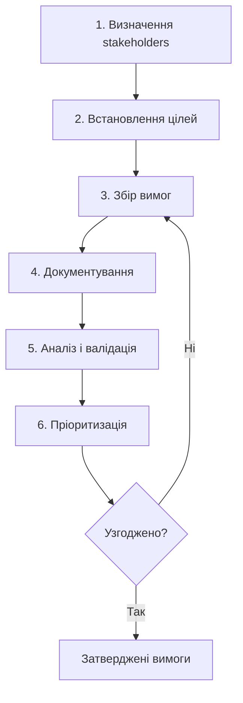

---
tags:
  - requirements
  - elicitation
  - stakeholders
  - business-analysis
aliases:
  - Requirements Elicitation
  - Requirements Gathering
  - Збір вимог
created: 2025-01-10
topic: Software Engineering
---

#  Requirements Gathering (Збір вимог)

> [!SUMMARY] TL;DR
> Requirements Gathering (Elicitation) — процес збору, виявлення та документування вимог від stakeholders. Включає ідентифікацію зацікавлених сторін, встановлення цілей, використання методів збору інформації (інтерв'ю, workshops, опитування), документування та валідацію вимог. Це фундаментальний етап, який визначає ЩО потрібно побудувати.
> 
> **Ключова ідея:** "Garbage in, garbage out" — якість фінального продукту залежить від якості зібраних вимог.

## 1. Основні етапи процесу



---

## 2. Етап 1: Визначення зацікавлених сторін

**Мета:** Ідентифікувати всіх людей/групи які впливають на проект або будуть його користувачами.

**Типи stakeholders:**

| Тип | Роль | Приклад |
| :--- | :--- | :--- |
| **Primary** | Безпосередні користувачі | End users, customers |
| **Secondary** | Непрямі користувачі | Support team, admins |
| **Tertiary** | Впливають на вимоги | Management, legal, compliance |
| **Facilitating** | Технічна реалізація | Dev team, architects, DevOps |

**Техніки ідентифікації:**
- Stakeholder mapping
- Organizational charts
- Workshops з ключовими особами
- Brainstorming sessions

**Приклад:**
```
Project: E-Commerce Platform

Primary Stakeholders:
- Online shoppers (end users)
- Store managers (product management)

Secondary:
- Customer support agents
- Marketing team

Tertiary:
- Finance department (payment compliance)
- Legal team (GDPR, terms of service)

Facilitating:
- Development team
- UX designers
- Security team
```

> [!TIP] Best Practice
> Створи stakeholder matrix з оцінкою їх впливу (influence) та зацікавленості (interest). Це допоможе визначити з ким потрібно найбільше взаємодіяти.

---

## 3. Етап 2: Встановлення цілей і завдань

**Мета:** Визначити загальні цілі проекту та конкретні завдання для досягнення.

**Business Goals (бізнес-цілі):**
```
SMART формат:
- Specific (конкретна)
- Measurable (вимірювана)
- Achievable (досяжна)
- Relevant (релевантна)
- Time-bound (обмежена часом)

Приклад:
❌ "Покращити UX"
✅ "Зменшити час checkout процесу з 8 до 3 хвилин 
   для 90% користувачів протягом Q2 2025"
```

**Project Objectives:**
```
Бізнес-ціль: Збільшити online продажі на 30%

Objectives (як досягти):
1. Спростити checkout (3 кроки замість 7)
2. Додати guest checkout (без реєстрації)
3. Інтегрувати Apple Pay / Google Pay
4. Покращити mobile UX (responsive design)
5. Додати product recommendations (AI)
```

**Зв'язок з вимогами:**
```
Business Goal → Objectives → Features → Requirements

Приклад:
Goal: Збільшити продажі
  └─> Objective: Guest checkout
      └─> Feature: Checkout без реєстрації
          └─> Requirement: "System shall allow checkout 
              with email only, no password required"
```

---

## 4. Етап 3: Збір вимог (Elicitation Techniques)

### 4.1 Інтерв'ю (Interviews)

**Structured Interview (структуроване):**
- Заздалегідь підготовлені питання
- Всі респонденти отримують однакові питання
- Легко порівнювати відповіді

**Unstructured Interview (неструктуроване):**
- Вільна бесіда
- Глибше розуміння контексту
- Більше часу, важче аналізувати

**Semi-structured (комбінований):**
- Базові питання + вільна дискусія
- Найпопулярніший підхід

**Приклад питань:**
```
Для end user:
- "Опишіть типовий робочий день з вашим інструментом"
- "Які найбільші проблеми ви зараз маєте?"
- "Що ви робите коли [X ситуація]?"
- "Як би ви хотіли щоб це працювало?"

Для business stakeholder:
- "Які ключові метрики успіху для цього проекту?"
- "Хто основні конкуренти та їх переваги?"
- "Які обмеження (budget, timeline, compliance)?"

Для technical stakeholder:
- "Які існуючі системи потрібно інтегрувати?"
- "Які технічні constraints (legacy systems, APIs)?"
- "Які non-functional requirements (performance, security)?"
```

> [!WARNING] Помилки інтерв'ю
> - **Leading questions:** "Ви ж згодні що feature X корисна?" → спотворює відповідь
> - **Не записувати:** Завжди записуй notes або audio (з дозволом)
> - **Ігнорувати контекст:** Питай "чому" та "як" для розуміння контексту

---

### 4.2 Workshops / JAD Sessions

**JAD (Joint Application Design)** — структуровані workshops з ключовими stakeholders.

**Формат:**
```
Учасники: 5-15 осіб
- Business stakeholders
- End users
- Business analysts
- Tech leads
- UX designers

Тривалість: 2-4 години (або кілька сесій)

Фасилітатор: Business Analyst

Agenda:
1. Презентація цілей проекту (15 min)
2. Brainstorming features (30 min)
3. Discussion і деталізація (60 min)
4. Prioritization (30 min)
5. Action items (15 min)
```

**Переваги:**
- ✅ Швидкий збір від багатьох stakeholders
- ✅ Одразу розв'язуються конфлікти між вимогами
- ✅ Загальне розуміння візії

**Недоліки:**
- ❌ Потребує досвідченого фасилітатора
- ❌ Складно організувати (schedule conflicts)
- ❌ Домінантні особи можуть заглушити інших

**Інструменти:**
- Whiteboard / Miro / FigJam
- Post-it notes для voting
- Timer для time-boxing

---

### 4.3 Опитування / Анкетування (Surveys/Questionnaires)

**Коли використовувати:**
- Велика кількість респондентів (100+)
- Географічно розподілені користувачі
- Потрібна статистична валідність
- Бюджет/час обмежені

**Типи питань:**

```
Closed-ended (закриті):
- Yes/No: "Чи використовуєте ви mobile app?"
- Multiple choice: "Як часто? (Daily / Weekly / Monthly / Rarely)"
- Rating scale: "Оцініть задоволеність від 1 до 5"

Open-ended (відкриті):
- "Які features вам найбільше потрібні?"
- "Опишіть останню проблему яку ви мали з системою"
```

**Best Practices:**
```
✅ DO:
- Коротке опитування (< 10 хвилин)
- Чіткі питання без жаргону
- Progress bar (скільки залишилось)
- Опційний email для follow-up
- Тестувати на 5-10 людях перед масовою розсилкою

❌ DON'T:
- Занадто довге (> 50 питань)
- Leading questions
- Змішувати кілька тем в одному питанні
- Робити всі питання обов'язковими
```

**Інструменти:**
- Google Forms (безкоштовно)
- Typeform (красивий UX)
- SurveyMonkey (аналітика)

---

### 4.4 Спостереження (Observation / Shadowing)

**Мета:** Побачити як користувачі насправді працюють (не як вони кажуть).

**Методи:**

**Passive Observation:**
- Просто спостерігаєш, не втручаєшся
- Користувач виконує свої звичайні задачі
- Записуєш notes, screenshot workflow

**Active Observation (Contextual Inquiry):**
- Спостерігаєш + задаєш питання в процесі
- "Чому ви зараз це зробили?"
- "Що означає це повідомлення?"

**Приклад:**
```
Task: Дізнатись як support agents обробляють tickets

Observation:
1. Agent отримує ticket по email
2. Копіює email вручну в CRM (!)
3. Шукає customer profile (3 різні системи)
4. Копіює відповідь з Excel файлу з шаблонами
5. Відправляє email, вручну міняє status в CRM

Insights:
❌ Багато manual copy-paste (помилки, час)
❌ 3 системи для одного клієнта (fragmented data)
❌ Шаблони в Excel (не версіоновані, важко знайти)

Requirements:
✅ Автоматична синхронізація email → CRM
✅ Unified customer profile view
✅ Built-in response templates з search
```

> [!TIP] Hawthorne Effect
> Люди працюють інакше коли знають що їх спостерігають. Намагайся бути максимально непомітним або проводь кілька сесій (перша для звикання).

---

### 4.5 Аналіз документів (Document Analysis)

**Що аналізувати:**
```
Існуюча документація:
- User manuals
- Business process documentation
- Existing requirements (legacy system)
- Support tickets / bug reports
- Analytics reports (Google Analytics)
- Competitor analysis

Законодавство:
- Compliance requirements (GDPR, HIPAA)
- Industry standards (PCI DSS)
- Company policies
```

**Приклад:**
```
Джерело: Support tickets за останні 6 місяців

Findings:
- 45% tickets: "Не можу знайти функцію X" → UX problem
- 30% tickets: "Slow performance" → Performance requirement
- 15% tickets: "Mobile doesn't work" → Mobile compatibility
- 10% tickets: Feature requests

Requirements:
→ Improve navigation (search, better menu)
→ Performance < 2 sec page load
→ Responsive design
→ Feature X, Y, Z (most requested)
```

---

### 4.6 Brainstorming

**Мета:** Генерувати якомога більше ідей без критики.

**Правила:**
1. ❌ **No criticism** — жодної критики під час генерації
2. ✅ **Quantity over quality** — чим більше ідей, тим краще
3. ✅ **Build on others' ideas** — комбінуй та покращуй
4. ✅ **Wild ideas welcome** — навіть божевільні ідеї

**Техніки:**

**Mind Mapping:**
```
                  E-Commerce
                      |
        +-------------+-------------+
        |             |             |
    Checkout      Search        Payment
        |             |             |
   Guest mode    Filters      Apple Pay
   Saved cards    AI reco.    Crypto
   1-click        Voice        Split pay
```

**"How Might We" (HMW):**
```
Problem: Users abandon cart because checkout is long

HMW питання:
- "How might we reduce checkout to 1 minute?"
- "How might we eliminate form fields?"
- "How might we make payment instant?"

Ideas:
→ Autofill з Google / Apple account
→ Skip shipping address for digital goods
→ Saved payment methods
→ Buy with 1 click (Amazon style)
```

---

### 4.7 Prototyping

**Коли використовувати:**
- Складні UX workflows
- Інноваційні features (користувачі не знають що хочуть)
- Візуалізувати ідею швидше ніж пояснити словами

**Типи:**

**Low-fidelity (lo-fi):**
- Paper sketches
- Wireframes (Figma, Balsamiq)
- Швидко, дешево
- Фокус на функціональності, не дизайні

**High-fidelity (hi-fi):**
- Interactive prototypes (Figma, Adobe XD)
- Виглядає майже як реальний продукт
- Для детального user testing

**Приклад процесу:**
```
1. Створи lo-fi wireframe
2. Покажи stakeholders
3. Збери feedback: "Тут потрібна кнопка X"
4. Ітерація
5. High-fi prototype
6. User testing з 5-10 користувачами
7. Фіналізація requirements на базі feedback
```

---

## 5. Етап 4: Документування вимог

**Формати:**

**[[URS]] (User Requirements Specification):**
- User stories
- Use cases
- User personas

**[[SRS]] (Software Requirements Specification):**
- Functional requirements (деталізовані)
- Non-functional requirements
- System interfaces

**Приклад документування:**
```
Feature: Guest Checkout

User Story:
As a first-time visitor,
I want to checkout without creating account,
So that I can complete purchase quickly

Functional Requirements:
FR-CHECKOUT-001: System shall allow checkout with 
                 email and shipping address only
FR-CHECKOUT-002: System shall send order confirmation 
                 to provided email
FR-CHECKOUT-003: System shall offer account creation 
                 after successful purchase

Acceptance Criteria:
✅ Can complete purchase in < 3 minutes
✅ No password required
✅ Email validation works
✅ Can track order via emailed link

Non-Functional:
NFR-CHECKOUT-001: Checkout process < 500ms response time
NFR-CHECKOUT-002: SSL/TLS encryption for all data
```

---

## 6. Етап 5: Аналіз і валідація вимог

**Критерії якості вимог:**

| Критерій | Що означає | Приклад |
| :--- | :--- | :--- |
| **Clear** | Однозначне розуміння | ❌ "Fast" → ✅ "< 200ms" |
| **Complete** | Всі деталі описані | Включає всі edge cases |
| **Consistent** | Не суперечить іншим | Не конфлікти між requirements |
| **Testable** | Можна перевірити | Є acceptance criteria |
| **Feasible** | Технічно можливо | Перевірено з tech lead |
| **Traceable** | Є зв'язок з business goal | Зрозуміло навіщо |

**Методи валідації:**

**Requirements Review:**
```
Учасники: BA, stakeholders, tech leads

Checklist:
☐ Всі stakeholders узгодили?
☐ Немає конфліктів між вимогами?
☐ Технічно feasible?
☐ В межах budget/timeline?
☐ Є acceptance criteria?
☐ Пріоритети визначені?
```

**Prototyping Validation:**
- Покажи prototype користувачам
- "Чи це те що ви хотіли?"
- Збери feedback

**Acceptance Test Cases:**
```
Requirement: "User can reset password via email"

Test Case:
1. Click "Forgot password"
2. Enter registered email
3. Check email inbox
4. Click reset link
5. Enter new password
6. Login with new password

Expected: ✅ Login successful
```

---

## 7. Етап 6: Пріоритизація вимог

**Методи:**

### MoSCoW Method

```
Must Have: Критично, без цього система не працює
  → User login, payment processing

Should Have: Важливо, але можна відкласти на v1.1
  → Search filters, product reviews

Could Have: Nice to have, якщо залишиться час
  → Wishlist, gift cards

Won't Have: Точно не в цьому релізі
  → AI chatbot, VR showroom
```

### Kano Model

```
Basic Needs: Очікується за замовчуванням (незадоволення якщо немає)
  → Website працює, можна купити товар

Performance: Чим більше, тим краще
  → Швидкість сайту, variety товарів

Delighters: Несподівані features (wow-effect)
  → Персональні рекомендації, AR примірка
```

### Value vs Effort Matrix

```
        High Value
            |
  Quick     |    Strategic
  Wins      |    Initiatives
  (Do Now)  |    (Plan)
------------|------------
  Low       |    Time
  Priority  |    Wasters
  (Later)   |    (Avoid)
            |
        Low Value
        
    (Low Effort → High Effort)
```

**Приклад:**
```
Feature: Guest checkout
Value: High (збільшить conversion на 30%)
Effort: Medium (2-3 sprints)
Priority: Must Have → Strategic Initiative

Feature: AR product preview
Value: Medium (wow-effect)
Effort: Very High (6+ months)
Priority: Won't Have → Future consideration
```

---

## 8. Проблеми та рішення

> [!WARNING] Типові проблеми

**Problem 1: "Stakeholders don't agree"**
```
Symptom: Різні stakeholders хочуть різного

Solution:
1. Facilitate workshop — обговорення віч-на-віч
2. Показати trade-offs — "Якщо X, то не Y"
3. Пріоритизація based on business goals
4. Executive sponsor робить final decision
```

**Problem 2: "Requirements are too vague"**
```
Symptom: "System should be user-friendly"

Solution:
→ Ask "What does user-friendly mean?"
→ Get specific examples
→ Define measurable criteria:
  ✅ "90% users complete task in < 3 min without help"
```

**Problem 3: "Scope creep"**
```
Symptom: Постійно додаються нові вимоги

Solution:
→ Встанови change request process
→ Оцінюй impact (cost, timeline)
→ Re-prioritize: що викинути якщо додаємо нове?
→ "Yes, але в v2.0"
```

**Problem 4: "Users say one thing, do another"**
```
Symptom: Інтерв'ю vs реальність різняться

Solution:
→ Use observation (shadowing)
→ Prototype testing
→ Analytics data > words
→ "Show, don't tell"
```

---

## 9. Чеклист для BA

**Перед початком:**
```
☐ Визначені всі stakeholders
☐ Є доступ до stakeholders (calendar time)
☐ Цілі проекту чіткі (SMART)
☐ Є baseline документація (існуючі процеси)
☐ Визначено методи збору (інтерв'ю, workshops, etc.)
```

**Під час збору:**
```
☐ Кожна зустріч записується (notes/audio)
☐ Follow-up питання задаються одразу
☐ Підтверджую розуміння з stakeholder
☐ Edge cases обговорюються
☐ Non-functional requirements не забуті
```

**Після збору:**
```
☐ Всі вимоги задокументовані
☐ Вимоги validated з stakeholders
☐ Пріоритети узгоджені
☐ Конфлікти resolved
☐ Sign-off від ключових stakeholders
☐ Requirements передані в [[SRS]]
```

---

## 10. Інструменти

**Requirements Management:**
- Jira / Azure DevOps (user stories)
- Confluence (документація)
- Notion (знання база)

**Prototyping:**
- Figma / Adobe XD (hi-fi)
- Balsamiq / Whimsical (lo-fi)
- Miro / FigJam (workshops)

**Surveys:**
- Google Forms
- Typeform
- SurveyMonkey

**Interview Recording:**
- Otter.ai (transcription)
- Zoom (запис)
- Notion (notes)

---

**Пов'язані теми:**
- [[URS]] — User Requirements Specification
- [[SRS]] — Software Requirements Specification
- [[SDLC]] — Software Development Lifecycle
- [[Scrum]] — User stories in Agile

**Ресурси:**
- [BABOK (Business Analysis Body of Knowledge)](https://www.iiba.org/standards-and-resources/babok/)
- [Requirements Engineering by Ian Sommerville](https://www.softwareengineering.com/)
- [User Story Mapping by Jeff Patton](https://www.jpattonassociates.com/user-story-mapping/)

**Next Actions:**
- [ ] Ідентифікуй stakeholders для поточного проекту
- [ ] Обери 2-3 elicitation methods
- [ ] Schedule interviews/workshops
- [ ] Створи requirements backlog
