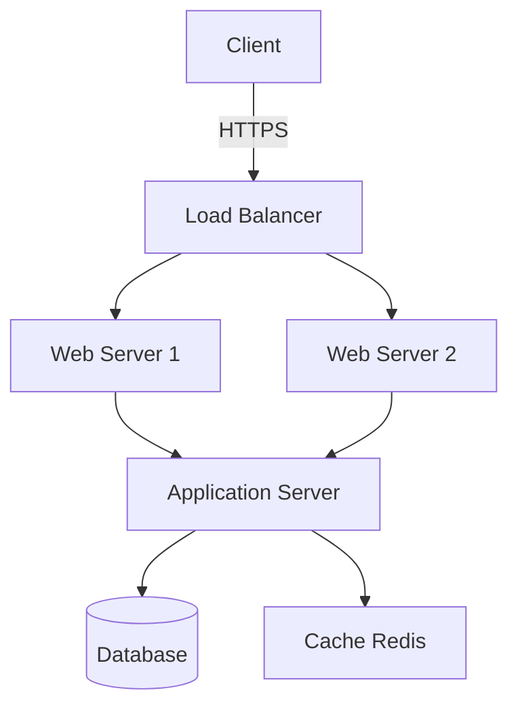
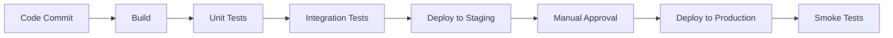
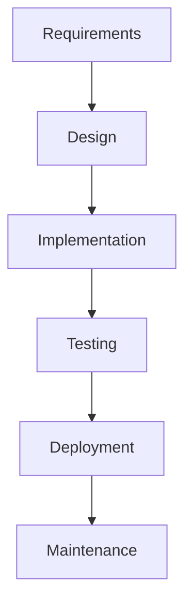
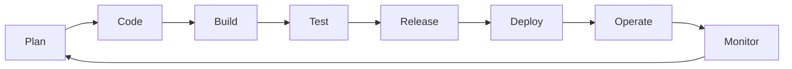

---
tags:
  - software-engineering
  - sdlc
  - methodology
  - process
aliases:
  - Software Development Life Cycle
  - Життєвий цикл розробки ПЗ
  - SDLC
created: 2025-01-10
topic: Software Engineering
---

# Software Development Life Cycle (SDLC)

> [!SUMMARY] TL;DR
> SDLC - це структурований процес розробки програмного забезпечення від початкової ідеї до підтримки та виведення з експлуатації. Включає фази планування, аналізу, дизайну, імплементації, тестування, deployment та maintenance.
> **Ключова ідея:** Систематичний підхід знижує ризики, покращує якість ПЗ та забезпечує передбачуваність проекту.

## 1. Фундаментальна теорія

SDLC визначає **послідовність етапів**, через які проходить проект розробки ПЗ. Кожна фаза має свої:
- **Вхідні дані** (input): що потрібно для початку
- **Активності** (activities): що робиться на етапі
- **Deliverables**: що виходить в результаті
- **Ролі**: хто відповідає

### Основні цілі SDLC:
1. **Передбачуваність** - чітке розуміння timeline та resources
2. **Якість** - систематичний підхід зменшує баги
3. **Контроль витрат** - раннє виявлення проблем дешевше виправляти
4. **Комунікація** - спільна мова для всіх stakeholders

## 2. Основні фази SDLC

### 2.1 Planning (Планування)

**Мета:** Визначити feasibility проекту

**Активності:**
- Аналіз бізнес-потреб
- Оцінка технічної можливості
- Розрахунок вартості та ROI
- Формування project charter

**Deliverables:**
- Project plan
- Budget estimation
- Timeline
- Risk assessment

> [!TIP] Best Practice
> Включайте tech lead'ів на етапі планування - вони можуть виявити технічні ризики, які впливають на вартість

---

### 2.2 Requirements Analysis (Аналіз вимог)

**Мета:** Чітко визначити **ЩО** має робити система

**Активності:**
- Збір вимог від stakeholders
- Документування functional/non-functional requirements
- Створення use cases
- Пріоритизація features

**Deliverables:**
- Requirements Specification Document (SRS)
- Use case diagrams
- User stories (в Agile)

**Types of Requirements:**

| Тип | Опис | Приклад |
| :--- | :--- | :--- |
| Functional | Що система робить | "Користувач може логінитись через email" |
| Non-functional | Якісні характеристики | "Час відповіді < 200ms" |
| Business | Бізнес-правила | "Знижка 10% для клієнтів з premium" |
| Technical | Технічні constraints | "Має працювати на iOS 15+" |

> [!WARNING] Анти-патерн
> "Scope creep" - постійне додавання нових вимог під час розробки. Встановіть процес change management!

---

### 2.3 Design (Проектування)

**Мета:** Визначити **ЯК** буде побудована система

**Рівні дизайну:**

**High-Level Design (HLD):**
- System architecture
- Вибір технологій (tech stack)
- Database schema overview
- API endpoints structure
- Integration points

**Low-Level Design (LLD):**
- Детальний дизайн кожного модуля
- Class diagrams, sequence diagrams
- Algorithms та data structures
- Database tables з constraints

**Deliverables:**
- Architecture diagrams
- Database schema
- API documentation
- UI/UX mockups



---

### 2.4 Implementation (Розробка)

**Мета:** Написати код згідно з дизайном

**Активності:**
- Coding за coding standards
- Code reviews
- Unit testing
- Version control (Git)
- Continuous Integration

**Deliverables:**
- Source code
- Unit tests
- Technical documentation
- Build artifacts

> [!TIP] Best Practices
> - Використовуй coding conventions команди
> - Пиши self-documenting code (чіткі назви змінних/функцій)
> - Follow [[DRY Principle]] - Don't Repeat Yourself
> - Commit often з descriptive messages

**Example commit message:**
```bash
git commit -m "feat(auth): add OAuth2 login flow

- Implement Google OAuth integration
- Add user session management
- Update login page UI

Closes #123"
```

---

### 2.5 Testing

**Мета:** Переконатися що система працює коректно

**Типи тестування:**

| Тип | Що перевіряє | Хто виконує | Приклад інструменту |
| :--- | :--- | :--- | :--- |
| **Unit Testing** | Окремі функції/методи | Developers | Jest, pytest |
| **Integration Testing** | Взаємодію між модулями | Developers/QA | Postman, pytest |
| **System Testing** | Всю систему end-to-end | QA Team | Selenium, Cypress |
| **User Acceptance** | Відповідність бізнес-вимогам | Client/Users | Manual |
| **Performance** | Швидкість, навантаження | QA/DevOps | JMeter, k6 |
| **Security** | Вразливості | Security Team | OWASP ZAP, Burp |

**Testing Pyramid:**
```
        /\
       /  \    E2E Tests (few)
      /____\
     /      \  Integration Tests (some)
    /________\
   /          \ Unit Tests (many)
  /____________\
```

**Deliverables:**
- Test cases
- Test reports
- Bug reports
- Test coverage metrics

> [!WARNING] Важливо
> "Testing doesn't prove absence of bugs, only their presence" - тестування не гарантує що баги відсутні, тільки знаходить ті що є

---

### 2.6 Deployment (Впровадження)

**Мета:** Випустити систему в production

**Підходи:**

**1. Big Bang Deployment**
- Одночасне впровадження для всіх
- Ризиковано для великих систем

**2. Phased Rollout**
- Поступове впровадження по модулях/регіонах
- Менший ризик

**3. Blue-Green Deployment**
- Два ідентичних середовища
- Швидке rollback якщо проблеми

**4. Canary Release**
- Спочатку 5% користувачів
- Поступово збільшуємо якщо все ОК

**Deliverables:**
- Deployment plan
- Rollback plan
- Production environment
- Deployment documentation

**Example CI/CD Pipeline:**


---

### 2.7 Maintenance (Підтримка)

**Мета:** Підтримувати та покращувати систему

**Типи maintenance:**

1. **Corrective** - виправлення багів
2. **Adaptive** - адаптація до нових умов (нова OS, browser)
3. **Perfective** - покращення performance, додавання features
4. **Preventive** - рефакторинг для запобігання проблем

**Активності:**
- Bug fixing
- Performance optimization
- Security patches
- Feature enhancements
- Documentation updates

> [!INFO] Факт
> Згідно досліджень, на maintenance йде 60-80% загального бюджету життєвого циклу ПЗ

## 3. SDLC Models (Моделі)

### 3.1 Waterfall Model

**Суть:** Послідовне виконання фаз, наступна фаза починається тільки після завершення попередньої



**Переваги:**
- ✅ Проста для розуміння та управління
- ✅ Чітка документація на кожному етапі
- ✅ Підходить для проектів з чіткими вимогами
- ✅ Easy to estimate timeline/budget

**Недоліки:**
- ❌ Негнучка - важко внести зміни
- ❌ Working software з'являється пізно
- ❌ Високий ризик якщо вимоги зміняться
- ❌ Клієнт бачить результат тільки в кінці

**Коли використовувати:**
- Вимоги чіткі та стабільні
- Технологія добре відома команді
- Короткий проект

**Приклад:** Розробка embedded software для медичного обладнання (строгі регуляції, чіткі вимоги)

---

### 3.2 Agile Model

**Суть:** Ітеративна розробка, швидка адаптація до змін, постійна взаємодія з клієнтом

**Agile Manifesto принципи:**
1. Люди та взаємодія > процеси та інструменти
2. Працююче ПЗ > вичерпна документація
3. Співпраця з клієнтом > переговори про контракт
4. Реагування на зміни > слідування плану

**Характеристики:**
- Короткі ітерації (sprints 1-4 тижні)
- Робочий продукт після кожної ітерації
- Постійний feedback від клієнта
- Self-organizing teams
- Continuous improvement

**Переваги:**
- ✅ Швидка адаптація до змін
- ✅ Ранній та регулярний delivery
- ✅ Клієнт залучений в процес
- ✅ Проблеми виявляються раніше

**Недоліки:**
- ❌ Менше документації (може бути проблемою)
- ❌ Потребує досвідченої команди
- ❌ Складніше оцінити загальний timeline
- ❌ Scope може нестримано розширюватись

**Популярні Agile frameworks:**
- [[Scrum]] - найпопулярніший (sprints, roles, ceremonies)
- [[Kanban]] - візуалізація workflow, WIP limits
- [[XP]] (Extreme Programming) - technical practices
- [[SAFe]] - для великих організацій

---

### 3.3 DevOps Model

**Суть:** Інтеграція Development та Operations, автоматизація, continuous delivery

**Key Practices:**
- **CI/CD** - Continuous Integration/Deployment
- **Infrastructure as Code** - Terraform, Ansible
- **Monitoring & Logging** - Prometheus, ELK stack
- **Containerization** - Docker, Kubernetes
- **Automation** - автоматизація всього можливого



**Переваги:**
- ✅ Швидкий час до ринку
- ✅ Висока якість через автоматизацію
- ✅ Швидке виявлення та виправлення проблем
- ✅ Краща collaboration

> [!TIP] Best Practice
> "You build it, you run it" - команда що розробляє feature, також відповідає за його роботу в production

## 4. Порівняння моделей

| Критерій | Waterfall | Agile | DevOps |
| :--- | :--- | :--- | :--- |
| **Гнучкість** | Низька | Висока | Висока |
| **Документація** | Extensive | Minimal | As needed |
| **Client involvement** | На початку/кінці | Постійно | Постійно |
| **Release frequency** | Один великий | Регулярні малі | Continuous |
| **Team size** | Any | Small-medium | Small-medium |
| **Risk** | Високий | Середній | Низький |
| **Time to market** | Довгий | Середній | Короткий |

## 5. Вибір SDLC моделі

> [!EXAMPLE] Приклади вибору
> 
> **Проект:** E-commerce startup
> **Вибір:** Agile (Scrum)
> **Чому:** Потрібна швидка адаптація до ринку, часті releases нових features
> 
> **Проект:** Banking core system
> **Вибір:** Waterfall з елементами Agile
> **Чому:** Високі вимоги до безпеки, extensive documentation, але потрібна певна гнучкість
> 
> **Проект:** SaaS продукт
> **Вибір:** DevOps
> **Чому:** Continuous deployment критично важливий, потрібна швидка реакція на feedback

**Питання для вибору моделі:**

1. Наскільки стабільні вимоги? 
   - Стабільні → Waterfall
   - Змінні → Agile

2. Наскільки критична швидкість delivery?
   - Дуже критична → DevOps
   - Може почекати → Waterfall

3. Яка залученість клієнта можлива?
   - Постійна → Agile/DevOps
   - Мінімальна → Waterfall

4. Який розмір команди?
   - Велика → Waterfall або SAFe
   - Мала → Scrum/Kanban

5. Чи критична документація?
   - Дуже → Waterfall
   - Можна мінімальну → Agile

## 6. Проблеми та анти-патерни

> [!WARNING] Типові проблеми

**1. "Requirements never stop changing"**
- **Symptom:** Постійні зміни вимог під час development
- **Solution:** 
  - Використовуй Agile замість Waterfall
  - Встанови change management process
  - Визнач MVP та nice-to-have features

**2. "Testing is always rushed at the end"**
- **Symptom:** Недостатньо часу на тестування
- **Solution:**
  - Shift-left testing (тестуй раніше)
  - Automated testing
  - Include QA в sprint planning

**3. "Documentation is outdated"**
- **Symptom:** Docs не відповідає коду
- **Solution:**
  - Documentation as code (Swagger, OpenAPI)
  - Update docs в рамках Definition of Done
  - Use self-documenting code

**4. "Deployment takes days/weeks"**
- **Symptom:** Складний manual deployment
- **Solution:**
  - Implement CI/CD pipelines
  - Automate deployment
  - Use Infrastructure as Code

**5. "Production bugs discovered after release"**
- **Symptom:** Баги проскакують в prod
- **Solution:**
  - Better test coverage
  - Staging environment identical to prod
  - Canary deployments для раннього виявлення

## 7. Корисні посилання

**Стандарти та frameworks:**
- [ISO/IEC 12207](https://www.iso.org/standard/63712.html) - Software lifecycle processes
- [CMMI](https://cmmiinstitute.com/) - Capability Maturity Model Integration
- [Agile Manifesto](https://agilemanifesto.org/)
- [Scrum Guide](https://scrumguides.org/)

**Tools:**
- **Project Management:** Jira, Azure DevOps, Trello
- **Version Control:** Git, GitHub, GitLab
- **CI/CD:** Jenkins, GitHub Actions, GitLab CI
- **Documentation:** Confluence, Notion
- **Testing:** Selenium, Jest, pytest, Postman

**Books:**
- "The Phoenix Project" - про DevOps transformation
- "Clean Code" - Robert Martin - про implementation best practices
- "Accelerate" - про high-performing teams

---

**Пов'язані теми:**
- [[Scrum]]
- [[Kanban]]
- [[CI-CD]]
- [[Testing Strategies]]
- [[Software Architecture Patterns]]
- [[Agile Methodologies]]

**Next Actions:**
- [ ] Визначити яка SDLC модель використовується в поточному проекті
- [ ] Ідентифікувати pain points в поточному процесі
- [ ] Запропонувати improvements базуючись на best practices
