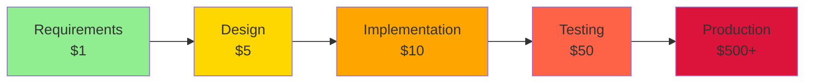
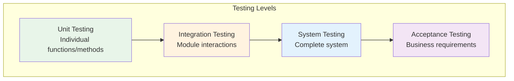
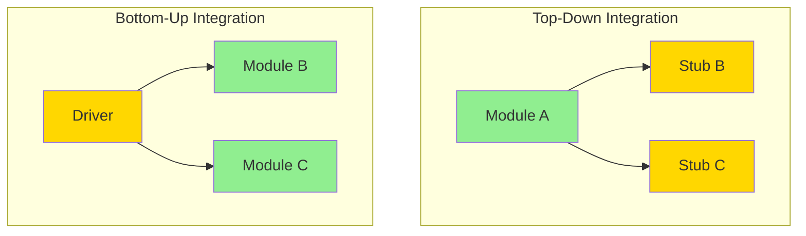
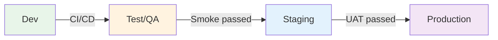
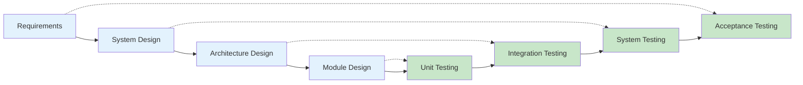
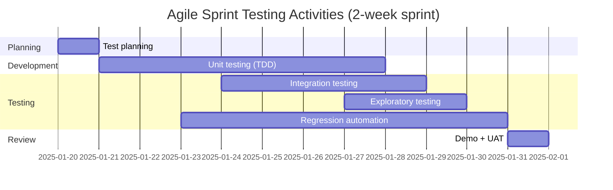

---
tags:
  - software-testing
  - qa
  - sdlc
  - quality-assurance
  - testing-levels
  - testing-types
aliases:
  - Software Testing
  - Тестування ПЗ
  - QA Testing
  - Quality Assurance
created: 2025-01-18
topic: Software Engineering
---

# 🧪 Software Testing

> [!SUMMARY] TL;DR
> Software Testing - систематичний процес верифікації та валідації програмного забезпечення для виявлення дефектів та забезпечення якості. Включає різні типи (functional, non-functional, regression) та рівні (unit, integration, system, acceptance) тестування, інтегровані в SDLC.
> **Ключова ідея:** Раннє та систематичне тестування значно знижує вартість виправлення дефектів та підвищує якість продукту.

## 📚 1. Фундаментальна теорія

### Що таке Software Testing?

**Software Testing** - процес виконання програми з метою знайти помилки та переконатися, що вона відповідає вимогам.

**Два ключові аспекти:**
- **Verification** - "Are we building the product right?" (чи правильно ми будуємо?)
- **Validation** - "Are we building the right product?" (чи те ми будуємо?)

### Testing vs Debugging

| Аспект | Testing | Debugging |
| :--- | :--- | :--- |
| **Мета** | Знайти дефекти | Виправити дефекти |
| **Хто виконує** | QA Engineers, Testers | Developers |
| **Коли** | Протягом всього SDLC | Після знаходження бага |
| **Процес** | Systematical, planned | Investigative, reactive |
| **Результат** | Bug report | Bug fix |

### Cost of Defects

Вартість виправлення дефекту зростає експоненційно залежно від етапу, на якому його знайшли:



> [!WARNING] Важливо
> Bug знайдений в production коштує в 100+ разів дорожче, ніж знайдений на етапі requirements. Це включає: час на виправлення, downtime, втрату репутації, можливі legal issues.

### 7 Принципів тестування (ISTQB)

1. **Testing shows presence of defects** - тестування може показати наявність багів, але не їх відсутність
2. **Exhaustive testing is impossible** - неможливо протестувати всі можливі сценарії
3. **Early testing** - починайте тестування якомога раніше в SDLC
4. **Defect clustering** - 80% багів знаходяться в 20% модулів
5. **Pesticide paradox** - однакові тести перестають знаходити нові баги
6. **Testing is context dependent** - різні проекти потребують різних підходів
7. **Absence-of-errors fallacy** - навіть система без багів може бути непридатною

> [!INFO] Факт
> Згідно з дослідженнями IBM, на тестування йде 40-50% загального бюджету розробки ПЗ. У критичних системах (авіація, медицина) може бути 60-80%.

## 🎯 2. Типи тестування (Testing Types)

### 2.1 Functional Testing

**Мета:** Перевірити чи система робить те, що повинна робити згідно з вимогами.

**Підхід:** Black Box Testing - тестуємо без знання внутрішньої реалізації, фокусуємось на inputs/outputs.

**Що перевіряється:**
- User interface
- APIs
- Database
- Security
- Client/Server applications
- Functionality основних features

**Процес:**
1. Визначити функціональність з requirements
2. Створити test cases (input, expected output)
3. Виконати тести
4. Порівняти actual vs expected результати
5. Зарепортити дефекти

> [!EXAMPLE] Приклад: Login функціональність
>
> **Test Case: Successful Login**
> - **Input:** valid email "user@example.com", valid password "Test123!"
> - **Expected:** Redirect to dashboard, show user name
> - **Actual:** ✅ Works as expected
>
> **Test Case: Invalid Password**
> - **Input:** valid email, invalid password "wrong"
> - **Expected:** Show error "Invalid credentials"
> - **Actual:** ✅ Shows error message
>
> **Test Case: Empty Fields**
> - **Input:** empty email, empty password
> - **Expected:** Show validation errors
> - **Actual:** ❌ BUG: No validation, form submits

**Типи Functional Testing:**

| Тип | Опис | Приклад |
| :--- | :--- | :--- |
| **Smoke Testing** | Перевірка базової функціональності | Чи запускається app, чи працює login |
| **Sanity Testing** | Швидка перевірка після змін | Після bug fix чи працює конкретна feature |
| **Regression Testing** | Чи не зламали нові зміни старе | Після deploy перевірити критичні flows |
| **Exploratory Testing** | Вільне дослідження без скрипта | Tester use app як реальний user |

### 2.2 Non-Functional Testing

**Мета:** Перевірити ЯК система працює (performance, security, usability).

**Ключові категорії:**

#### Performance Testing

Перевірка швидкості, стабільності та scalability під різним навантаженням.

**Типи:**

1. **Load Testing** - поведінка під очікуваним навантаженням
   - Приклад: 1000 одночасних користувачів
   - Метрики: response time, throughput, error rate

2. **Stress Testing** - межі системи, коли вона падає
   - Приклад: 10000 користувачів одночасно
   - Мета: знайти breaking point

3. **Spike Testing** - різкі стрибки навантаження
   - Приклад: Black Friday traffic spike

4. **Endurance Testing** - стабільність протягом тривалого часу
   - Приклад: 72 години non-stop роботи
   - Виявляє: memory leaks, performance degradation

**Інструменти:**
- Apache JMeter
- k6
- Gatling
- Locust
- Artillery

> [!EXAMPLE] Performance Test Scenario
> ```python
> # Example k6 load test
> import http from 'k6/http';
> import { check, sleep } from 'k6';
>
> export let options = {
>   stages: [
>     { duration: '2m', target: 100 },  // Ramp up to 100 users
>     { duration: '5m', target: 100 },  // Stay at 100 users
>     { duration: '2m', target: 0 },    // Ramp down to 0
>   ],
>   thresholds: {
>     http_req_duration: ['p(95)<500'], // 95% requests < 500ms
>     http_req_failed: ['rate<0.01'],   // Error rate < 1%
>   },
> };
>
> export default function () {
>   let res = http.get('https://api.example.com/users');
>   check(res, {
>     'status is 200': (r) => r.status === 200,
>     'response time < 500ms': (r) => r.timings.duration < 500,
>   });
>   sleep(1);
> }
> ```

#### Security Testing

Виявлення вразливостей та загроз безпеці.

**Що перевіряється:**
- Authentication & Authorization
- SQL Injection
- XSS (Cross-Site Scripting)
- CSRF (Cross-Site Request Forgery)
- Sensitive data exposure
- Broken access control

**Типи:**
- **Vulnerability Scanning** - автоматичне сканування відомих вразливостей
- **Penetration Testing** - симуляція реальної атаки
- **Security Auditing** - перевірка security policies
- **Compliance Testing** - відповідність стандартам (GDPR, PCI-DSS)

**Інструменти:**
- OWASP ZAP
- Burp Suite
- Nessus
- Metasploit
- SonarQube (static analysis)

#### Usability Testing

Перевірка зручності використання для end users.

**Що перевіряється:**
- Navigation intuitiveness
- Content clarity
- UI/UX consistency
- Accessibility (WCAG compliance)
- Mobile responsiveness

**Методи:**
- User interviews
- A/B testing
- Heatmaps analysis
- Session recordings

#### Compatibility Testing

Перевірка роботи в різних environments.

**Dimensions:**
- **Browser compatibility** - Chrome, Firefox, Safari, Edge
- **OS compatibility** - Windows, macOS, Linux, iOS, Android
- **Device compatibility** - Desktop, tablet, mobile
- **Network compatibility** - 3G, 4G, 5G, WiFi

**Інструменти:**
- BrowserStack
- Sauce Labs
- LambdaTest

### 2.3 Regression Testing

**Мета:** Переконатися що нові зміни (bug fixes, features) не зламали існуючу функціональність.

**Коли виконується:**
- Після bug fix
- Після додавання нової feature
- Після refactoring
- Перед кожним release

**Стратегії вибору test cases:**

1. **Retest All** - запустити всі тести
   - ✅ Maximum coverage
   - ❌ Дуже повільно та дорого

2. **Test Selection** - вибрати підмножину тестів
   - Based on:
     - Changed modules
     - Critical features
     - Areas з частими дефектами
     - Recently failed tests

3. **Test Case Prioritization**
   - Priority 1: Critical business flows (login, checkout)
   - Priority 2: High-usage features
   - Priority 3: Edge cases

**Рівні Regression Testing:**

| Рівень | Коли | Scope | Час виконання |
| :--- | :--- | :--- | :--- |
| **Unit Regression** | After code changes | Changed units | Хвилини |
| **Regional Regression** | After module changes | Related modules | Години |
| **Full Regression** | Before release | Вся система | Години/дні |

> [!TIP] Best Practice
> Автоматизуйте regression tests! Це найкращий candidate для automation, тому що:
> - Виконуються часто
> - Стабільні (не змінюються часто)
> - Мають чіткий expected результат
> - ROI високий

**Приклад Regression Test Suite структури:**
```
regression-tests/
├── critical/          # Must pass, blocks release
│   ├── login.test.js
│   ├── checkout.test.js
│   └── payment.test.js
├── high-priority/     # Should pass, can release with known issues
│   ├── search.test.js
│   └── filters.test.js
└── low-priority/      # Nice to have
    ├── footer.test.js
    └── about-page.test.js
```

## 🏗️ 3. Рівні тестування (Testing Levels)

Testing levels визначають **КОЛИ** та **ЩО** тестуємо в архітектурі системи.



### 3.1 Unit Testing

**Мета:** Тестувати найменші окремі компоненти (функції, методи, класи).

**Характеристики:**
- Перший рівень тестування
- Виконується developers під час coding
- Швидкі (milliseconds)
- Ізольовані (використовують mocks/stubs)
- Автоматизовані

**Що тестуємо:**
- Individual functions
- Class methods
- Edge cases та boundary conditions
- Error handling

**Frameworks:**

| Мова | Фреймворки |
| :--- | :--- |
| JavaScript/TypeScript | Jest, Mocha, Vitest, Jasmine |
| Python | pytest, unittest, nose2 |
| Java | JUnit, TestNG |
| C# | NUnit, xUnit, MSTest |
| Go | testing package, testify |
| Ruby | RSpec, Minitest |

> [!EXAMPLE] Unit Test приклад (JavaScript/Jest)
> ```javascript
> // calculator.js
> export function add(a, b) {
>   if (typeof a !== 'number' || typeof b !== 'number') {
>     throw new Error('Arguments must be numbers');
>   }
>   return a + b;
> }
>
> export function divide(a, b) {
>   if (b === 0) {
>     throw new Error('Cannot divide by zero');
>   }
>   return a / b;
> }
>
> // calculator.test.js
> import { add, divide } from './calculator';
>
> describe('Calculator', () => {
>   describe('add', () => {
>     test('should add two positive numbers', () => {
>       expect(add(2, 3)).toBe(5);
>     });
>
>     test('should add negative numbers', () => {
>       expect(add(-5, -3)).toBe(-8);
>     });
>
>     test('should throw error for non-number arguments', () => {
>       expect(() => add('2', 3)).toThrow('Arguments must be numbers');
>     });
>   });
>
>   describe('divide', () => {
>     test('should divide two numbers', () => {
>       expect(divide(10, 2)).toBe(5);
>     });
>
>     test('should throw error when dividing by zero', () => {
>       expect(() => divide(10, 0)).toThrow('Cannot divide by zero');
>     });
>   });
> });
> ```

> [!EXAMPLE] Unit Test приклад (Python/pytest)
> ```python
> # user.py
> class User:
>     def __init__(self, username, email):
>         if not username or not email:
>             raise ValueError("Username and email are required")
>         if '@' not in email:
>             raise ValueError("Invalid email format")
>         self.username = username
>         self.email = email
>
>     def get_display_name(self):
>         return f"{self.username} ({self.email})"
>
> # test_user.py
> import pytest
> from user import User
>
> class TestUser:
>     def test_user_creation_success(self):
>         user = User("john_doe", "john@example.com")
>         assert user.username == "john_doe"
>         assert user.email == "john@example.com"
>
>     def test_user_creation_with_empty_username(self):
>         with pytest.raises(ValueError, match="Username and email are required"):
>             User("", "john@example.com")
>
>     def test_user_creation_with_invalid_email(self):
>         with pytest.raises(ValueError, match="Invalid email format"):
>             User("john_doe", "invalid-email")
>
>     def test_get_display_name(self):
>         user = User("john_doe", "john@example.com")
>         assert user.get_display_name() == "john_doe (john@example.com)"
> ```

**Best Practices для Unit Testing:**
- ✅ Test one thing per test
- ✅ Use descriptive test names
- ✅ Follow AAA pattern (Arrange, Act, Assert)
- ✅ Keep tests independent
- ✅ Use mocks для external dependencies
- ❌ Don't test framework code
- ❌ Don't test private methods directly

### 3.2 Integration Testing

**Мета:** Тестувати взаємодію між різними модулями/компонентами системи.

**Характеристики:**
- Виконується після unit testing
- Перевіряє communication між модулями
- Виявляє interface defects
- Може включати external systems (DB, API, file system)

**Approaches:**

#### Big Bang Integration
Всі модулі інтегруються одночасно і тестуються разом.
- ✅ Підходить для малих систем
- ❌ Важко ізолювати defects
- ❌ Пізнє виявлення проблем

#### Incremental Integration

**Top-Down:**
- Тестуємо від верхніх модулів до нижніх
- Використовуємо stubs для нижніх модулів
- ✅ Early testing високорівневої логіки
- ❌ Потребує багато stubs

**Bottom-Up:**
- Тестуємо від нижніх модулів до верхніх
- Використовуємо drivers для верхніх модулів
- ✅ Easy to test low-level modules
- ❌ Високорівнева логіка тестується пізніше

**Sandwich (Hybrid):**
- Комбінація top-down та bottom-up
- ✅ Parallel testing
- ✅ Balanced approach



> [!EXAMPLE] Integration Test приклад (API + Database)
> ```python
> # test_user_repository_integration.py
> import pytest
> from sqlalchemy import create_engine
> from sqlalchemy.orm import sessionmaker
> from models import Base, User
> from repositories import UserRepository
>
> @pytest.fixture
> def db_session():
>     # Setup: Create in-memory test database
>     engine = create_engine('sqlite:///:memory:')
>     Base.metadata.create_all(engine)
>     Session = sessionmaker(bind=engine)
>     session = Session()
>
>     yield session
>
>     # Teardown
>     session.close()
>
> class TestUserRepository:
>     def test_create_and_find_user(self, db_session):
>         repo = UserRepository(db_session)
>
>         # Create user
>         user = repo.create(username="john", email="john@example.com")
>         assert user.id is not None
>
>         # Find user
>         found_user = repo.find_by_id(user.id)
>         assert found_user is not None
>         assert found_user.username == "john"
>         assert found_user.email == "john@example.com"
>
>     def test_update_user(self, db_session):
>         repo = UserRepository(db_session)
>
>         user = repo.create(username="john", email="john@example.com")
>         user.email = "newemail@example.com"
>         repo.update(user)
>
>         updated_user = repo.find_by_id(user.id)
>         assert updated_user.email == "newemail@example.com"
> ```

> [!EXAMPLE] Integration Test приклад (API Testing)
> ```javascript
> // test/integration/api.test.js
> const request = require('supertest');
> const app = require('../../src/app');
> const db = require('../../src/database');
>
> describe('User API Integration Tests', () => {
>   beforeAll(async () => {
>     await db.connect();
>   });
>
>   afterAll(async () => {
>     await db.disconnect();
>   });
>
>   beforeEach(async () => {
>     await db.clearUsers();
>   });
>
>   describe('POST /api/users', () => {
>     test('should create a new user', async () => {
>       const response = await request(app)
>         .post('/api/users')
>         .send({
>           username: 'john_doe',
>           email: 'john@example.com',
>           password: 'Test123!'
>         })
>         .expect(201);
>
>       expect(response.body).toHaveProperty('id');
>       expect(response.body.username).toBe('john_doe');
>       expect(response.body).not.toHaveProperty('password'); // Should not expose password
>     });
>
>     test('should return 400 for invalid email', async () => {
>       const response = await request(app)
>         .post('/api/users')
>         .send({
>           username: 'john_doe',
>           email: 'invalid-email',
>           password: 'Test123!'
>         })
>         .expect(400);
>
>       expect(response.body.error).toContain('Invalid email');
>     });
>   });
>
>   describe('GET /api/users/:id', () => {
>     test('should return user by id', async () => {
>       // Setup: Create user first
>       const createResponse = await request(app)
>         .post('/api/users')
>         .send({
>           username: 'jane_doe',
>           email: 'jane@example.com',
>           password: 'Test123!'
>         });
>
>       const userId = createResponse.body.id;
>
>       // Test: Get user
>       const response = await request(app)
>         .get(`/api/users/${userId}`)
>         .expect(200);
>
>       expect(response.body.username).toBe('jane_doe');
>     });
>   });
> });
> ```

**Інструменти для Integration Testing:**
- **API Testing:** Postman, Insomnia, REST Assured, Supertest
- **Database:** TestContainers, H2 (in-memory), SQLite
- **Message Queues:** Embedded Kafka, RabbitMQ test containers
- **Mocking:** WireMock, MockServer, nock

### 3.3 System Testing

**Мета:** Тестувати повністю інтегровану систему як ціле, end-to-end.

**Характеристики:**
- Виконується QA team
- Black box testing
- Testing environment максимально близьке до production
- Перевіряє functional та non-functional requirements
- Включає всі компоненти: UI, API, Database, External services

**Що тестуємо:**
- Complete user workflows
- Data flow через всю систему
- System configuration
- Recovery scenarios
- Performance під навантаженням

**Типи System Testing:**

1. **End-to-End (E2E) Testing**
   - Симуляція реального user journey
   - Від UI до database і назад

2. **Smoke Testing (Sanity)**
   - Базова перевірка що система працює
   - "Build Verification Testing"

3. **Recovery Testing**
   - Як система відновлюється після збою

4. **Configuration Testing**
   - Різні configurations та environments

> [!EXAMPLE] E2E Test приклад (Cypress)
> ```javascript
> // cypress/e2e/checkout-flow.cy.js
> describe('E-commerce Checkout Flow', () => {
>   beforeEach(() => {
>     // Setup: Clear cart, login
>     cy.clearCookies();
>     cy.visit('/login');
>     cy.get('[data-testid="email"]').type('test@example.com');
>     cy.get('[data-testid="password"]').type('Test123!');
>     cy.get('[data-testid="login-button"]').click();
>     cy.url().should('include', '/dashboard');
>   });
>
>   it('should complete full checkout flow', () => {
>     // 1. Browse products
>     cy.visit('/products');
>     cy.get('[data-testid="product-card"]').first().click();
>
>     // 2. Add to cart
>     cy.get('[data-testid="add-to-cart"]').click();
>     cy.get('[data-testid="cart-badge"]').should('contain', '1');
>
>     // 3. Go to cart
>     cy.get('[data-testid="cart-icon"]').click();
>     cy.url().should('include', '/cart');
>     cy.get('[data-testid="cart-item"]').should('have.length', 1);
>
>     // 4. Proceed to checkout
>     cy.get('[data-testid="checkout-button"]').click();
>
>     // 5. Fill shipping info
>     cy.get('[data-testid="shipping-address"]').type('123 Main St');
>     cy.get('[data-testid="shipping-city"]').type('New York');
>     cy.get('[data-testid="shipping-zip"]').type('10001');
>     cy.get('[data-testid="continue-button"]').click();
>
>     // 6. Select payment method
>     cy.get('[data-testid="payment-method"]').select('credit-card');
>     cy.get('[data-testid="card-number"]').type('4242424242424242');
>     cy.get('[data-testid="card-expiry"]').type('12/25');
>     cy.get('[data-testid="card-cvc"]').type('123');
>
>     // 7. Place order
>     cy.get('[data-testid="place-order"]').click();
>
>     // 8. Verify success
>     cy.url().should('include', '/order-confirmation');
>     cy.get('[data-testid="order-success"]').should('be.visible');
>     cy.get('[data-testid="order-number"]').should('exist');
>
>     // 9. Verify email sent (mock check)
>     cy.get('@emailService').should('have.been.calledOnce');
>   });
>
>   it('should handle payment failure gracefully', () => {
>     // Setup: add item to cart
>     cy.visit('/products');
>     cy.get('[data-testid="product-card"]').first().click();
>     cy.get('[data-testid="add-to-cart"]').click();
>     cy.get('[data-testid="cart-icon"]').click();
>     cy.get('[data-testid="checkout-button"]').click();
>
>     // Fill shipping
>     cy.get('[data-testid="shipping-address"]').type('123 Main St');
>     cy.get('[data-testid="shipping-city"]').type('New York');
>     cy.get('[data-testid="shipping-zip"]').type('10001');
>     cy.get('[data-testid="continue-button"]').click();
>
>     // Use invalid card number
>     cy.get('[data-testid="payment-method"]').select('credit-card');
>     cy.get('[data-testid="card-number"]').type('4000000000000002'); // Declined card
>     cy.get('[data-testid="card-expiry"]').type('12/25');
>     cy.get('[data-testid="card-cvc"]').type('123');
>     cy.get('[data-testid="place-order"]').click();
>
>     // Verify error handling
>     cy.get('[data-testid="payment-error"]')
>       .should('be.visible')
>       .and('contain', 'Payment declined');
>     cy.url().should('include', '/checkout'); // Should stay on checkout
>     cy.get('[data-testid="cart-badge"]').should('contain', '1'); // Cart should not be cleared
>   });
> });
> ```

> [!EXAMPLE] E2E Test приклад (Playwright)
> ```typescript
> // tests/e2e/user-registration.spec.ts
> import { test, expect } from '@playwright/test';
>
> test.describe('User Registration Flow', () => {
>   test('should successfully register new user', async ({ page }) => {
>     // Navigate to registration
>     await page.goto('/register');
>
>     // Fill registration form
>     await page.fill('[data-testid="username"]', 'newuser123');
>     await page.fill('[data-testid="email"]', 'newuser@example.com');
>     await page.fill('[data-testid="password"]', 'SecurePass123!');
>     await page.fill('[data-testid="confirm-password"]', 'SecurePass123!');
>
>     // Accept terms
>     await page.check('[data-testid="terms-checkbox"]');
>
>     // Submit
>     await page.click('[data-testid="register-button"]');
>
>     // Wait for success
>     await expect(page).toHaveURL(/.*dashboard/, { timeout: 5000 });
>
>     // Verify welcome message
>     await expect(page.locator('[data-testid="welcome-message"]'))
>       .toContainText('Welcome, newuser123');
>
>     // Verify user menu shows email
>     await page.click('[data-testid="user-menu"]');
>     await expect(page.locator('[data-testid="user-email"]'))
>       .toContainText('newuser@example.com');
>   });
>
>   test('should show validation errors for invalid input', async ({ page }) => {
>     await page.goto('/register');
>
>     // Try to submit empty form
>     await page.click('[data-testid="register-button"]');
>
>     // Check validation errors
>     await expect(page.locator('[data-testid="username-error"]'))
>       .toBeVisible();
>     await expect(page.locator('[data-testid="email-error"]'))
>       .toBeVisible();
>     await expect(page.locator('[data-testid="password-error"]'))
>       .toBeVisible();
>   });
>
>   test('should prevent registration with existing email', async ({ page }) => {
>     await page.goto('/register');
>
>     // Use existing user email
>     await page.fill('[data-testid="username"]', 'anotheruser');
>     await page.fill('[data-testid="email"]', 'existing@example.com');
>     await page.fill('[data-testid="password"]', 'SecurePass123!');
>     await page.fill('[data-testid="confirm-password"]', 'SecurePass123!');
>     await page.check('[data-testid="terms-checkbox"]');
>
>     await page.click('[data-testid="register-button"]');
>
>     // Verify error message
>     await expect(page.locator('[data-testid="error-message"]'))
>       .toContainText('Email already registered');
>   });
> });
> ```

**Інструменти для System Testing:**
- **E2E Frameworks:** Cypress, Playwright, Selenium WebDriver
- **Mobile:** Appium, Detox, XCUITest
- **API Testing:** Postman, REST Assured
- **Performance:** JMeter, k6, Gatling

### 3.4 Acceptance Testing

**Мета:** Перевірити чи система відповідає бізнес-вимогам та готова для delivery.

**Характеристики:**
- Останній рівень тестування перед release
- Виконується customer/stakeholders або QA від їх імені
- Фокус на business requirements, не на technical aspects
- Black box testing
- Decision point: Accept or Reject

**Типи Acceptance Testing:**

#### User Acceptance Testing (UAT)

Клієнт/end users тестують систему в умовах близьких до реальних.

**Процес:**
1. Підготувати UAT environment (prod-like)
2. Створити UAT test scenarios based on user stories
3. End users виконують тести
4. Збирати feedback
5. Fix critical issues
6. Sign-off від client

**UAT Test Case приклад:**
```
Test Case ID: UAT-001
Feature: Invoice Generation
User Story: As an accountant, I want to generate monthly invoices for clients

Preconditions:
- User logged in as accountant role
- At least 5 clients with billable activities exist

Test Steps:
1. Navigate to Invoices > Generate
2. Select month: December 2025
3. Select clients: Client A, Client B
4. Click "Generate Invoices"
5. Review preview
6. Click "Send via Email"

Expected Results:
- Invoices generated successfully
- Preview shows correct totals for each client
- Email sent confirmation shown
- Invoices appear in "Sent" list
- Client receives email with PDF attachment

Actual Results: [To be filled by tester]
Pass/Fail: [To be filled by tester]
Comments: [To be filled by tester]
```

#### Alpha Testing

- Виконується internal users в dev environment
- Before the product goes to external users
- Simulated or real operational testing

#### Beta Testing

- Виконується limited number of end users
- В real production environment
- Purpose: gather feedback, find edge cases
- Examples: Gmail Beta, iOS Beta program

#### Operational Acceptance Testing (OAT)

Перевірка operational readiness.

**Що тестуємо:**
- Backup/restore procedures
- Disaster recovery
- Security procedures
- Performance under production load
- Maintenance tasks
- User training materials

> [!TIP] Best Practice
> **Definition of Done для Acceptance Testing:**
> - ✅ All critical bugs fixed
> - ✅ All acceptance criteria met
> - ✅ Performance metrics acceptable
> - ✅ Documentation complete
> - ✅ Training completed
> - ✅ Sign-off від stakeholders

## 🔺 4. Testing Pyramid та Strategy

### Testing Pyramid

Концепція Testing Pyramid визначає оптимальний розподіл різних типів тестів.

```
           /\
          /  \      E2E Tests (UI)
         / 10%\     - Slow
        /______\    - Expensive
       /        \   - Brittle
      /   20%    \  Integration Tests
     /____________\ - Medium speed
    /              \ - Medium cost
   /      70%       \ Unit Tests
  /__________________\ - Fast, Cheap, Reliable
```

**Принципи:**

1. **Багато Unit Tests** (70%)
   - Швидкі, дешеві, стабільні
   - Швидкий feedback loop
   - Easy to debug

2. **Помірна кількість Integration Tests** (20%)
   - Тестують взаємодію між компонентами
   - Середня швидкість виконання
   - Балансують coverage та cost

3. **Мінімум E2E Tests** (10%)
   - Тільки critical user journeys
   - Повільні, дорогі, brittle (часто ламаються)
   - Складно maintain

> [!WARNING] Анти-патерн: Ice Cream Cone
> ```
>   __________
>  /          \   Too many E2E tests
> |            |  - Slow feedback
> |            |  - High maintenance
>  \          /   - Flaky tests
>   \        /    Some integration tests
>    \      /     Few unit tests
>     \____/
> ```
> Уникайте перевернутої піраміди! Це веде до повільних, нестабільних test suites.

### Test Strategy Components

#### 1. Test Coverage

**Метрики:**

| Метрика | Формула | Target | Примітка |
| :--- | :--- | :--- | :--- |
| **Code Coverage** | (Lines executed / Total lines) × 100% | 80%+ | Не гарантує якість |
| **Branch Coverage** | (Branches executed / Total branches) × 100% | 70%+ | Краще за line coverage |
| **Function Coverage** | (Functions called / Total functions) × 100% | 90%+ | High-level метрика |
| **Requirement Coverage** | (Requirements tested / Total requirements) × 100% | 100% | Business perspective |

> [!WARNING] Coverage Trap
> **100% code coverage ≠ 100% bug-free**
>
> Coverage показує які lines виконувались, але НЕ показує:
> - Чи правильні assertions
> - Чи всі edge cases покриті
> - Чи тести мають sense
>
> Можна мати 100% coverage з поганими тестами!

**Приклад:**
```javascript
// Function with 100% line coverage but poor test quality
function divide(a, b) {
  return a / b;  // No validation!
}

// Bad test - 100% coverage but doesn't test edge cases
test('divide', () => {
  expect(divide(10, 2)).toBe(5);  // ✅ Line covered
  // ❌ Missing: divide by zero
  // ❌ Missing: non-numeric inputs
  // ❌ Missing: negative numbers
});
```

#### 2. Test Selection Criteria

**Коли писати Unit Test:**
- ✅ Business logic
- ✅ Algorithms та calculations
- ✅ Data transformations
- ✅ Validation logic
- ✅ Edge cases та boundary conditions
- ❌ Simple getters/setters
- ❌ Framework code
- ❌ Trivial code

**Коли писати Integration Test:**
- ✅ API endpoints
- ✅ Database operations
- ✅ External service interactions
- ✅ Authentication/authorization flows
- ✅ File system operations

**Коли писати E2E Test:**
- ✅ Critical user journeys (login, checkout)
- ✅ High-value features
- ✅ Regulatory compliance scenarios
- ❌ Every possible scenario (too expensive)

#### 3. Test Automation Strategy

**ROI Automation Formula:**
```
ROI = (Savings - Cost) / Cost × 100%

Savings = (Manual execution time × Test frequency × Period) - Maintenance time
Cost = Initial automation time + Maintenance time
```

**Good candidates для automation:**
- ✅ Regression tests
- ✅ Tests виконуються часто
- ✅ Stable functionality
- ✅ Repetitive tests
- ✅ Data-driven tests
- ✅ Performance tests

**Poor candidates для automation:**
- ❌ One-time tests
- ❌ Frequently changing UI
- ❌ Exploratory testing
- ❌ Usability testing
- ❌ Tests requiring human judgment

> [!EXAMPLE] ROI Calculation
> **Scenario:** Автоматизація regression suite
>
> **Manual:**
> - Execution time: 8 годин
> - Frequency: 2 рази на тиждень
> - Period: 1 рік (52 тижні)
> - Total manual time: 8h × 2 × 52 = 832 години
>
> **Automation:**
> - Initial automation: 80 годин
> - Maintenance: 2 години/місяць × 12 = 24 години
> - Execution time: 1 година
> - Total automated time: 1h × 2 × 52 = 104 години
> - Total cost: 80 + 24 + 104 = 208 годин
>
> **ROI:**
> - Savings: 832 - 208 = 624 години
> - ROI: (624 - 208) / 208 × 100% = 200%
> - ✅ Excellent ROI!

### Test Environment Strategy



**Environments:**

| Environment | Purpose | Data | Tests |
| :--- | :--- | :--- | :--- |
| **Dev** | Active development | Mock/Fake | Unit, Integration |
| **Test/QA** | Testing features | Synthetic | System, Integration |
| **Staging** | Pre-production | Prod-like (anonymized) | E2E, UAT, Performance |
| **Production** | Live users | Real | Smoke, Monitoring |

> [!TIP] Best Practice
> **Staging === Production**
>
> Staging має бути максимально ідентичним до production:
> - Same infrastructure (containers, load balancers)
> - Same configuration
> - Similar data volume
> - Same integrations
>
> "If it works in staging, it works in production"

## 🔄 5. Тестування в різних SDLC моделях

### 5.1 Testing in Waterfall

**Характеристики:**
- Testing = окрема фаза після implementation
- Extensive test planning upfront
- Formal test documentation
- Sequential execution

**V-Model:**


**Test Phases у Waterfall:**

| Phase | Test Planning | Test Execution |
| :--- | :--- | :--- |
| **Requirements** | Define acceptance criteria | → Acceptance Testing |
| **System Design** | Plan system test cases | → System Testing |
| **Architecture Design** | Plan integration approach | → Integration Testing |
| **Module Design** | Define unit test cases | → Unit Testing |
| **Implementation** | Write unit tests | Execute unit tests |
| **Testing Phase** | Execute all test levels | Find and log defects |
| **Deployment** | Plan smoke tests | Verify production |

**Advantages для Testing:**
- ✅ Comprehensive test planning
- ✅ Clear test documentation
- ✅ Traceability (requirements → test cases)
- ✅ Dedicated testing phase
- ✅ Predictable timeline

**Disadvantages:**
- ❌ Late defect discovery (expensive to fix)
- ❌ Limited flexibility для changes
- ❌ "Big Bang" testing at the end
- ❌ Limited client feedback
- ❌ Risk of requirements misunderstanding discovered late

> [!EXAMPLE] Waterfall Testing Timeline
> **Project: Banking Core System (12 months)**
>
> Month 1-2: Requirements → Create UAT test scenarios
> Month 3-4: Design → Create system test plan
> Month 5-8: Implementation → Unit testing by devs
> Month 9-10: Testing Phase:
>   - Week 1-2: Integration testing
>   - Week 3-4: System testing
>   - Week 5-6: UAT
>   - Week 7-8: Bug fixes + regression
> Month 11: Deployment preparation
> Month 12: Production deployment + smoke tests

**Best Practices for Waterfall Testing:**
- Start test planning early
- Create detailed test cases
- Establish clear entry/exit criteria
- Plan for adequate testing time (25-40% проекту)
- Build in time для regression після bug fixes

### 5.2 Testing in Agile

**Характеристики:**
- Testing інтегровано в кожен sprint
- Continuous testing
- Test automation critical
- Whole team responsibility
- Early and frequent feedback

**Testing Activities per Sprint:**



**Agile Testing Quadrants:**

```
            Manual
              |
      Q2      |      Q3
   Functional |    Non-functional
   Stories    |    (Performance,
   (Manual)   |     Security)
              |
───────────────────────── Business-facing
              |
      Q1      |      Q4
   Unit Tests |   Automated
   TDD/BDD    |   API/UI Tests
   (Automated)|   (Tools)
              |
          Automated
```

**Q1 - Technology-facing, Automated (Support Programming):**
- Unit tests
- Component tests
- TDD/BDD

**Q2 - Business-facing, Manual (Guide Development):**
- Story testing
- Prototypes
- User scenarios

**Q3 - Business-facing, Manual (Critique Product):**
- Exploratory testing
- User acceptance testing
- Usability testing

**Q4 - Technology-facing, Automated (Critique Product):**
- Performance testing
- Load testing
- Security testing

**Definition of Done (Testing Perspective):**
```markdown
Story is Done when:
- [ ] Code written and reviewed
- [ ] Unit tests written (>80% coverage)
- [ ] Integration tests pass
- [ ] Manual testing completed
- [ ] Acceptance criteria met
- [ ] Regression tests pass
- [ ] No critical/high bugs
- [ ] Documentation updated
- [ ] Demo'd to Product Owner
- [ ] Deployed to staging
```

**Testing Roles in Agile:**

| Role | Testing Responsibilities |
| :--- | :--- |
| **Developers** | Unit tests, TDD, Integration tests, Bug fixes |
| **QA Engineers** | Test planning, Manual testing, Automation, Exploratory |
| **Product Owner** | Define acceptance criteria, UAT, Accept stories |
| **Scrum Master** | Remove testing blockers, Facilitate quality discussions |
| **Whole Team** | Quality mindset, Code reviews, Pair testing |

> [!EXAMPLE] Agile Testing in Sprint
> **Sprint Goal:** Add shopping cart functionality
>
> **Week 1:**
> - **Day 1-2:** Stories breakdown, test scenarios defined
> - **Day 3-5:**
>   - Devs write unit tests (TDD approach)
>   - QA prepares test data and automation scripts
>   - Pair testing для complex scenarios
>
> **Week 2:**
> - **Day 6-8:**
>   - Manual exploratory testing
>   - Automated E2E tests for critical flows
>   - Bug fixing
> - **Day 9:**
>   - Regression suite execution
>   - Performance testing (cart with 100 items)
> - **Day 10:**
>   - Demo to PO
>   - UAT sign-off
>   - Deploy to staging

**Advantages для Testing:**
- ✅ Early defect detection (cheaper to fix)
- ✅ Continuous feedback
- ✅ Adaptable to changes
- ✅ High test automation
- ✅ Whole team ownership

**Challenges:**
- ❌ Requires strong automation skills
- ❌ Time pressure in short sprints
- ❌ Documentation може страждати
- ❌ Regression suite може розростатись
- ❌ Need experienced testers

> [!TIP] Shift-Left Testing in Agile
> **Shift-Left = Testing раніше в lifecycle**
>
> Traditional: Requirements → Design → Dev → **Test**
> Shift-Left: **Test** during Requirements → Design → Dev → Test
>
> **How:**
> - QA reviews requirements для testability
> - Test cases written before code (BDD)
> - Unit tests written first (TDD)
> - Automation starts day 1 of sprint

### 5.3 Testing in DevOps

**Характеристики:**
- Continuous testing in CI/CD pipeline
- Automated testing at every stage
- Fast feedback (<10 minutes)
- Testing in production
- Infrastructure testing

**CI/CD Pipeline Testing Stages:**

```mermaid
graph LR
    A[Code Commit] --> B[Build]
    B --> C[Unit Tests]
    C --> D[Static Analysis]
    D --> E[Integration Tests]
    E --> F[Container Build]
    F --> G[Security Scan]
    G --> H[Deploy to Staging]
    H --> I[E2E Tests]
    I --> J[Performance Tests]
    J --> K[Manual Approval]
    K --> L[Deploy to Prod]
    L --> M[Smoke Tests]
    M --> N[Monitoring]

    style C fill:#C8E6C9
    style E fill:#C8E6C9
    style I fill:#C8E6C9
    style J fill:#FFF9C4
    style M fill:#C8E6C9
```



**Testing at Each Stage:**

**1. Pre-commit (Local):**
```bash
# git pre-commit hook
#!/bin/bash
echo "Running pre-commit tests..."
npm run lint          # Linting (2 sec)
npm run test:unit     # Unit tests (30 sec)
npm run type-check    # TypeScript check (5 sec)
```

**2. Commit Stage (CI):**
```yaml
# .github/workflows/ci.yml
name: CI Pipeline

on: [push, pull_request]

jobs:
  test:
    runs-on: ubuntu-latest
    steps:
      - uses: actions/checkout@v3

      - name: Install dependencies
        run: npm ci

      - name: Lint
        run: npm run lint

      - name: Unit tests
        run: npm run test:unit -- --coverage

      - name: Upload coverage
        uses: codecov/codecov-action@v3

      - name: Integration tests
        run: npm run test:integration

      - name: Build
        run: npm run build

      - name: Static security analysis
        run: npm audit
```

**3. Acceptance Stage (Staging):**
```yaml
# .github/workflows/staging.yml
name: Staging Deployment

on:
  push:
    branches: [main]

jobs:
  deploy-and-test:
    steps:
      - name: Deploy to staging
        run: |
          docker-compose -f docker-compose.staging.yml up -d

      - name: Wait for services
        run: ./scripts/wait-for-services.sh

      - name: E2E tests
        run: npm run test:e2e

      - name: Performance tests
        run: k6 run tests/performance/load-test.js

      - name: Security tests
        run: |
          zap-baseline.py -t https://staging.example.com

      - name: Smoke tests
        run: npm run test:smoke
```

**4. Production Verification:**
```yaml
# Post-deployment verification
- name: Production smoke tests
  run: |
    curl https://api.example.com/health
    npm run test:smoke:production

- name: Synthetic monitoring
  run: |
    # Datadog Synthetic tests
    datadog-ci synthetics run-tests --public-id abc123
```

**Testing in Production:**

> [!INFO] Testing in Production ≠ Testing on Users
> Modern DevOps practices включають safe testing in production без впливу на users.

**Techniques:**

1. **Feature Flags**
```javascript
// Gradual rollout with testing
if (featureFlag.isEnabled('new-checkout', { userId, rollout: 5% })) {
  return <NewCheckout />;  // 5% of users
} else {
  return <OldCheckout />;  // 95% of users
}
```

2. **Canary Deployments**
```yaml
# Deploy to 5% of servers first
apiVersion: v1
kind: Service
metadata:
  name: my-service
spec:
  selector:
    app: my-app
    version: canary  # 5% of traffic
  ---
  selector:
    app: my-app
    version: stable  # 95% of traffic
```

3. **Synthetic Monitoring**
```javascript
// Datadog synthetic test
const synthetics = require('@datadog/datadog-ci');

synthetics.runTests({
  tests: [
    {
      id: 'abc-123',
      name: 'Critical User Journey',
      steps: [
        { url: 'https://example.com/login', assertions: [{ type: 'statusCode', value: 200 }] },
        { url: 'https://example.com/dashboard', assertions: [{ type: 'responseTime', value: '<500' }] }
      ],
      frequency: 300 // Run every 5 minutes
    }
  ]
});
```

4. **Chaos Engineering**
```python
# Chaos Monkey - random service failures
from chaoslib.types import Configuration, Secrets
from chaostoolkit.types import Activity

def terminate_random_instance(configuration: Configuration, secrets: Secrets):
    """Randomly terminate EC2 instance to test resilience"""
    # Implementation
    pass
```

**Test Metrics in DevOps:**

| Metric | Target | Purpose |
| :--- | :--- | :--- |
| **Build Time** | <10 min | Fast feedback |
| **Test Success Rate** | >95% | Stable tests |
| **Test Coverage** | >80% | Adequate coverage |
| **Deployment Frequency** | Multiple/day | Continuous delivery |
| **MTTR** (Mean Time To Repair) | <1 hour | Quick recovery |
| **Change Failure Rate** | <15% | Quality releases |

> [!EXAMPLE] DevOps Testing Pipeline Example
> **Scenario:** Microservice deployment
>
> **Commit:** 10:00 AM
> - ✅ Pre-commit: Lint + Unit (1 min) - Local
>
> **CI Build:** 10:01 AM
> - ✅ Unit tests (2 min)
> - ✅ Integration tests (3 min)
> - ✅ Build Docker image (2 min)
> - ✅ Security scan (1 min)
> - **Total: 8 min**
>
> **Staging Deploy:** 10:09 AM
> - ✅ Deploy to staging (2 min)
> - ✅ E2E tests (5 min)
> - ✅ Performance tests (3 min)
> - **Total: 10 min**
>
> **Production Deploy:** 10:19 AM
> - ✅ Canary deploy (5% traffic) (2 min)
> - ✅ Smoke tests (1 min)
> - ✅ Monitor metrics (5 min)
> - ✅ Full rollout (2 min)
> - **Total: 10 min**
>
> **Total Time: 28 minutes від commit до production!**

**Advantages:**
- ✅ Максимально швидкий feedback
- ✅ High automation
- ✅ Early defect detection
- ✅ Continuous improvement
- ✅ Production confidence

**Challenges:**
- ❌ Requires significant automation investment
- ❌ Complex pipeline management
- ❌ Need monitoring expertise
- ❌ Cultural shift required

### Порівняння Testing підходів

| Аспект | Waterfall | Agile | DevOps |
| :--- | :--- | :--- | :--- |
| **Коли тестуємо** | Окрема фаза | Кожен sprint | Continuously |
| **Automation рівень** | Low-Medium | Medium-High | Very High |
| **Feedback speed** | Weeks | Days | Minutes |
| **Test documentation** | Extensive | Minimal | As-code |
| **Tester роль** | Separate QA team | Part of dev team | DevOps engineers |
| **Test environment** | Dedicated QA env | Multiple envs | Prod-like + Prod |
| **Deployment frequency** | Once per release | Every sprint | Multiple per day |
| **Testing focus** | Comprehensive | Critical paths | Fast + reliable |

## 🤖 6. Test Automation

### Коли автоматизувати, коли manual?

**Decision Matrix:**

| Критерій | Automate | Manual |
| :--- | :--- | :--- |
| **Frequency** | Often repeated | One-time or rare |
| **Stability** | Stable functionality | Frequently changing |
| **Complexity** | Repetitive, predictable | Requires judgment |
| **Cost** | High ROI | Low execution cost |
| **Risk** | Critical path | Low priority |
| **Type** | Regression, API, Unit | Exploratory, Usability |

### Automation Pyramid для різних рівнів

```
Cost/Time to maintain
        ^
        |        E2E UI Tests
        |         /\           Slowest, most expensive
        |        /  \          Most brittle
        |       /____\
        |      /      \        API/Integration Tests
        |     /        \       Medium speed
        |    /__________\
        |   /            \     Unit Tests
        |  /______________\    Fastest, cheapest
        |                      Most reliable
        +---------------------->
                          Test Coverage
```

### Популярні інструменти та frameworks

#### Unit Testing

**JavaScript/TypeScript:**
```bash
# Jest - найпопулярніший
npm install --save-dev jest @types/jest

# Vitest - швидкий, modern
npm install --save-dev vitest

# Mocha + Chai - гнучкий
npm install --save-dev mocha chai
```

**Python:**
```bash
# pytest - найпопулярніший
pip install pytest pytest-cov

# unittest - built-in
# No installation needed

# nose2 - extends unittest
pip install nose2
```

**Java:**
```xml
<!-- JUnit 5 -->
<dependency>
    <groupId>org.junit.jupiter</groupId>
    <artifactId>junit-jupiter</artifactId>
    <version>5.9.0</version>
    <scope>test</scope>
</dependency>
```

#### Integration Testing

**API Testing:**
```bash
# Supertest (Node.js)
npm install --save-dev supertest

# REST Assured (Java)
# Maven dependency

# Requests + pytest (Python)
pip install requests pytest
```

**Database Testing:**
```bash
# TestContainers - real DB in Docker
npm install --save-dev testcontainers

# In-memory databases
npm install --save-dev sqlite3
pip install pytest-postgresql
```

#### E2E Testing

**Cypress:**
```bash
npm install --save-dev cypress

# Modern, developer-friendly
# Built-in waiting
# Time-travel debugging
# Great documentation
```

**Playwright:**
```bash
npm install --save-dev @playwright/test

# Multi-browser (Chrome, Firefox, Safari, Edge)
# Auto-wait
# Parallel execution
# Mobile emulation
```

**Selenium:**
```bash
npm install --save-dev selenium-webdriver

# Industry standard
# Multi-language support
# Large ecosystem
# More complex setup
```

**Comparison:**

| Feature | Cypress | Playwright | Selenium |
| :--- | :--- | :--- | :--- |
| **Speed** | Fast | Very Fast | Medium |
| **Setup** | Easy | Easy | Complex |
| **Browsers** | Chrome, Edge, Firefox | All major | All |
| **Language** | JS only | JS, Python, Java, C# | All languages |
| **Learning curve** | Easy | Easy | Medium |
| **Debugging** | Excellent | Good | Medium |
| **CI/CD** | Excellent | Excellent | Good |
| **Best for** | Modern web apps | Cross-browser testing | Legacy systems |

### Automation Best Practices

**1. Test Structure (AAA Pattern):**
```javascript
test('should calculate total price with discount', () => {
  // Arrange - Setup
  const cart = new ShoppingCart();
  cart.addItem({ name: 'Book', price: 20 });
  cart.addItem({ name: 'Pen', price: 5 });
  const discount = new Discount(10); // 10% discount

  // Act - Execute
  const total = cart.calculateTotal(discount);

  // Assert - Verify
  expect(total).toBe(22.5); // (20 + 5) * 0.9 = 22.5
});
```

**2. Test Independence:**
```javascript
// ❌ Bad - Tests depend on order
describe('User CRUD', () => {
  let userId;

  test('create user', () => {
    userId = createUser('John');
    expect(userId).toBeDefined();
  });

  test('get user', () => {
    const user = getUser(userId); // Depends on previous test!
    expect(user.name).toBe('John');
  });
});

// ✅ Good - Tests are independent
describe('User CRUD', () => {
  test('create user', () => {
    const userId = createUser('John');
    expect(userId).toBeDefined();
  });

  test('get user', () => {
    const userId = createUser('Jane'); // Setup in this test
    const user = getUser(userId);
    expect(user.name).toBe('Jane');
  });
});
```

**3. Use Page Object Model (POM) для E2E:**
```javascript
// ❌ Bad - Direct selectors in tests
test('login', async ({ page }) => {
  await page.goto('/login');
  await page.fill('#email', 'user@example.com');
  await page.fill('#password', 'password123');
  await page.click('button[type="submit"]');
  await expect(page.locator('.dashboard')).toBeVisible();
});

// ✅ Good - Page Object Model
class LoginPage {
  constructor(page) {
    this.page = page;
    this.emailInput = page.locator('[data-testid="email"]');
    this.passwordInput = page.locator('[data-testid="password"]');
    this.submitButton = page.locator('[data-testid="login-button"]');
  }

  async login(email, password) {
    await this.emailInput.fill(email);
    await this.passwordInput.fill(password);
    await this.submitButton.click();
  }
}

test('login', async ({ page }) => {
  const loginPage = new LoginPage(page);
  await page.goto('/login');
  await loginPage.login('user@example.com', 'password123');
  await expect(page.locator('.dashboard')).toBeVisible();
});
```

**4. Use Data-Driven Testing:**
```javascript
// Test multiple scenarios with different data
const testCases = [
  { input: 'user@example.com', expected: true },
  { input: 'invalid-email', expected: false },
  { input: 'user@', expected: false },
  { input: '@example.com', expected: false },
  { input: '', expected: false },
];

testCases.forEach(({ input, expected }) => {
  test(`validate email: ${input}`, () => {
    expect(isValidEmail(input)).toBe(expected);
  });
});
```

**5. Avoid Sleep/Wait - Use Smart Waiting:**
```javascript
// ❌ Bad - Fixed waits
await page.click('#submit');
await page.waitForTimeout(5000); // Arbitrary wait
expect(page.locator('.success')).toBeVisible();

// ✅ Good - Wait for specific condition
await page.click('#submit');
await page.waitForSelector('.success', { state: 'visible' });
expect(page.locator('.success')).toBeVisible();
```

**6. Test Naming Convention:**
```javascript
// ✅ Good - Descriptive names
test('should return 400 when email is invalid', () => {});
test('should create user with valid data', () => {});
test('should throw error when dividing by zero', () => {});

// ❌ Bad - Vague names
test('test 1', () => {});
test('email', () => {});
test('works', () => {});
```

### ROI Calculation Tool

```python
def calculate_automation_roi(
    manual_execution_time_hours: float,
    test_frequency_per_week: int,
    automation_development_hours: float,
    maintenance_hours_per_month: float,
    period_months: int = 12,
    hourly_rate: float = 50
) -> dict:
    """
    Calculate ROI for test automation

    Example:
    >>> calculate_automation_roi(
    ...     manual_execution_time_hours=8,
    ...     test_frequency_per_week=2,
    ...     automation_development_hours=80,
    ...     maintenance_hours_per_month=4,
    ...     period_months=12
    ... )
    """
    # Manual cost
    weeks = period_months * 4.33
    manual_total_hours = manual_execution_time_hours * test_frequency_per_week * weeks
    manual_cost = manual_total_hours * hourly_rate

    # Automation cost
    automation_execution_hours = 0.5 * test_frequency_per_week * weeks  # Automated tests run faster
    maintenance_total_hours = maintenance_hours_per_month * period_months
    automation_total_hours = automation_development_hours + automation_execution_hours + maintenance_total_hours
    automation_cost = automation_total_hours * hourly_rate

    # ROI
    savings = manual_cost - automation_cost
    roi_percentage = (savings / automation_cost) * 100 if automation_cost > 0 else 0

    return {
        'manual_cost': f'${manual_cost:,.2f}',
        'automation_cost': f'${automation_cost:,.2f}',
        'savings': f'${savings:,.2f}',
        'roi_percentage': f'{roi_percentage:.1f}%',
        'breakeven_months': automation_development_hours / (manual_execution_time_hours * test_frequency_per_week * 4.33 - automation_execution_hours / weeks * 4.33) if savings > 0 else 'Never',
        'recommendation': 'Automate' if roi_percentage > 100 else 'Manual testing more cost-effective'
    }

# Example usage
result = calculate_automation_roi(
    manual_execution_time_hours=8,
    test_frequency_per_week=2,
    automation_development_hours=80,
    maintenance_hours_per_month=4,
    period_months=12
)

print(result)
# Output:
# {
#   'manual_cost': '$41,584.00',
#   'automation_cost': '$14,912.00',
#   'savings': '$26,672.00',
#   'roi_percentage': '178.9%',
#   'breakeven_months': 2.8,
#   'recommendation': 'Automate'
# }
```

> [!TIP] Коли автоматизація має сенс?
> - ROI > 100% протягом 12 місяців
> - Breakeven < 6 місяців
> - Tests виконуються мінімум 2 рази на тиждень
> - Functionality стабільна

## ⚠️ 7. Best Practices та Anti-patterns

### Best Practices

#### 1. Test Early and Often

> [!TIP] Shift-Left Testing
> Чим раніше знаходите баг, тим дешевше виправити:
> - Requirements phase: $1
> - Design phase: $5
> - Implementation: $10
> - Testing phase: $50
> - Production: $500+

**Як впровадити:**
- Пишіть unit tests під час coding (TDD)
- Code reviews з фокусом на testability
- Automated testing в CI/CD
- QA залучені з початку sprint planning

#### 2. Follow Test Pyramid

```
     E2E (Slow, Expensive)
    Integration (Medium)
   Unit Tests (Fast, Cheap)
```

**Оптимальний розподіл:**
- 70% Unit tests
- 20% Integration tests
- 10% E2E tests

#### 3. Write Maintainable Tests

**Характеристики maintainable test:**
- ✅ Clear and descriptive names
- ✅ Single responsibility
- ✅ No hardcoded values
- ✅ Proper setup/teardown
- ✅ Independent від інших тестів

```javascript
// ✅ Good
describe('UserService', () => {
  let userService;
  let mockDatabase;

  beforeEach(() => {
    mockDatabase = createMockDatabase();
    userService = new UserService(mockDatabase);
  });

  afterEach(() => {
    mockDatabase.clear();
  });

  test('should create user with hashed password', async () => {
    const userData = { email: 'test@example.com', password: 'plain123' };

    const user = await userService.createUser(userData);

    expect(user.password).not.toBe('plain123');
    expect(user.password).toMatch(/^\$2[aby]\$/); // bcrypt hash pattern
  });
});
```

#### 4. Use Meaningful Assertions

```javascript
// ❌ Bad - Generic assertions
expect(result).toBeTruthy();
expect(error).toBeDefined();

// ✅ Good - Specific assertions
expect(result.statusCode).toBe(201);
expect(result.data.id).toMatch(/^[0-9a-f]{24}$/); // MongoDB ObjectId pattern
expect(error.message).toBe('Email already exists');
expect(response.headers['content-type']).toContain('application/json');
```

#### 5. Test Edge Cases and Boundaries

```javascript
describe('calculateDiscount', () => {
  // ✅ Test boundaries
  test('should apply 0% discount for purchases under $100', () => {
    expect(calculateDiscount(99.99)).toBe(0);
  });

  test('should apply 10% discount for exactly $100', () => {
    expect(calculateDiscount(100)).toBe(10);
  });

  test('should apply 10% discount for purchases over $100', () => {
    expect(calculateDiscount(100.01)).toBe(10.001);
  });

  // ✅ Test edge cases
  test('should handle zero amount', () => {
    expect(calculateDiscount(0)).toBe(0);
  });

  test('should handle negative amount', () => {
    expect(() => calculateDiscount(-10)).toThrow('Amount must be positive');
  });

  test('should handle very large numbers', () => {
    expect(calculateDiscount(1000000)).toBe(100000);
  });
});
```

#### 6. Keep Tests Fast

**Target execution times:**
- Unit test: <100ms
- Integration test: <1s
- E2E test: <30s

**Optimization strategies:**
- Use in-memory databases для тестів
- Parallel test execution
- Mock external services
- Test only what's necessary

#### 7. Use Test Data Builders

```javascript
// ✅ Test Data Builder Pattern
class UserBuilder {
  constructor() {
    this.data = {
      email: 'default@example.com',
      username: 'defaultuser',
      role: 'user',
      isActive: true
    };
  }

  withEmail(email) {
    this.data.email = email;
    return this;
  }

  withRole(role) {
    this.data.role = role;
    return this;
  }

  asAdmin() {
    this.data.role = 'admin';
    return this;
  }

  inactive() {
    this.data.isActive = false;
    return this;
  }

  build() {
    return this.data;
  }
}

// Usage in tests
test('should not allow inactive users to login', () => {
  const user = new UserBuilder()
    .withEmail('inactive@example.com')
    .inactive()
    .build();

  expect(() => loginService.login(user)).toThrow('Account is inactive');
});

test('admin can access admin panel', () => {
  const admin = new UserBuilder().asAdmin().build();

  expect(authService.canAccess(admin, '/admin')).toBe(true);
});
```

### Anti-patterns

#### ❌ 1. Testing Implementation Details

```javascript
// ❌ Bad - Testing internal implementation
test('should use quicksort algorithm', () => {
  const spy = jest.spyOn(arrayUtils, 'quicksort');
  sortArray([3, 1, 2]);
  expect(spy).toHaveBeenCalled(); // Don't care HOW it sorts
});

// ✅ Good - Testing behavior
test('should sort array in ascending order', () => {
  const result = sortArray([3, 1, 2]);
  expect(result).toEqual([1, 2, 3]); // Care about the result
});
```

#### ❌ 2. Flaky Tests

**Причини flaky tests:**
- Race conditions
- Timing issues
- External dependencies
- Test order dependencies
- Random data
- Insufficient waits

```javascript
// ❌ Bad - Flaky test
test('should show notification', async () => {
  showNotification('Success!');
  await wait(100); // Might not be enough time
  expect(screen.getByText('Success!')).toBeInTheDocument();
});

// ✅ Good - Reliable test
test('should show notification', async () => {
  showNotification('Success!');
  await waitFor(() => {
    expect(screen.getByText('Success!')).toBeInTheDocument();
  }, { timeout: 3000 });
});
```

#### ❌ 3. Overmocking

```javascript
// ❌ Bad - Mocking everything
test('should process payment', () => {
  const mockValidator = jest.fn().mockReturnValue(true);
  const mockCalculator = jest.fn().mockReturnValue(100);
  const mockProcessor = jest.fn().mockResolvedValue({ success: true });
  const mockLogger = jest.fn();

  // Test proves nothing about real integration
});

// ✅ Good - Mock only external dependencies
test('should process payment', async () => {
  const mockPaymentGateway = jest.fn().mockResolvedValue({ success: true });

  const result = await processPayment({
    amount: 100,
    currency: 'USD',
    paymentGateway: mockPaymentGateway
  });

  expect(result.success).toBe(true);
  expect(mockPaymentGateway).toHaveBeenCalledWith({
    amount: 100,
    currency: 'USD'
  });
});
```

#### ❌ 4. Testing Only Happy Paths

```javascript
// ❌ Bad - Only success case
test('should create user', async () => {
  const user = await createUser({ email: 'test@example.com', password: 'valid123' });
  expect(user).toBeDefined();
});

// ✅ Good - Test error cases too
describe('createUser', () => {
  test('should create user with valid data', async () => {
    const user = await createUser({ email: 'test@example.com', password: 'valid123' });
    expect(user.id).toBeDefined();
  });

  test('should reject invalid email', async () => {
    await expect(createUser({ email: 'invalid', password: 'valid123' }))
      .rejects.toThrow('Invalid email');
  });

  test('should reject weak password', async () => {
    await expect(createUser({ email: 'test@example.com', password: '123' }))
      .rejects.toThrow('Password too weak');
  });

  test('should reject duplicate email', async () => {
    await createUser({ email: 'test@example.com', password: 'valid123' });
    await expect(createUser({ email: 'test@example.com', password: 'other123' }))
      .rejects.toThrow('Email already exists');
  });
});
```

#### ❌ 5. Ice Cream Cone (Inverted Pyramid)

```
Many E2E tests (slow, brittle)
Some Integration tests
Few Unit tests
```

**Проблеми:**
- Дуже повільний test suite
- Часті failures
- Важко debug
- Високі maintenance costs

**Рішення:** Refactor до правильної піраміди

#### ❌ 6. Not Testing Error Handling

```javascript
// ❌ Bad - No error testing
test('should fetch user data', async () => {
  const data = await fetchUser('user123');
  expect(data.name).toBe('John');
});

// ✅ Good - Test error scenarios
describe('fetchUser', () => {
  test('should return user data for valid id', async () => {
    const data = await fetchUser('user123');
    expect(data.name).toBe('John');
  });

  test('should throw 404 for non-existent user', async () => {
    await expect(fetchUser('invalid')).rejects.toThrow('User not found');
  });

  test('should handle network errors', async () => {
    mockApi.networkError();
    await expect(fetchUser('user123')).rejects.toThrow('Network error');
  });

  test('should handle timeout', async () => {
    mockApi.timeout();
    await expect(fetchUser('user123')).rejects.toThrow('Request timeout');
  });
});
```

#### ❌ 7. Copy-Paste Tests

```javascript
// ❌ Bad - Duplicated test code
test('admin can create post', () => {
  const admin = { role: 'admin' };
  expect(canCreatePost(admin)).toBe(true);
});

test('editor can create post', () => {
  const editor = { role: 'editor' };
  expect(canCreatePost(editor)).toBe(true);
});

test('user cannot create post', () => {
  const user = { role: 'user' };
  expect(canCreatePost(user)).toBe(false);
});

// ✅ Good - Use parameterized tests
test.each([
  { role: 'admin', expected: true },
  { role: 'editor', expected: true },
  { role: 'moderator', expected: false },
  { role: 'user', expected: false },
])('$role should %s create post', ({ role, expected }) => {
  expect(canCreatePost({ role })).toBe(expected);
});
```

### Test Coverage Metrics

> [!WARNING] Coverage не гарантує якість
> High coverage ≠ Good tests
>
> Можна мати 100% coverage з тестами що нічого не перевіряють:
> ```javascript
> test('function runs', () => {
>   myFunction(); // 100% coverage, 0% value
> });
> ```

**Reasonable targets:**
- **Unit tests:** 80-90% coverage
- **Integration tests:** 60-70% critical paths
- **E2E tests:** 20-30% main user journeys

**Що НЕ потребує coverage:**
- Getters/setters
- Framework boilerplate
- Configuration files
- Generated code
- Trivial code

## 💡 8. Практичні приклади

### Приклад 1: TDD Workflow

**Scenario:** Implement function що validates credit card numbers using Luhn algorithm.

**Step 1: Write failing test**
```javascript
// creditCard.test.js
describe('validateCreditCard', () => {
  test('should return true for valid Visa card', () => {
    expect(validateCreditCard('4532015112830366')).toBe(true);
  });
});

// Run test → ❌ FAILS (function doesn't exist)
```

**Step 2: Write minimal code to pass**
```javascript
// creditCard.js
export function validateCreditCard(cardNumber) {
  // Luhn algorithm implementation
  const digits = cardNumber.split('').map(Number);
  let sum = 0;

  for (let i = digits.length - 1; i >= 0; i--) {
    let digit = digits[i];

    if ((digits.length - i) % 2 === 0) {
      digit *= 2;
      if (digit > 9) digit -= 9;
    }

    sum += digit;
  }

  return sum % 10 === 0;
}

// Run test → ✅ PASSES
```

**Step 3: Add more test cases**
```javascript
describe('validateCreditCard', () => {
  test('should return true for valid Visa card', () => {
    expect(validateCreditCard('4532015112830366')).toBe(true);
  });

  test('should return true for valid Mastercard', () => {
    expect(validateCreditCard('5425233430109903')).toBe(true);
  });

  test('should return false for invalid card', () => {
    expect(validateCreditCard('4532015112830367')).toBe(false);
  });

  test('should return false for card with letters', () => {
    expect(validateCreditCard('453201511283ABC6')).toBe(false);
  });

  test('should return false for empty string', () => {
    expect(validateCreditCard('')).toBe(false);
  });
});

// Run tests → ❌ Some fail
```

**Step 4: Refactor to handle edge cases**
```javascript
export function validateCreditCard(cardNumber) {
  // Validate input
  if (!cardNumber || typeof cardNumber !== 'string') {
    return false;
  }

  // Remove spaces and hyphens
  const cleaned = cardNumber.replace(/[\s-]/g, '');

  // Check if only digits
  if (!/^\d+$/.test(cleaned)) {
    return false;
  }

  // Check length (13-19 digits)
  if (cleaned.length < 13 || cleaned.length > 19) {
    return false;
  }

  // Luhn algorithm
  const digits = cleaned.split('').map(Number);
  let sum = 0;

  for (let i = digits.length - 1; i >= 0; i--) {
    let digit = digits[i];

    if ((digits.length - i) % 2 === 0) {
      digit *= 2;
      if (digit > 9) digit -= 9;
    }

    sum += digit;
  }

  return sum % 10 === 0;
}

// Run tests → ✅ All pass!
```

### Приклад 2: Integration Testing (API + Database)

**Scenario:** Test user registration API endpoint.

```javascript
// test/integration/userRegistration.test.js
const request = require('supertest');
const app = require('../../src/app');
const db = require('../../src/database');

describe('POST /api/auth/register', () => {
  beforeAll(async () => {
    await db.connect();
  });

  afterAll(async () => {
    await db.disconnect();
  });

  beforeEach(async () => {
    await db.clearCollection('users');
  });

  test('should register new user successfully', async () => {
    const newUser = {
      email: 'john@example.com',
      username: 'johndoe',
      password: 'SecurePass123!',
      firstName: 'John',
      lastName: 'Doe'
    };

    const response = await request(app)
      .post('/api/auth/register')
      .send(newUser)
      .expect('Content-Type', /json/)
      .expect(201);

    // Verify response
    expect(response.body).toHaveProperty('id');
    expect(response.body.email).toBe(newUser.email);
    expect(response.body.username).toBe(newUser.username);
    expect(response.body).not.toHaveProperty('password'); // Password should not be returned

    // Verify database
    const userInDb = await db.findUserByEmail(newUser.email);
    expect(userInDb).toBeDefined();
    expect(userInDb.username).toBe(newUser.username);
    expect(userInDb.password).not.toBe(newUser.password); // Should be hashed
  });

  test('should return 400 for invalid email', async () => {
    const response = await request(app)
      .post('/api/auth/register')
      .send({
        email: 'invalid-email',
        username: 'johndoe',
        password: 'SecurePass123!'
      })
      .expect(400);

    expect(response.body.error).toContain('Invalid email');
  });

  test('should return 409 for duplicate email', async () => {
    const user = {
      email: 'existing@example.com',
      username: 'existing',
      password: 'SecurePass123!'
    };

    // Create first user
    await request(app).post('/api/auth/register').send(user).expect(201);

    // Try to create duplicate
    const response = await request(app)
      .post('/api/auth/register')
      .send({ ...user, username: 'different' })
      .expect(409);

    expect(response.body.error).toContain('Email already exists');
  });

  test('should hash password before storing', async () => {
    const newUser = {
      email: 'secure@example.com',
      username: 'secure',
      password: 'PlainPassword123!'
    };

    await request(app).post('/api/auth/register').send(newUser).expect(201);

    const userInDb = await db.findUserByEmail(newUser.email);
    expect(userInDb.password).not.toBe(newUser.password);
    expect(userInDb.password).toMatch(/^\$2[aby]\$/); // bcrypt hash
    expect(userInDb.password.length).toBeGreaterThan(50);
  });

  test('should send welcome email after registration', async () => {
    const emailService = require('../../src/services/emailService');
    const sendEmailSpy = jest.spyOn(emailService, 'sendWelcomeEmail');

    const newUser = {
      email: 'welcome@example.com',
      username: 'welcome',
      password: 'SecurePass123!'
    };

    await request(app).post('/api/auth/register').send(newUser).expect(201);

    expect(sendEmailSpy).toHaveBeenCalledWith(
      newUser.email,
      expect.objectContaining({
        username: newUser.username
      })
    );
  });
});
```

### Приклад 3: E2E Test для E-commerce

```javascript
// cypress/e2e/purchase-flow.cy.js
describe('Complete Purchase Flow', () => {
  beforeEach(() => {
    // Setup
    cy.clearCookies();
    cy.clearLocalStorage();

    // Seed database with test products
    cy.task('seedProducts');

    // Login as test user
    cy.login('testuser@example.com', 'Test123!');
  });

  it('should complete full purchase from browsing to confirmation', () => {
    // 1. Browse products
    cy.visit('/products');
    cy.get('[data-testid="category-electronics"]').click();

    // 2. View product details
    cy.contains('Wireless Headphones').click();
    cy.get('[data-testid="product-price"]').should('contain', '$99.99');
    cy.get('[data-testid="product-rating"]').should('be.visible');

    // 3. Add to cart
    cy.get('[data-testid="add-to-cart"]').click();
    cy.get('[data-testid="cart-notification"]')
      .should('be.visible')
      .and('contain', 'Added to cart');
    cy.get('[data-testid="cart-count"]').should('contain', '1');

    // 4. Add another product
    cy.get('[data-testid="back-to-products"]').click();
    cy.contains('USB-C Cable').click();
    cy.get('[data-testid="quantity"]').clear().type('2');
    cy.get('[data-testid="add-to-cart"]').click();
    cy.get('[data-testid="cart-count"]').should('contain', '3');

    // 5. View cart
    cy.get('[data-testid="cart-icon"]').click();
    cy.url().should('include', '/cart');

    // Verify cart contents
    cy.get('[data-testid="cart-item"]').should('have.length', 2);
    cy.contains('Wireless Headphones').should('exist');
    cy.contains('USB-C Cable').should('exist');

    // Verify totals
    cy.get('[data-testid="subtotal"]').should('contain', '$129.97'); // 99.99 + 2*14.99
    cy.get('[data-testid="tax"]').should('contain', '$13.00');
    cy.get('[data-testid="total"]').should('contain', '$142.97');

    // 6. Apply coupon
    cy.get('[data-testid="coupon-input"]').type('SAVE10');
    cy.get('[data-testid="apply-coupon"]').click();
    cy.get('[data-testid="discount"]').should('contain', '-$13.00');
    cy.get('[data-testid="total"]').should('contain', '$129.97');

    // 7. Proceed to checkout
    cy.get('[data-testid="checkout-button"]').click();
    cy.url().should('include', '/checkout');

    // 8. Fill shipping info
    cy.get('[data-testid="shipping-address"]').type('123 Main Street');
    cy.get('[data-testid="shipping-city"]').type('New York');
    cy.get('[data-testid="shipping-state"]').select('NY');
    cy.get('[data-testid="shipping-zip"]').type('10001');
    cy.get('[data-testid="shipping-phone"]').type('555-123-4567');

    // 9. Select shipping method
    cy.get('[data-testid="shipping-method-standard"]').check();
    cy.get('[data-testid="continue-to-payment"]').click();

    // 10. Enter payment info
    cy.get('[data-testid="card-number"]').type('4242424242424242');
    cy.get('[data-testid="card-name"]').type('Test User');
    cy.get('[data-testid="card-expiry"]').type('12/25');
    cy.get('[data-testid="card-cvc"]').type('123');

    // 11. Review order
    cy.get('[data-testid="review-order"]').click();

    // Verify order summary
    cy.get('[data-testid="review-items"]').should('contain', 'Wireless Headphones');
    cy.get('[data-testid="review-items"]').should('contain', 'USB-C Cable');
    cy.get('[data-testid="review-shipping"]').should('contain', '123 Main Street');
    cy.get('[data-testid="review-total"]').should('contain', '$129.97');

    // 12. Place order
    cy.get('[data-testid="place-order"]').click();

    // 13. Verify success
    cy.url().should('include', '/order-confirmation');
    cy.get('[data-testid="success-message"]')
      .should('be.visible')
      .and('contain', 'Order placed successfully');

    cy.get('[data-testid="order-number"]')
      .should('be.visible')
      .invoke('text')
      .should('match', /^ORD-\d{8}$/);

    // 14. Verify email sent
    cy.task('getLastEmail').then((email) => {
      expect(email.to).to.equal('testuser@example.com');
      expect(email.subject).to.contain('Order Confirmation');
      expect(email.body).to.contain('Wireless Headphones');
    });

    // 15. Verify cart is empty
    cy.get('[data-testid="cart-count"]').should('contain', '0');

    // 16. Check order history
    cy.visit('/account/orders');
    cy.get('[data-testid="order-history"]')
      .first()
      .should('contain', 'Wireless Headphones')
      .and('contain', '$129.97')
      .and('contain', 'Processing');
  });

  it('should handle out of stock items', () => {
    cy.visit('/products');

    // Mark product as out of stock
    cy.task('setProductStock', { productId: 'headphones-123', stock: 0 });

    cy.contains('Wireless Headphones').click();
    cy.get('[data-testid="add-to-cart"]').should('be.disabled');
    cy.get('[data-testid="out-of-stock-message"]')
      .should('be.visible')
      .and('contain', 'Out of Stock');
    cy.get('[data-testid="notify-when-available"]').should('be.visible');
  });

  it('should handle payment failure gracefully', () => {
    // Add item and go to checkout
    cy.visit('/products');
    cy.contains('Wireless Headphones').click();
    cy.get('[data-testid="add-to-cart"]').click();
    cy.get('[data-testid="cart-icon"]').click();
    cy.get('[data-testid="checkout-button"]').click();

    // Fill shipping
    cy.get('[data-testid="shipping-address"]').type('123 Main St');
    cy.get('[data-testid="shipping-city"]').type('New York');
    cy.get('[data-testid="shipping-state"]').select('NY');
    cy.get('[data-testid="shipping-zip"]').type('10001');
    cy.get('[data-testid="continue-to-payment"]').click();

    // Use declined card
    cy.get('[data-testid="card-number"]').type('4000000000000002');
    cy.get('[data-testid="card-name"]').type('Test User');
    cy.get('[data-testid="card-expiry"]').type('12/25');
    cy.get('[data-testid="card-cvc"]').type('123');
    cy.get('[data-testid="review-order"]').click();
    cy.get('[data-testid="place-order"]').click();

    // Verify error handling
    cy.get('[data-testid="payment-error"]')
      .should('be.visible')
      .and('contain', 'Payment declined');

    // Should stay on checkout
    cy.url().should('include', '/checkout');

    // Cart should not be cleared
    cy.get('[data-testid="cart-count"]').should('contain', '1');

    // Should offer to try again
    cy.get('[data-testid="try-different-payment"]').should('be.visible');
  });
});
```

## 🔗 9. Корисні посилання

### Стандарти та сертифікації
- [ISTQB](https://www.istqb.org/) - International Software Testing Qualifications Board
- [ISO/IEC/IEEE 29119](https://www.iso.org/standard/45142.html) - Software Testing Standard
- [IEEE 829](https://standards.ieee.org/standard/829-2008.html) - Test Documentation Standard

### Testing Frameworks Documentation
- [Jest](https://jestjs.io/) - JavaScript testing framework
- [Pytest](https://docs.pytest.org/) - Python testing framework
- [JUnit](https://junit.org/junit5/) - Java testing framework
- [Cypress](https://www.cypress.io/) - E2E testing framework
- [Playwright](https://playwright.dev/) - Modern E2E testing
- [Selenium](https://www.selenium.dev/) - Browser automation

### Performance Testing
- [k6](https://k6.io/) - Modern load testing tool
- [Apache JMeter](https://jmeter.apache.org/) - Performance testing tool
- [Gatling](https://gatling.io/) - Load testing framework
- [Locust](https://locust.io/) - Python load testing

### Security Testing
- [OWASP](https://owasp.org/) - Web Application Security
- [OWASP ZAP](https://www.zaproxy.org/) - Security testing tool
- [Burp Suite](https://portswigger.net/burp) - Web security testing

### Books
- **"The Art of Software Testing"** - Glenford Myers - classic
- **"Lessons Learned in Software Testing"** - Cem Kaner
- **"Agile Testing"** - Lisa Crispin & Janet Gregory
- **"Growing Object-Oriented Software, Guided by Tests"** - Steve Freeman
- **"Test Driven Development: By Example"** - Kent Beck
- **"Continuous Delivery"** - Jez Humble - DevOps testing

### Communities та Resources
- [Ministry of Testing](https://www.ministryoftesting.com/) - Community
- [Software Testing Help](https://www.softwaretestinghelp.com/) - Tutorials
- [Test Automation University](https://testautomationu.applitools.com/) - Free courses
- [Awesome Testing](https://github.com/TheJambo/awesome-testing) - Curated list

---

**Пов'язані теми:**
- [[SDLC]]
- [[Agile-Methodology]]
- [[CI-CD]]
- [[DevOps]]
- [[Test-Driven-Development]]
- [[Behavior-Driven-Development]]
- [[Quality Assurance]]

**Next Actions:**
- [ ] Визначити які типи тестування використовуються в поточному проекті
- [ ] Оцінити test coverage та ідентифікувати gaps
- [ ] Створити test strategy document для проекту
- [ ] Налаштувати CI/CD з автоматичним запуском тестів
- [ ] Обрати та налаштувати test automation framework
- [ ] Провести training для команди з best practices тестування
