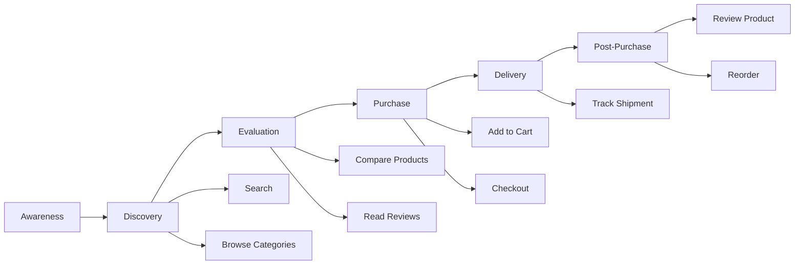

---
tags:
  - requirements
  - documentation
  - urs
  - user-stories
aliases:
  - User Requirements Specification
  - URS Document
  - User Stories
created: 2025-01-10
topic: Software Engineering
---

#  User Requirements Specification (URS)

> [!SUMMARY] TL;DR
> URS описує вимоги з точки зору користувачів у формі user stories та сценаріїв використання. Фокусується на тому, **що** користувачі хочуть робити та **навіщо**, а не на технічній реалізації. Написані простою мовою, зрозумілою для non-technical stakeholders.
> 
> **Ключова ідея:** URS відповідає на "Що потрібно користувачам?" перед тим як [[SRS]] відповість "Як це технічно реалізувати?"

## 1. Що таке URS?

**URS (User Requirements Specification)** — документ який описує вимоги з перспективи кінцевих користувачів.

**Відмінності від SRS:**

| Аспект | URS | [[SRS]] |
| :--- | :--- | :--- |
| Audience | Business stakeholders, users | Development team |
| Мова | Business language | Technical language |
| Фокус | Що і навіщо | Як технічно |
| Деталі | High-level | Детальні специфікації |
| Формат | User stories, scenarios | Functional requirements |

**Коли створюється:**
- Найраніша фаза (Requirements Gathering)
- Результат interviews, workshops, observation
- **До** написання SRS

## 2. Структура URS

### 2.1. Executive Summary

```
Project: E-Commerce Platform
Business Goal: Increase online sales by 30% through improved UX
Target Users:
  - Online shoppers (B2C)
  - Store administrators
  - Customer support agents

Key Pain Points Being Solved:
  ❌ Current checkout too complex (7 steps)
  ❌ No mobile experience
  ❌ Poor search results
  ❌ Can't track orders
```

### 2.2. User Personas

```
Persona 1: Sarah - Busy Professional
Age: 32, Marketing Manager
Tech Level: Medium
Goals:
  - Quick purchases during lunch break
  - Easy reordering of regular items
  - Track deliveries
Frustrations:
  - Long checkout forms
  - Slow website on mobile
  - Unclear shipping times

Persona 2: Mike - Store Admin
Age: 45, Operations Manager
Tech Level: Low
Goals:
  - Update product info easily
  - View sales analytics
  - Process refunds quickly
Frustrations:
  - Current system requires training
  - No bulk operations
  - Poor reporting tools
```

### 2.3. User Stories (As-a, I want, So that)

**Format:**
```
US-[ID]: As a [role], I want [capability], so that [benefit]

Acceptance Criteria:
  - Criterion 1
  - Criterion 2

Priority: Must Have / Should Have / Nice to Have
Estimate: Story points (1,2,3,5,8)
```

**Приклади:**

```
US-001: Quick Product Search
As a shopper,
I want to search products by typing keywords,
So that I can quickly find what I need

Acceptance Criteria:
  ✓ Search works with partial words ("lap" finds "laptop")
  ✓ Results appear as I type (instant search)
  ✓ Can filter by price, category, brand
  ✓ Shows "No results" with suggestions if nothing found

Priority: Must Have
Estimate: 5 points
Dependencies: None
```

```
US-002: Guest Checkout
As a first-time visitor,
I want to complete purchase without creating account,
So that I don't waste time on registration

Acceptance Criteria:
  ✓ Can checkout with just email and shipping address
  ✓ Option to "Save details for next time" at the end
  ✓ Confirmation email includes order tracking link
  ✓ Can create account later using same email

Priority: Must Have
Estimate: 8 points
Dependencies: US-005 (Email system)
```

```
US-003: Saved Payment Methods
As a returning customer,
I want to save my credit card securely,
So that I can checkout faster next time

Acceptance Criteria:
  ✓ Can save multiple cards
  ✓ Card shows last 4 digits only (•••• 1234)
  ✓ Can set default card
  ✓ Can delete saved cards anytime
  ✓ CVV still required at checkout (PCI compliance)

Priority: Should Have
Estimate: 5 points
Dependencies: US-001, Payment gateway integration
```

### 2.4. Use Case Scenarios

```
Scenario: Mobile Shopping During Commute

Context:
Sarah is on the train, browsing products on her phone.
She has 15 minutes before her stop.

Steps:
1. Opens website on mobile browser
2. Searches "wireless headphones"
3. Filters: Price $50-$100, 4+ stars
4. Taps product to see details
5. Reads reviews from other buyers
6. Adds to cart
7. Continues shopping (adds phone case)
8. Goes to cart, sees 2 items
9. Proceeds to checkout
10. Uses saved address (auto-filled)
11. Pays with Apple Pay (one tap)
12. Gets confirmation: "Arrives Wednesday"
13. Receives email confirmation

Success Criteria:
✓ Entire flow takes < 5 minutes
✓ Works on 4G connection
✓ No pinch-to-zoom needed
✓ All buttons large enough for fingers
✓ Can complete one-handed
```

```
Scenario: Admin Bulk Update Products

Context:
Mike needs to mark 50 products as "Sale - 20% off"

Current Pain Point:
Must open each product individually, edit, save (50 times!)

Desired Flow:
1. Goes to Products page
2. Filters: Category = "Electronics"
3. Selects multiple products (checkboxes)
4. Clicks "Bulk Actions"
5. Selects "Add discount"
6. Enters: 20%, valid 7 days
7. Clicks "Apply"
8. System confirms: "50 products updated"
9. Email sent to subscribed customers

Success Criteria:
✓ Can select all matching filter
✓ Bulk action completes in < 10 seconds
✓ Can undo if mistake made
✓ Clear confirmation of what changed
```

## 3. User Needs vs System Capabilities

| User Need | Business Benefit | System Capability Required |
| :--- | :--- | :--- |
| Find products quickly | Increased conversions | Fast search, good relevance |
| Feel payment is secure | Reduced cart abandonment | SSL, PCI compliance, trust badges |
| Track my order | Fewer support calls | Real-time tracking, notifications |
| Easy returns | Customer loyalty | Self-service return portal |
| Works on phone | Mobile traffic converts | Responsive design, mobile payments |

## 4. User Journey Map



**Pain Points по етапах:**
- **Discovery:** Search too slow, poor filters
- **Evaluation:** Not enough product photos
- **Purchase:** Checkout form too long
- **Delivery:** No tracking updates
- **Post-Purchase:** Returns process unclear

## 5. Success Metrics

```
User-Focused KPIs:

Conversion Rate:
Current: 2.3%
Target: 3.5%
Measure: (Purchases / Visitors) × 100

Checkout Completion:
Current: 45% (55% abandon cart)
Target: 70%
Measure: (Completed / Started Checkout) × 100

Time to Purchase:
Current: 8 minutes average
Target: 3 minutes
Measure: From landing to order confirmation

Customer Satisfaction:
Current: 3.2/5
Target: 4.5/5
Measure: Post-purchase NPS survey

Mobile Conversion:
Current: 1.1% (50% of traffic but low conversion)
Target: 2.8%
```

## 6. User Acceptance Criteria (High-Level)

```
The system is acceptable when:

Usability:
✓ 90% of first-time users complete purchase without help
✓ Mobile users can checkout in < 5 minutes
✓ Accessibility: WCAG AA compliant

Performance:
✓ Pages load in < 2 seconds (95th percentile)
✓ Search results appear instantly (< 500ms)
✓ System available 99.9% of time

Security & Trust:
✓ Payment feels secure (SSL, trust badges)
✓ Personal data handled properly (GDPR)
✓ No unexpected charges

Support:
✓ FAQs answer common questions
✓ Live chat available during business hours
✓ Order status visible without login
```

## 7. Зв'язок з іншими документами

```
URS → [[SRS]] → Design → Implementation
 ↓
User Stories → Functional Requirements → Code
 ↓
Acceptance Criteria → Test Cases → Validation
```

**URS відповідає:** "Що хочуть користувачі?"
**SRS відповідає:** "Як система це реалізує технічно?"
**SysRS відповідає:** "Які системні обмеження та вимоги?"

---

**Пов'язані теми:**
- [[SRS]] — Software Requirements Specification
- [[SDLC]] — Software Development Lifecycle  
- [[Scrum]] — User stories in Agile

**Ресурси:**
- [Writing Effective User Stories](https://www.mountaingoatsoftware.com/agile/user-stories)
- [User Story Mapping](https://www.jpattonassociates.com/user-story-mapping/)
