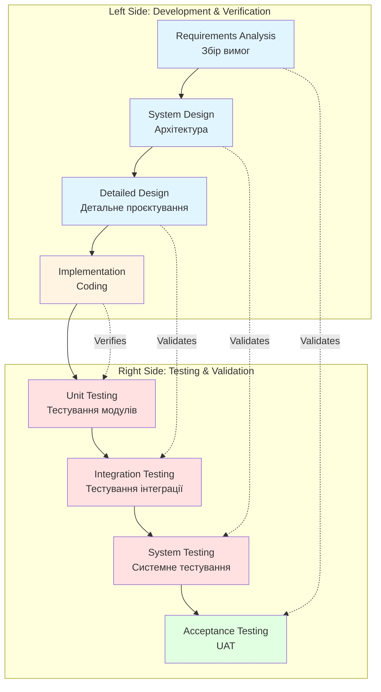

---
tags:
  - sdlc
  - methodology
  - v-model
  - testing
  - quality-assurance
aliases:
  - V-Model
  - V-Shape Model
  - Validation and Verification Model
  - V-подібна модель
created: 2026-01-10
topic: Software Development Methodologies
---

# V-Model (Verification and Validation Model)

> [!SUMMARY] TL;DR
> V-Model — це розширення Waterfall моделі, де кожна фаза розробки має відповідну фазу тестування. Утворює V-подібну структуру: ліва сторона — development phases, права — testing phases. Основна ідея: planning testing паралельно з development для раннього виявлення дефектів.
> **Ключова ідея:** "Test early, test often" — тестування плануємо одночасно з розробкою, а не після неї.

## 1. Фундаментальна теорія

**V-Model** (Verification and Validation Model) — це software development процес, що підкреслює важливість тестування на кожному етапі розробки. На відміну від [[Waterfall-Model]], де тестування — це окрема фаза в кінці, V-Model інтегрує тестування протягом всього lifecycle.

**Ключові терміни:**
- **Verification** — "Are we building the product right?" (чи відповідає продукт специфікаціям)
- **Validation** — "Are we building the right product?" (чи відповідає продукт потребам користувача)

**Основні характеристики:**
- **Parallel development and testing** — test plans створюються одночасно з design
- **Early defect detection** — bugs виявляються на ранніх стадіях
- **Rigorous documentation** — детальні test cases для кожного рівня
- **Traceability** — чіткий зв'язок між requirements та test cases
- **High quality focus** — quality assurance embedded у процес

> [!INFO] Походження назви
> "V" у назві походить від форми діаграми процесу: development phases йдуть вниз (ліва сторона V), потім testing phases підіймаються вгору (права сторона V). Нижня точка V — це coding/implementation phase.

**Коли застосовується:**
- Safety-critical systems (авіація, медицина, automotive)
- Проєкти з high reliability requirements
- Regulated industries (FDA, ISO certifications)
- Системи де failure cost дуже високий
- Коли потрібна detailed traceability (кожна вимога → test case)
- Projects з stable requirements та достатнім часом для testing

## 2. Структура V-Model

### V-подібна діаграма:



### Mapping між Development та Testing фазами:

| Development Phase | Testing Phase | Test Focus | Test Artifacts |
| :--- | :--- | :--- | :--- |
| **Requirements Analysis** | **Acceptance Testing (UAT)** | Чи system відповідає business needs? | User acceptance test cases, UAT plan |
| **System Design** | **System Testing** | Чи працює система as a whole? | System test plan, functional test cases |
| **Detailed Design** | **Integration Testing** | Чи коректно інтегруються modules? | Integration test scenarios, API tests |
| **Implementation** | **Unit Testing** | Чи кожен unit працює individually? | Unit test cases, code coverage reports |

> [!TIP] Test Planning Timeline
> Критично важливо: test plans та test cases створюються під час ВІДПОВІДНОЇ development фази, а не після неї:
> - Requirements phase → пишемо UAT scenarios
> - System design → створюємо system test plan
> - Detailed design → проєктуємо integration tests
> - Coding → пишемо unit tests паралельно з кодом

## 3. Деталі по фазах

### Ліва сторона V (Development & Verification):

**Phase 1: Requirements Analysis**
- **Що робимо:** Збираємо business та user requirements
- **Deliverables:** [[SRS]], [[URS]], Business Requirements Document
- **Паралельно створюємо:** User Acceptance Test (UAT) scenarios
- **Verification criteria:** Requirements повні, testable, non-ambiguous

**Phase 2: System Design (High-Level Design)**
- **Що робимо:** Визначаємо system architecture, modules, interfaces
- **Deliverables:** System Architecture Document, Database Schema, API Specifications
- **Паралельно створюємо:** System Test Plan (functional, non-functional tests)
- **Verification criteria:** Design feasible, scalable, meets requirements

**Phase 3: Detailed Design (Low-Level Design)**
- **Що робимо:** Деталізуємо кожен module — algorithms, data structures, class diagrams
- **Deliverables:** Detailed Design Document, Component Specifications
- **Паралельно створюємо:** Integration Test Cases (міжмодульна взаємодія)
- **Verification criteria:** Design implementable, follows coding standards

**Phase 4: Implementation (Coding)**
- **Що робимо:** Пишемо actual code based on detailed design
- **Deliverables:** Source Code, Unit Tests, Code Review Reports
- **Паралельно створюємо:** Unit Test Cases для кожної функції/методу
- **Verification criteria:** Code matches design, passes unit tests, meets quality metrics

### Права сторона V (Testing & Validation):

**Phase 5: Unit Testing**
- **Що тестуємо:** Окремі functions, methods, classes
- **Test types:** White-box testing, boundary testing, code coverage
- **Tools:** pytest, unittest (Python); Jest, Mocha (JS); JUnit (Java)
- **Success criteria:** 80%+ code coverage, all critical paths tested
- **Validates:** Detailed Design phase

**Phase 6: Integration Testing**
- **Що тестуємо:** Взаємодію між modules, APIs, databases
- **Test types:** API testing, database integration, service interactions
- **Tools:** Postman, SoapUI, REST Assured
- **Success criteria:** All interfaces work correctly, data flows between components
- **Validates:** System Design phase

**Phase 7: System Testing**
- **Що тестуємо:** System as a whole проти functional та non-functional requirements
- **Test types:** Functional, performance, security, usability testing
- **Tools:** Selenium, JMeter, OWASP ZAP
- **Success criteria:** System meets all specified requirements
- **Validates:** High-Level Design phase

**Phase 8: Acceptance Testing (UAT)**
- **Що тестуємо:** Чи система задовольняє business needs у real-world scenarios
- **Test types:** Alpha testing (internal), Beta testing (external users)
- **Who performs:** End users, business stakeholders
- **Success criteria:** Business acceptance, sign-off from client
- **Validates:** Requirements Analysis phase

## 4. Практичні приклади

### Приклад 1: Медичний апарат (успішний кейс V-Model)

**Контекст:**
Розробка software для infusion pump (апарат для внутрішньовенного введення ліків). FDA-regulated, high safety requirements.

**Чому V-Model:**
- Requirements від FDA та медичних експертів — чіткі, stable
- Failure може призвести до смерті пацієнта
- Потрібна повна traceability (кожна вимога → test case → результат)
- Regulatory audit requires detailed documentation

**Як застосували V-Model:**

```
Requirements Phase (3 місяці):
├─ Functional requirements: dose calculation, alarms, UI flows
├─ Safety requirements: max dose limits, fail-safes, error handling
└─ Паралельно: UAT test scenarios (500+ test cases)

System Design Phase (2 місяці):
├─ Architecture: embedded system, real-time OS, hardware interfaces
├─ Safety mechanisms: watchdog timers, redundant sensors
└─ Паралельно: System test plan (200+ test cases)

Detailed Design Phase (2 місяці):
├─ Module specs: dose calculator, alarm manager, UI controller
├─ Algorithms: flow rate control, sensor calibration
└─ Паралельно: Integration test scenarios (150+ test cases)

Implementation (4 місяці):
├─ C code for embedded system
└─ Паралельно: Unit tests (TDD approach, 95% code coverage)

Testing Phases (5 місяців):
├─ Unit Testing: 2000+ unit tests, 95% coverage achieved
├─ Integration Testing: hardware-software integration, sensor communication
├─ System Testing: performance under stress, fail-safe verification
└─ UAT: Clinical trials with medical staff, FDA submission
```

**Результат:**
✅ FDA approval з першої спроби  
✅ Zero critical defects у production  
✅ Full traceability для audit (кожна вимога → code → test → result)  
✅ High confidence у safety та reliability  

> [!TIP] Critical Success Factor
> У цьому проєкті test-first підхід був критичним: кожна функція мала test case перед написанням коду. Це забезпечило 95% code coverage та early detection вразливостей.

### Приклад 2: Python приклад Test Traceability Matrix

```python
from dataclasses import dataclass, field
from typing import List, Dict, Optional
from enum import Enum

class RequirementType(Enum):
    FUNCTIONAL = "Functional"
    NON_FUNCTIONAL = "Non-Functional"
    SAFETY = "Safety"

class TestLevel(Enum):
    UNIT = "Unit Test"
    INTEGRATION = "Integration Test"
    SYSTEM = "System Test"
    UAT = "User Acceptance Test"

class TestStatus(Enum):
    NOT_STARTED = "Not Started"
    IN_PROGRESS = "In Progress"
    PASSED = "Passed"
    FAILED = "Failed"
    BLOCKED = "Blocked"

@dataclass
class Requirement:
    """Represents a system requirement"""
    req_id: str
    description: str
    req_type: RequirementType
    priority: str  # High, Medium, Low
    source: str  # Stakeholder who requested it
    
@dataclass
class TestCase:
    """Represents a test case mapped to requirement(s)"""
    test_id: str
    description: str
    test_level: TestLevel
    related_requirements: List[str]  # List of requirement IDs
    preconditions: str
    test_steps: List[str]
    expected_result: str
    status: TestStatus = TestStatus.NOT_STARTED
    actual_result: Optional[str] = None
    defect_ids: List[str] = field(default_factory=list)

class TraceabilityMatrix:
    """V-Model Traceability Matrix — зв'язок requirements → test cases"""
    
    def __init__(self):
        self.requirements: Dict[str, Requirement] = {}
        self.test_cases: Dict[str, TestCase] = {}
        
    def add_requirement(self, req: Requirement):
        """Add requirement to matrix"""
        self.requirements[req.req_id] = req
        
    def add_test_case(self, test: TestCase):
        """Add test case and validate requirement references"""
        # Validate that all referenced requirements exist
        for req_id in test.related_requirements:
            if req_id not in self.requirements:
                raise ValueError(f"Test {test.test_id} references non-existent requirement {req_id}")
        
        self.test_cases[test.test_id] = test
        
    def get_tests_for_requirement(self, req_id: str) -> List[TestCase]:
        """Find all test cases that validate a specific requirement"""
        return [
            test for test in self.test_cases.values()
            if req_id in test.related_requirements
        ]
        
    def get_requirements_for_test(self, test_id: str) -> List[Requirement]:
        """Find all requirements validated by a specific test"""
        test = self.test_cases.get(test_id)
        if not test:
            return []
        
        return [
            self.requirements[req_id] 
            for req_id in test.related_requirements
            if req_id in self.requirements
        ]
        
    def get_coverage_report(self) -> Dict:
        """Generate test coverage report"""
        total_reqs = len(self.requirements)
        covered_reqs = set()
        
        for test in self.test_cases.values():
            covered_reqs.update(test.related_requirements)
            
        uncovered_reqs = set(self.requirements.keys()) - covered_reqs
        
        # Coverage by test level
        coverage_by_level = {}
        for level in TestLevel:
            level_tests = [t for t in self.test_cases.values() if t.test_level == level]
            level_reqs = set()
            for test in level_tests:
                level_reqs.update(test.related_requirements)
            coverage_by_level[level.value] = len(level_reqs)
            
        return {
            "total_requirements": total_reqs,
            "covered_requirements": len(covered_reqs),
            "coverage_percentage": (len(covered_reqs) / total_reqs * 100) if total_reqs > 0 else 0,
            "uncovered_requirements": list(uncovered_reqs),
            "coverage_by_level": coverage_by_level
        }
        
    def get_test_execution_status(self) -> Dict:
        """Get current test execution status"""
        status_counts = {status: 0 for status in TestStatus}
        
        for test in self.test_cases.values():
            status_counts[test.status] += 1
            
        total_tests = len(self.test_cases)
        
        return {
            "total_tests": total_tests,
            "status_breakdown": {status.value: count for status, count in status_counts.items()},
            "execution_percentage": (
                (status_counts[TestStatus.PASSED] + status_counts[TestStatus.FAILED]) 
                / total_tests * 100
            ) if total_tests > 0 else 0
        }

# Приклад використання для медичного апарату
if __name__ == "__main__":
    matrix = TraceabilityMatrix()
    
    # Add requirements (Requirements Analysis phase)
    matrix.add_requirement(Requirement(
        req_id="REQ-001",
        description="System shall calculate drug dosage based on patient weight",
        req_type=RequirementType.FUNCTIONAL,
        priority="High",
        source="Medical Expert"
    ))
    
    matrix.add_requirement(Requirement(
        req_id="REQ-002",
        description="System shall trigger alarm if dosage exceeds safe limit",
        req_type=RequirementType.SAFETY,
        priority="Critical",
        source="FDA Regulation"
    ))
    
    matrix.add_requirement(Requirement(
        req_id="REQ-003",
        description="UI shall respond to user input within 200ms",
        req_type=RequirementType.NON_FUNCTIONAL,
        priority="Medium",
        source="UX Designer"
    ))
    
    # Add test cases (created during corresponding development phases)
    
    # Unit test (created during Implementation phase)
    matrix.add_test_case(TestCase(
        test_id="UT-001",
        description="Unit test for dosage calculation function",
        test_level=TestLevel.UNIT,
        related_requirements=["REQ-001"],
        preconditions="Mock patient weight data available",
        test_steps=[
            "Call calculate_dosage(weight=70, drug='morphine')",
            "Verify returned value matches expected formula"
        ],
        expected_result="Correct dosage value within 0.1% accuracy",
        status=TestStatus.PASSED
    ))
    
    # Integration test (created during Detailed Design phase)
    matrix.add_test_case(TestCase(
        test_id="IT-001",
        description="Integration test: dosage calculator + alarm manager",
        test_level=TestLevel.INTEGRATION,
        related_requirements=["REQ-001", "REQ-002"],
        preconditions="Both modules deployed and connected",
        test_steps=[
            "Set patient weight to 50kg",
            "Request dosage calculation for max safe amount",
            "Verify alarm does NOT trigger",
            "Request dosage exceeding safe limit",
            "Verify alarm DOES trigger"
        ],
        expected_result="Alarm triggers only when dosage exceeds safe limit",
        status=TestStatus.PASSED
    ))
    
    # System test (created during System Design phase)
    matrix.add_test_case(TestCase(
        test_id="ST-001",
        description="End-to-end system test with hardware",
        test_level=TestLevel.SYSTEM,
        related_requirements=["REQ-001", "REQ-002", "REQ-003"],
        preconditions="Full system deployed on target hardware",
        test_steps=[
            "Enter patient data via touchscreen UI",
            "Measure UI response time",
            "Request drug infusion",
            "Monitor alarm system during infusion",
            "Simulate sensor failure"
        ],
        expected_result="All requirements met under normal and failure scenarios",
        status=TestStatus.IN_PROGRESS
    ))
    
    # UAT (created during Requirements phase)
    matrix.add_test_case(TestCase(
        test_id="UAT-001",
        description="Clinical trial with medical staff",
        test_level=TestLevel.UAT,
        related_requirements=["REQ-001", "REQ-002", "REQ-003"],
        preconditions="System installed in hospital, trained nurses available",
        test_steps=[
            "Nurses perform typical workflows",
            "Observe usability and safety in real scenarios",
            "Collect feedback on alarm clarity",
            "Test emergency procedures"
        ],
        expected_result="Medical staff can safely operate device without errors",
        status=TestStatus.NOT_STARTED
    ))
    
    # Generate reports
    print("="*60)
    print("V-MODEL TRACEABILITY MATRIX REPORT")
    print("="*60)
    
    # Coverage report
    coverage = matrix.get_coverage_report()
    print(f"\n📊 REQUIREMENT COVERAGE:")
    print(f"Total Requirements: {coverage['total_requirements']}")
    print(f"Covered Requirements: {coverage['covered_requirements']}")
    print(f"Coverage: {coverage['coverage_percentage']:.1f}%")
    
    if coverage['uncovered_requirements']:
        print(f"\n⚠️  Uncovered Requirements: {coverage['uncovered_requirements']}")
    else:
        print(f"\n✅ All requirements have test coverage!")
        
    print(f"\nCoverage by Test Level:")
    for level, count in coverage['coverage_by_level'].items():
        print(f"  {level}: {count} requirements")
    
    # Execution status
    execution = matrix.get_test_execution_status()
    print(f"\n🧪 TEST EXECUTION STATUS:")
    print(f"Total Tests: {execution['total_tests']}")
    print(f"Execution Progress: {execution['execution_percentage']:.1f}%")
    print(f"\nStatus Breakdown:")
    for status, count in execution['status_breakdown'].items():
        if count > 0:
            print(f"  {status}: {count}")
    
    # Traceability examples
    print(f"\n🔗 TRACEABILITY EXAMPLES:")
    print(f"\nTests for REQ-001 (Dosage Calculation):")
    for test in matrix.get_tests_for_requirement("REQ-001"):
        print(f"  - {test.test_id}: {test.description} [{test.test_level.value}]")
        
    print(f"\nRequirements validated by IT-001:")
    for req in matrix.get_requirements_for_test("IT-001"):
        print(f"  - {req.req_id}: {req.description} [{req.req_type.value}]")
```

**Trade-offs:**
- ✅ Повна traceability — бачимо coverage для кожної вимоги
- ✅ Легко знайти untested requirements
- ✅ Audit-ready reporting
- ❌ Overhead на підтримку matrix (може бути automated через CI/CD)
- ❌ Не підходить для agile з frequent requirement changes

### Приклад 3: E-commerce checkout (mixed результат)

**Контекст:**
Startup вирішив використати V-Model для checkout flow у e-commerce платформі.

**Що пішло добре:**
- ✅ Early detection integration issues між payment gateway та inventory system
- ✅ System testing виявив performance bottleneck до production
- ✅ UAT з real users виявив 15 usability issues

**Що пішло не так:**
- ❌ Requirements змінилися тричі під час development (конкуренти запустили нові features)
- ❌ V-Model rigidity не дозволила швидко адаптуватися
- ❌ Test documentation overhead (200+ test cases для relatively simple feature)
- ❌ Delayed launch на 2 місяці через extended testing phases

**Висновок:**  
V-Model був overkill для цього проєкту. Краще підійшов би agile approach з continuous testing.

> [!WARNING] When V-Model Is Overkill
> Якщо проєкт має:
> - Uncertain або evolving requirements
> - Швидкі ринкові зміни
> - Можливість iterative releases
> - Low criticality (failure не catastrophic)
> 
> → V-Model буде занадто rigid та slow. Розгляньте [[Scrum]] або інші agile методології.

## 5. Порівняння з іншими методологіями

| Аспект | V-Model | [[Waterfall-Model]] | [[Scrum]] (Agile) |
| :--- | :--- | :--- | :--- |
| **Testing approach** | Паралельний з development | Окрема фаза в кінці | Continuous протягом sprint |
| **Defect detection** | Ранній (early phases) | Пізній (testing phase) | Дуже ранній (daily builds) |
| **Documentation** | Extensive (requirements + tests) | Extensive (design docs) | Minimal (working software) |
| **Flexibility** | Low (change-resistant) | Very Low | High (change-embracing) |
| **Traceability** | Excellent (req ↔ test mapping) | Good (phase deliverables) | Moderate (user stories) |
| **Suitable for** | Safety-critical, regulated | Fixed requirements, simple | Innovative, evolving products |
| **Cost of defects** | Low (early detection) | High (late detection) | Low (immediate feedback) |
| **Test coverage** | Very High (systematic) | Medium (depends on phase) | Variable (depends on team) |
| **Time to market** | Long (extensive testing) | Long (sequential phases) | Short (iterative releases) |

### V-Model vs Waterfall: ключові відмінності

**Waterfall:**
```
Requirements → Design → Implementation → [TESTING STARTS HERE] → Deployment
```

**V-Model:**
```
Requirements (+ UAT planning) → 
Design (+ System test planning) → 
Detailed Design (+ Integration test planning) → 
Implementation (+ Unit testing) →
[All tests ALREADY PLANNED and EXECUTED incrementally]
```

**Коли вибирати V-Model замість Waterfall:**
- Якщо quality та reliability критичні (safety, security)
- Коли потрібна regulatory compliance (FDA, ISO)
- Якщо є budget та час для thorough testing
- Коли failures мають high cost або impact

**Коли вибирати Waterfall замість V-Model:**
- Проєкт простий, low-risk
- Budget обмежений (V-Model requires more test resources)
- Time-to-market критичний (V-Model slower через extensive testing)

## 6. Проблеми та анти-патерни

### Типові проблеми:

> [!WARNING] Test Plan Shelf-ware
> **Проблема:** Test plans створюються під час early phases але потім ігноруються або не оновлюються.
> 
> **Наслідки:**
> - Outdated test cases
> - Waste of effort на створення plans
> - Testing не відповідає actual implementation
> 
> **Рішення:** Living documentation — test plans у Git, review та update під час implementation.

> [!WARNING] Over-Testing Low-Risk Components
> **Проблема:** Однакова rigorous testing для всіх компонентів, незалежно від risk level.
> 
> **Наслідки:**
> - Wasted resources на testing trivial code
> - Недостатня увага critical components
> - Delayed project timeline
> 
> **Рішення:** Risk-based testing approach — більше уваги high-risk areas (security, calculations, integrations).

> [!WARNING] Requirements Volatility
> **Проблема:** Requirements змінюються під час project, але V-Model не передбачає flexibility.
> 
> **Наслідки:**
> - Test cases need re-work
> - Re-planning всіх test levels
> - Expensive scope changes
> 
> **Рішення:** Hybrid model — V-Model для stable core, agile для evolving features. Або change control board для managing changes.

### Анти-патерни:

**1. "Test Automation as Afterthought"**
- Automation розглядається після створення manual tests
- Автоматизувати складно (tests не designed for automation)
- High maintenance cost

**Рішення:** Plan automation з самого початку — test cases designed to be automatable.

**2. "100% Coverage Obsession"**
- Прагнення до 100% code coverage у всіх компонентах
- Marignimal ROI на останні 10-20% coverage
- Resources витрачаються на trivial tests

**Рішення:** Risk-based target — 90% для critical modules, 60-70% для low-risk.

**3. "Test-First Hypocrisy"**
- Claim що test plans створюються early, but фактично пишуться після coding
- No real early defect detection
- V-Model only на папері

**Рішення:** Formal gates — test plan review and approval required перед початком implementation.

## 7. Best Practices для V-Model

✅ **Do's:**

**Test Planning:**
- Створюй test cases паралельно з design (не після)
- Use test-driven development (TDD) approach де можливо
- Maintain traceability matrix (requirement → test case → result)
- Plan test automation з початку

**Risk Management:**
- Prioritize testing based on risk (focus на critical paths)
- Prototype high-risk components early
- Include security testing на system test level

**Documentation:**
- Living documentation (у version control, не Word docs)
- Automated test reports (integrate з CI/CD)
- Clear acceptance criteria для кожного test level

**Team Collaboration:**
- Testers involved від requirements phase (не тільки testing phase)
- Developers review test plans (знають як їх code буде tested)
- Cross-functional reviews на phase gates

❌ **Don'ts:**

- Використовувати V-Model для highly volatile requirements
- Skiping test planning phases (defeats purpose V-Model)
- Creating test cases після implementation (too late!)
- Ignoring automated testing (manual testing не scalable)
- Treating V-Model як strict waterfall з testing (забуваєте про parallel work)

### Modified V-Model підходи:

**Incremental V-Model:**
- Розбиваємо систему на increments
- Кожен increment проходить повний V-lifecycle
- Дозволяє earlier releases та feedback

**Agile V-Model (Hybrid):**
- V-Model для critical components (safety, security)
- Agile для user-facing features
- Best of both worlds для complex systems

## 8. Інструменти для V-Model

**Requirements Management:**
- Jama Connect — traceability між requirements та tests
- IBM DOORS — requirements management для regulated industries
- Azure DevOps — work item tracking з test case linking

**Test Management:**
- TestRail — test case management з traceability matrix
- Zephyr — integration з Jira для test tracking
- qTest — end-to-end test management

**Test Automation:**
- Selenium (web UI testing)
- Pytest (Python unit та integration tests)
- JUnit/TestNG (Java testing)
- Postman/REST Assured (API testing)
- JMeter (performance testing)

**Traceability:**
- ReqView — lightweight requirements traceability
- SpiraTest — complete traceability solution
- Spreadsheets/Custom scripts (для small projects)

## 9. Корисні посилання

**Standards та Guidelines:**
- ISO 12207 — Software Lifecycle Processes (includes V-Model)
- IEC 62304 — Medical Device Software Lifecycle (V-Model based)
- DO-178C — Aviation Software Safety (similar approach)
- ISTQB — International Software Testing Qualifications (testing levels align з V-Model)

**Books:**
- "Software Testing" by Ron Patton — covers V-Model testing approach
- "Testing Computer Software" by Cem Kaner — detailed test planning strategies
- "Effective Software Testing" by Elfriede Dustin — V-Model case studies

**Related Notes:**
- [[Waterfall-Model]] — базова модель для V-Model
- [[SDLC]] — broader context software development lifecycle
- [[Scrum]] — альтернативний agile підхід
- [[Requirements-Gathering]] — critical для successful V-Model implementation

---

**Next Actions:**
- [ ] Додати Python template для automated traceability matrix
- [ ] Створити checklist для V-Model phase gates
- [ ] Розширити секцію про test automation strategies
- [ ] Додати case study з automotive industry (ISO 26262)
