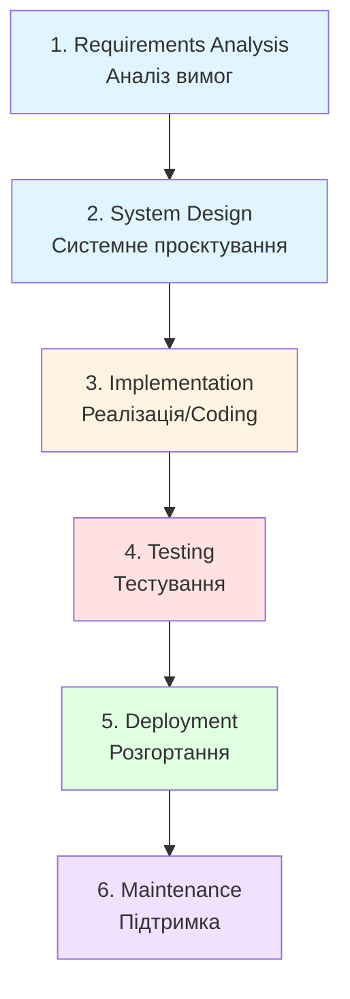
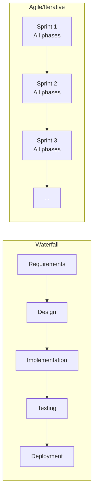

---
tags:
  - sdlc
  - methodology
  - waterfall
  - project-management
aliases:
  - Waterfall
  - Каскадна модель
  - Sequential Model
created: 2026-01-10
topic: Software Development Methodologies
---

# Waterfall Model

> [!SUMMARY] TL;DR
> Waterfall — це послідовна модель розробки ПЗ, де кожна фаза завершується перед початком наступної. Характеризується чіткою структурою, детальною документацією та відсутністю зворотних зв'язків між фазами.
> **Ключова ідея:** "Measure twice, cut once" — все плануємо на початку, потім виконуємо послідовно без повернень назад.

## 1. Фундаментальна теорія

**Waterfall Model** (Каскадна модель) — це класична методологія розробки програмного забезпечення, запропонована Вінстоном Ройсом у 1970 році. Назва походить від каскадного (водоспадного) характеру процесу: кожна фаза "стікає" в наступну, як вода з водоспаду.

**Основні характеристики:**
- **Лінійність** — процес йде тільки вперед, без ітерацій
- **Документоорієнтованість** — кожна фаза створює formal deliverables
- **Жорстка послідовність** — наступна фаза починається лише після завершення попередньої
- **Раннє планування** — всі вимоги визначаються на початку проєкту
- **Складність внесення змін** — зміни дорогі та складні після завершення фази

> [!INFO] Історичний контекст
> Waterfall виник у часи, коли розробка ПЗ була тісно пов'язана з виробничими процесами (будівництво, машинобудування). Модель запозичила підхід з інженерії, де зміни на пізніх етапах коштують дорого (неможливо перебудувати міст після його завершення).

**Коли застосовується:**
- Проєкти з чіткими, незмінними вимогами
- Regulated industries (медицина, авіація, фінанси)
- Малі проєкти з добре зрозумілою domain
- Коли клієнт хоче fixed price/scope contract
- Системи з високими вимогами до безпеки та надійності

## 2. Структура фаз Waterfall

### Типова послідовність фаз:



### Деталі по кожній фазі:

| Фаза | Основні активності | Deliverables | Тривалість (%) |
| :--- | :--- | :--- | :---: |
| **Requirements** | Збір та аналіз бізнес-вимог, створення specifications | [[SRS]], [[URS]], [[SysRS]] | 15-20% |
| **Design** | Архітектура системи, database design, UI/UX mockups | Design documents, ER diagrams, API specs | 15-20% |
| **Implementation** | Написання коду згідно design документів | Source code, unit tests | 30-40% |
| **Testing** | Integration testing, system testing, UAT | Test plans, bug reports, test results | 15-20% |
| **Deployment** | Release до production, навчання користувачів | Deployment guides, user manuals | 5-10% |
| **Maintenance** | Bug fixes, minor enhancements, підтримка | Patches, updates, support logs | Ongoing |

> [!TIP] Phase Gates
> Між фазами існують "Phase Gates" або "Milestones" — контрольні точки, де стейкхолдери review результати фази та дають go/no-go рішення. Це формальний момент для затвердження progress перед витратами на наступну фазу.

## 3. Візуалізація процесу

### Порівняння з ітеративними моделями:



### Timeline приклад (12-місячний проєкт):

```
Month:  1    2    3    4    5    6    7    8    9    10   11   12
        |====|====|====|====|====|====|====|====|====|====|====|
Req:    [###]
Design:      [####]
Impl:             [###########]
Test:                          [######]
Deploy:                                 [##]
Maint:                                     [###############]→
```

## 4. Практичні приклади

### Приклад 1: Банківська система (успішний кейс)

**Контекст:**
Розробка системи для обробки кредитних заявок у великому банку. Strict regulatory requirements, чіткі business rules, які не змінюються.

**Чому Waterfall підходив:**
- Compliance requirements були детально описані на початку
- Інтеграція з legacy системами потребувала чіткого design
- Fixed budget та timeline (12 місяців)
- Не можна було release частково (all-or-nothing deployment)

**Результат:**
✅ Проєкт завершено в строк та в бюджеті  
✅ Всі regulatory checks пройдені з першого разу  
✅ Детальна документація для audits  

### Приклад 2: E-commerce стартап (провальний кейс)

**Контекст:**
Стартап вирішив використати Waterfall для розробки marketplace платформи.

**Що пішло не так:**
- Спочатку зібрали вимоги на 6 місяців розробки
- Через 4 місяці ринок змінився (конкурент запустив нову фічу)
- Requirements застаріли, але повернутися до фази Design було неможливо без перезапуску проєкту
- Launch затримався на 3 місяці через repeated testing cycles

**Наслідки:**
❌ Продукт був outdated до моменту launch  
❌ 40% features ніхто не використовував  
❌ Витрачено budget на unrelevant functionality  

> [!WARNING] Common Pitfall
> Найбільша помилка — використання Waterfall для проєктів з невизначеними або мінливими вимогами. Якщо є хоч 30% ймовірності зміни requirements — краще розглянути ітеративні підходи.

### Приклад 3: Python script для Waterfall project tracking

```python
from enum import Enum
from datetime import datetime, timedelta
from dataclasses import dataclass
from typing import Optional

class Phase(Enum):
    REQUIREMENTS = "Requirements Analysis"
    DESIGN = "System Design"
    IMPLEMENTATION = "Implementation"
    TESTING = "Testing"
    DEPLOYMENT = "Deployment"
    MAINTENANCE = "Maintenance"

@dataclass
class WaterfallPhase:
    phase: Phase
    start_date: datetime
    planned_duration: int  # days
    status: str = "Not Started"  # Not Started, In Progress, Completed
    deliverables: list[str] = None
    completion_date: Optional[datetime] = None
    
    def complete(self):
        """Mark phase as completed and set completion date"""
        if self.status != "In Progress":
            raise ValueError("Cannot complete phase that is not in progress")
        self.status = "Completed"
        self.completion_date = datetime.now()
        
    def can_start(self, previous_phase: Optional['WaterfallPhase']) -> bool:
        """Check if this phase can start (previous must be completed)"""
        if previous_phase is None:
            return True  # First phase can always start
        return previous_phase.status == "Completed"

class WaterfallProject:
    def __init__(self, name: str, start_date: datetime):
        self.name = name
        self.start_date = start_date
        self.phases: list[WaterfallPhase] = []
        
    def add_phase(self, phase: Phase, duration_days: int, deliverables: list[str]):
        """Add a phase to the project"""
        # Calculate start date based on previous phases
        if self.phases:
            last_phase = self.phases[-1]
            start_date = last_phase.start_date + timedelta(days=last_phase.planned_duration)
        else:
            start_date = self.start_date
            
        waterfall_phase = WaterfallPhase(
            phase=phase,
            start_date=start_date,
            planned_duration=duration_days,
            deliverables=deliverables
        )
        self.phases.append(waterfall_phase)
        
    def start_next_phase(self):
        """Start the next phase if previous is completed"""
        for i, phase in enumerate(self.phases):
            if phase.status == "Not Started":
                previous = self.phases[i-1] if i > 0 else None
                if phase.can_start(previous):
                    phase.status = "In Progress"
                    print(f"✅ Started phase: {phase.phase.value}")
                    return phase
                else:
                    print(f"❌ Cannot start {phase.phase.value}: previous phase not completed")
                    return None
        print("All phases completed!")
        return None
        
    def get_progress(self) -> dict:
        """Get project progress statistics"""
        total_phases = len(self.phases)
        completed = sum(1 for p in self.phases if p.status == "Completed")
        in_progress = sum(1 for p in self.phases if p.status == "In Progress")
        
        return {
            "total_phases": total_phases,
            "completed": completed,
            "in_progress": in_progress,
            "completion_percentage": (completed / total_phases * 100) if total_phases > 0 else 0
        }

# Приклад використання
if __name__ == "__main__":
    # Create project
    project = WaterfallProject(
        name="Banking Credit System",
        start_date=datetime(2026, 1, 1)
    )
    
    # Define phases
    project.add_phase(
        Phase.REQUIREMENTS,
        duration_days=45,
        deliverables=["SRS Document", "Use Cases", "Stakeholder Sign-off"]
    )
    
    project.add_phase(
        Phase.DESIGN,
        duration_days=60,
        deliverables=["Architecture Diagram", "Database Schema", "API Specification"]
    )
    
    project.add_phase(
        Phase.IMPLEMENTATION,
        duration_days=120,
        deliverables=["Source Code", "Unit Tests", "Code Review Reports"]
    )
    
    project.add_phase(
        Phase.TESTING,
        duration_days=45,
        deliverables=["Test Plans", "Test Results", "Bug Reports"]
    )
    
    project.add_phase(
        Phase.DEPLOYMENT,
        duration_days=15,
        deliverables=["Deployment Guide", "User Manual", "Production Environment"]
    )
    
    # Simulate project execution
    print(f"\n🚀 Project: {project.name}")
    print(f"Start Date: {project.start_date.date()}\n")
    
    # Start and complete first phase
    phase1 = project.start_next_phase()
    print(f"Working on {phase1.phase.value}...")
    phase1.complete()
    
    # Try to start next phase
    phase2 = project.start_next_phase()
    
    # Check progress
    progress = project.get_progress()
    print(f"\n📊 Progress: {progress['completion_percentage']:.1f}%")
    print(f"Completed: {progress['completed']}/{progress['total_phases']} phases")
```

**Trade-offs у цьому коді:**
- ✅ Чітко відображає waterfall constraint (наступна фаза не може почати без завершення попередньої)
- ✅ Легко tracking deliverables per phase
- ❌ Немає механізму для handling змін у requirements
- ❌ Не можна повернутися до попередньої фази без "restarting" проєкту

## 5. Порівняння з іншими методологіями

| Аспект | Waterfall | [[Scrum]] (Agile) | [[V-Model]] |
| :--- | :--- | :--- | :--- |
| **Структура** | Лінійна, послідовна | Ітеративна, incremental | V-подібна з паралельним testing |
| **Flexibility** | Низька (change-resistant) | Висока (change-embracing) | Середня |
| **Документація** | Дуже детальна | Мінімальна, working software > docs | Детальна + test docs |
| **Feedback loops** | Тільки в кінці (UAT) | Після кожного sprint | На кожному етапі тестування |
| **Ризики** | Виявляються пізно | Виявляються рано | Мітигуються через early testing |
| **Client involvement** | Початок та кінець | Continuous | Середній рівень |
| **Time to market** | Довгий (місяці/роки) | Короткий (тижні) | Довгий, але з кращою якістю |
| **Team size** | Може бути великою (спеціалізація) | Малі cross-functional teams | Середні teams |
| **Best for** | Regulated, fixed requirements | Innovative, evolving products | Safety-critical systems |

### Коли вибирати Waterfall замість Agile:

✅ **Обирай Waterfall якщо:**
- Вимоги чіткі, зафіксовані, не зміняться
- Fixed price/scope/timeline contract
- Strict compliance та regulatory requirements
- Складна інтеграція з legacy системами
- Команда розподілена географічно без можливості щоденної комунікації
- Проєкт short-term (<6 місяців) з well-known domain

❌ **НЕ обирай Waterfall якщо:**
- Вимоги можуть змінитися
- Потрібен швидкий time-to-market
- Innovative product без чіткого vision
- Хочеш early user feedback
- High uncertainty про технічні рішення

## 6. Проблеми та анти-патерни

### Типові проблеми:

> [!WARNING] "Big Bang" Integration
> **Проблема:** Всі компоненти розробляються паралельно та інтегруються одночасно в кінці implementation phase.
> 
> **Наслідки:**
> - Integration bugs виявляються пізно
> - Складно визначити root cause проблем
> - Testing phase затягується
> 
> **Рішення:** Incremental integration навіть у waterfall (інтегруй та тестуй модулі поступово).

> [!WARNING] Requirements Freeze Syndrome
> **Проблема:** Команда відмовляється розглядати будь-які зміни після завершення requirements phase, навіть критичні.
> 
> **Наслідки:**
> - Outdated або irrelevant product
> - User dissatisfaction
> - Failed business objectives
> 
> **Рішення:** Change Control Board — формальний process для оцінки критичних змін (cost, timeline impact).

> [!WARNING] Testing as Afterthought
> **Проблема:** Testing розглядається як окрема фаза в кінці, а не continuous activity.
> 
> **Наслідки:**
> - Bugs виявляються занадто пізно
> - Дороге виправлення issues
> - Quality compromises
> 
> **Рішення:** Паралельна розробка test plans під час design phase, unit testing під час implementation.

### Анти-патерни:

**1. "Waterfall Theater"**
- Команда claim що використовує Waterfall, але насправді chaos
- Немає proper documentation
- Phases overlap безконтрольно
- Change requests handling ad-hoc

**2. "Analysis Paralysis"**
- Requirements phase затягується на місяці
- Perfect documentation замість "good enough"
- Страх пропустити щось критичне
- Delayed start фактичної розробки

**3. "Scope Creep via Change Orders"**
- Initial scope мінімальний для виграшу тендеру
- Потім нескінченні change orders з доплатою
- Project розтягується на роки
- Budget overruns 200-300%

## 7. Best Practices для Waterfall

✅ **Do's:**
- Детальна requirements gathering на початку (involve всіх стейкхолдерів)
- Формальні sign-offs після кожної фази
- Regular status reports та tracking
- Change Control Board для managing змін
- Prototype або proof-of-concept для high-risk компонентів
- Паралельний розвиток test documentation з design phase

❌ **Don'ts:**
- Використовувати для highly innovative або uncertain projects
- Ігнорувати intermediate milestones (phase gates)
- Розпочинати implementation до завершення design
- Відмовляти у будь-яких змінах після requirements freeze
- Покладатися на "Big Bang" integration
- Minimizing documentation (це ключова перевага Waterfall)

### Modified Waterfall підходи:

**Sashimi Model (Overlapping Waterfall):**
- Фази частково overlap (наприклад, design починається коли requirements на 80%)
- Знижує total project duration
- Зберігає sequential nature але з flexibility

**Waterfall with Feedback Loops:**
- Додавання formal review points
- Можливість повернення до попередньої фази (з penalties/budget increase)
- Більше схоже на reality

## 8. Корисні посилання

**Документація та стандарти:**
- IEEE 12207 — Software Lifecycle Processes standard (формальний Waterfall-like process)
- PMI PMBOK — Project Management Body of Knowledge (розділи про sequential project phases)
- ISO 9001 — Quality Management (часто використовується з Waterfall)

**Інструменти для Waterfall project management:**
- Microsoft Project — класика для Gantt charts та waterfall planning
- Jira (Waterfall mode) — можна налаштувати для sequential phases
- Smartsheet — для detailed project plans та tracking

**Книги:**
- "Software Engineering" by Ian Sommerville — описує класичні підходи включно з Waterfall
- "The Mythical Man-Month" by Fred Brooks — критика та insights про великі waterfall projects

**Пов'язані нотатки:**
- [[SDLC]] — загальний огляд життєвого циклу розробки
- [[V-Model]] — модифікація Waterfall з акцентом на testing
- [[Scrum]] — протилежний підхід (agile)
- [[Requirements-Gathering]] — критична фаза для Waterfall

---

**Next Actions:**
- [ ] Додати case study з реального проєкту
- [ ] Створити template для Waterfall project charter
- [ ] Розширити секцію про risk management в Waterfall
