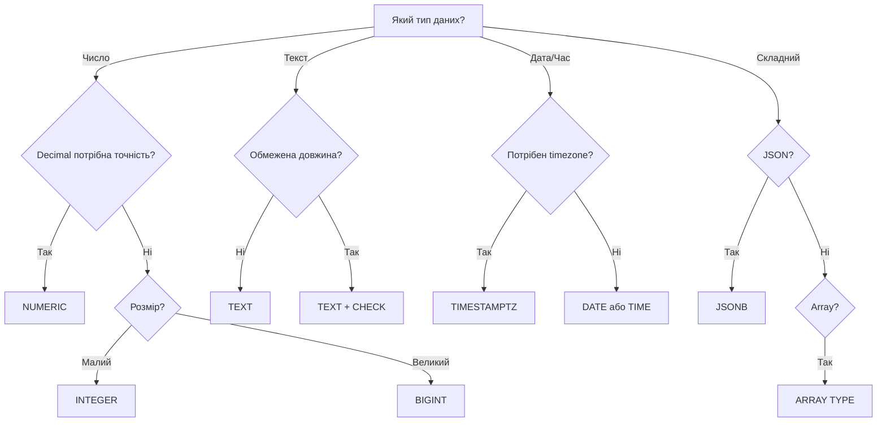

---
tags:
  - postgresql
  - data-types
  - jsonb
  - arrays
  - custom-types
aliases:
  - PostgreSQL Типи даних
  - PostgreSQL Data Types
  - Типи даних PostgreSQL
created: 2025-01-17
topic: PostgreSQL Fundamentals
---

# 📦 PostgreSQL - Data Types

> [!SUMMARY] TL;DR
> PostgreSQL підтримує **40+ вбудованих типів даних** + можливість створення custom types. Від простих (INTEGER, TEXT) до складних (JSONB, Arrays, Ranges, Геометрія). Правильний вибір типу = кращ performance та менше помилок.
> **Key idea:** PostgreSQL - це об'єктно-реляційна БД, що поєднує надійність SQL з гнучкістю NoSQL через JSONB та розширювані типи.

## 1. Категорії типів даних

### Огляд

| Категорія | Приклади | Use Cases |
| :--- | :--- | :--- |
| **Числові** | INTEGER, BIGINT, NUMERIC, REAL | Фінанси, лічильники, вимірювання |
| **Текстові** | TEXT, VARCHAR, CHAR | Імена, описи, коментарі |
| **Дата/Час** | TIMESTAMP, DATE, INTERVAL | Події, логи, історія |
| **Boolean** | BOOLEAN | Прапорці, стани |
| **JSON** | JSON, JSONB | API responses, метадані, гнучкі схеми |
| **Arrays** | INTEGER[], TEXT[] | Теги, опції, багатозначні поля |
| **Ranges** | DATERANGE, INT4RANGE | Бронювання, періоди, діапазони |
| **UUID** | UUID | Унікальні ідентифікатори |
| **Network** | INET, CIDR, MACADDR | IP адреси, підмережі |
| **Geometric** | POINT, LINE, POLYGON | Координати, геометрія |
| **Custom** | ENUM, COMPOSITE, DOMAIN | Бізнес-логіка |

## 2. Числові типи

### Integer типи

| Тип | Розмір | Діапазон | Використання |
| :--- | :--- | :--- | :--- |
| **SMALLINT** | 2 bytes | -32,768 to 32,767 | Лічильники, статуси |
| **INTEGER** | 4 bytes | -2B to 2B | **Дефолт** для ID, FK |
| **BIGINT** | 8 bytes | -9×10¹⁸ to 9×10¹⁸ | Великі ID, timestamps |
| **SERIAL** | 4 bytes | Auto-increment | Legacy auto ID |
| **BIGSERIAL** | 8 bytes | Auto-increment | Legacy auto ID |

```sql
CREATE TABLE products (
    id SERIAL PRIMARY KEY,              -- Auto-increment 1, 2, 3...
    stock SMALLINT DEFAULT 0,           -- Зазвичай < 32k
    views BIGINT DEFAULT 0              -- Може бути величезним
);
```

> [!TIP] Tip
> **PostgreSQL 10+**: Використовуйте `GENERATED ALWAYS AS IDENTITY` замість SERIAL
>
> ```sql
> CREATE TABLE products (
>     id INTEGER GENERATED ALWAYS AS IDENTITY PRIMARY KEY
> );
> ```

### Floating-point типи

| Тип | Розмір | Точність | Використання |
| :--- | :--- | :--- | :--- |
| **REAL** | 4 bytes | 6 decimal digits | Наукові обчислення |
| **DOUBLE PRECISION** | 8 bytes | 15 decimal digits | Координати, вимірювання |
| **NUMERIC(p,s)** | Variable | Exact | **Фінанси, гроші** |

```sql
CREATE TABLE measurements (
    temperature REAL,                   -- 23.456 °C
    latitude DOUBLE PRECISION,          -- 40.7127837

    -- NUMERIC(precision, scale)
    price NUMERIC(10, 2),               -- 12345678.90
    exchange_rate NUMERIC(20, 10)       -- 1.2345678901
);
```

> [!WARNING] Warning
> **Ніколи не використовуйте REAL/DOUBLE для грошей!**
>
> ```sql
> SELECT 0.1 + 0.2;  -- 0.30000000000000004 (floating point error)
>
> -- Використовуйте NUMERIC
> SELECT 0.1::NUMERIC + 0.2::NUMERIC;  -- 0.3 (exact)
> ```

### Money type

```sql
CREATE TABLE transactions (
    amount MONEY  -- Формат: $1,234.56
);

INSERT INTO transactions VALUES ('$100.50');
SELECT * FROM transactions WHERE amount > '$50';
```

> [!WARNING] Warning
> `MONEY` type залежить від locale. **Краще використовувати NUMERIC(10,2)**

## 3. Текстові типи

### Основні типи

| Тип | Ліміт | Зберігання | Використання |
| :--- | :--- | :--- | :--- |
| **CHAR(n)** | Fixed n | n bytes (padded) | Legacy, рідко |
| **VARCHAR(n)** | Max n | Actual + 1 byte | Обмежені рядки |
| **TEXT** | Unlimited | Actual + 1-4 bytes | **Рекомендовано** |

```sql
CREATE TABLE users (
    -- ❌ ПОГАНО: CHAR додає пробіли
    code CHAR(5),               -- 'ABC  ' (3 символи + 2 пробіли)

    -- ✅ ДОБРЕ: VARCHAR обмежує довжину
    username VARCHAR(50),       -- До 50 символів

    -- ✅ НАЙКРАЩЕ: TEXT без обмежень
    bio TEXT,                   -- Необмежений текст

    -- Обмеження через constraint
    email TEXT CHECK (length(email) <= 255)
);
```

> [!TIP] Tip
> **Використовуйте TEXT + CHECK constraint** замість VARCHAR для гнучкості:
>
> ```sql
> -- Можна змінити без ALTER TABLE
> ALTER TABLE users DROP CONSTRAINT users_email_check;
> ALTER TABLE users ADD CONSTRAINT users_email_check
>     CHECK (length(email) <= 500);
> ```

### Кодування та collation

```sql
-- Перевірити кодування БД
SHOW server_encoding;  -- UTF8

-- Створити БД з іншим кодуванням
CREATE DATABASE mydb ENCODING 'UTF8' LC_COLLATE 'uk_UA.UTF-8';

-- Case-insensitive порівняння
CREATE TABLE users (
    email CITEXT  -- Case-Insensitive TEXT (потрібно CREATE EXTENSION citext)
);

-- Тепер:
SELECT * FROM users WHERE email = 'USER@EXAMPLE.COM';  -- Знайде user@example.com
```

## 4. Дата та Час

### Типи

| Тип | Зберігання | Діапазон | Точність | Timezone |
| :--- | :--- | :--- | :--- | :--- |
| **DATE** | 4 bytes | 4713 BC to 5874897 AD | 1 day | ❌ |
| **TIME** | 8 bytes | 00:00:00 to 24:00:00 | 1 μs | ❌ |
| **TIMESTAMP** | 8 bytes | Full datetime | 1 μs | ❌ |
| **TIMESTAMPTZ** | 8 bytes | Full datetime | 1 μs | ✅ **Рекомендовано** |
| **INTERVAL** | 16 bytes | -178M years to 178M | 1 μs | N/A |

```sql
CREATE TABLE events (
    -- ❌ ПОГАНО: Без timezone
    created_at TIMESTAMP DEFAULT NOW(),

    -- ✅ ДОБРЕ: З timezone
    created_at TIMESTAMPTZ DEFAULT NOW(),

    -- Дата без часу
    birth_date DATE,

    -- Час без дати
    opening_time TIME,

    -- Тривалість
    duration INTERVAL
);
```

### Робота з датами

```sql
-- Поточний час
SELECT NOW();                           -- 2025-01-17 15:30:45.123456+02
SELECT CURRENT_DATE;                    -- 2025-01-17
SELECT CURRENT_TIME;                    -- 15:30:45.123456+02

-- Арифметика
SELECT NOW() + INTERVAL '1 day';        -- Завтра
SELECT NOW() - INTERVAL '1 hour';       -- Годину тому
SELECT AGE(TIMESTAMP '2000-01-01');     -- 25 years 16 days

-- Форматування
SELECT TO_CHAR(NOW(), 'YYYY-MM-DD HH24:MI:SS');
SELECT TO_TIMESTAMP('2025-01-17 15:30', 'YYYY-MM-DD HH24:MI');

-- Витягти компоненти
SELECT EXTRACT(YEAR FROM NOW());        -- 2025
SELECT EXTRACT(MONTH FROM NOW());       -- 1
SELECT EXTRACT(DOW FROM NOW());         -- Day of week (0=Sun, 6=Sat)
```

> [!TIP] Tip
> **Завжди використовуйте TIMESTAMPTZ** для збереження часу з timezone awareness:
>
> ```sql
> -- TIMESTAMP зберігає без timezone (небезпечно!)
> INSERT INTO events (created_at) VALUES ('2025-01-17 15:00:00');
> -- Яка timezone? UTC? Local? Невідомо!
>
> -- TIMESTAMPTZ зберігає з timezone
> INSERT INTO events (created_at) VALUES ('2025-01-17 15:00:00+02');
> -- Завжди конвертується в UTC при збереженні
> ```

## 5. Boolean

```sql
CREATE TABLE users (
    is_active BOOLEAN DEFAULT TRUE,
    email_verified BOOLEAN NOT NULL DEFAULT FALSE
);

-- Значення
INSERT INTO users (is_active) VALUES (TRUE);   -- true, 't', 'yes', 'on', '1'
INSERT INTO users (is_active) VALUES (FALSE);  -- false, 'f', 'no', 'off', '0'
INSERT INTO users (is_active) VALUES (NULL);   -- NULL (unknown)

-- Використання
SELECT * FROM users WHERE is_active;                    -- TRUE
SELECT * FROM users WHERE NOT is_active;                -- FALSE
SELECT * FROM users WHERE is_active IS NULL;            -- NULL
```

## 6. JSON та JSONB

### JSON vs JSONB

| Характеристика | JSON | JSONB |
| :--- | :--- | :--- |
| **Зберігання** | Text | Binary |
| **Швидкість INSERT** | ⚡ Швидше | 🐌 Повільніше (parse) |
| **Швидкість SELECT** | 🐌 Повільно (parse) | ⚡ Швидко |
| **Індексування** | ❌ Обмежене | ✅ GIN індекси |
| **Операції** | ❌ Мало | ✅ Багато |
| **Дублікати ключів** | ✅ Зберігає | ❌ Видаляє |
| **Рекомендація** | ❌ Legacy | ✅ **Використовуйте** |

```sql
CREATE TABLE products (
    id SERIAL PRIMARY KEY,
    name TEXT,
    metadata JSONB  -- ✅ ЗАВЖДИ JSONB, не JSON!
);

-- Вставка
INSERT INTO products (name, metadata) VALUES
('Laptop', '{"brand": "Dell", "specs": {"ram": "16GB", "cpu": "i7"}}');

-- Запити
SELECT
    name,
    metadata->>'brand' AS brand,                    -- TEXT
    metadata->'specs'->>'ram' AS ram,               -- Nested
    (metadata->'specs'->>'ram')::TEXT AS ram_text
FROM products;
```

### JSONB оператори

| Оператор | Опис | Приклад |
| :--- | :--- | :--- |
| `->` | Get JSON object (returns JSONB) | `data->'key'` |
| `->>` | Get JSON object (returns TEXT) | `data->>'key'` |
| `@>` | Contains | `data @> '{"key": "value"}'` |
| `?` | Key exists | `data ? 'key'` |
| `?|` | Any key exists | `data ?| array['key1', 'key2']` |
| `?&` | All keys exist | `data ?& array['key1', 'key2']` |
| `||` | Concatenate | `data || '{"new": "value"}'` |
| `-` | Delete key | `data - 'key'` |
| `#-` | Delete path | `data #- '{path,to,key}'` |

```sql
-- Пошук по вмісту
SELECT * FROM products WHERE metadata @> '{"brand": "Dell"}';

-- Перевірка ключа
SELECT * FROM products WHERE metadata ? 'specs';

-- Update JSONB
UPDATE products
SET metadata = metadata || '{"stock": 10}'
WHERE id = 1;

-- Delete key
UPDATE products
SET metadata = metadata - 'old_field'
WHERE id = 1;
```

Детальніше: [[PostgreSQL - JSONB Guide]]

## 7. Arrays

```sql
CREATE TABLE articles (
    id SERIAL PRIMARY KEY,
    tags TEXT[],                        -- Array of text
    ratings INTEGER[],                  -- Array of integers
    matrix INTEGER[][]                  -- 2D array
);

-- Вставка
INSERT INTO articles (tags, ratings) VALUES
(ARRAY['postgresql', 'database', 'sql'], ARRAY[5, 4, 5]);

-- Або з синтаксисом {}
INSERT INTO articles (tags) VALUES
('{postgresql,database,sql}');

-- Запити
SELECT * FROM articles WHERE tags @> ARRAY['postgresql'];     -- Contains
SELECT * FROM articles WHERE tags && ARRAY['python', 'sql'];  -- Overlap
SELECT * FROM articles WHERE tags[1] = 'postgresql';          -- Index (1-based!)

-- Функції
SELECT array_length(tags, 1) FROM articles;                   -- Довжина
SELECT unnest(tags) FROM articles;                            -- Розгорнути в рядки
SELECT array_append(tags, 'new-tag') FROM articles;          -- Додати елемент
```

> [!WARNING] Warning
> **Arrays індексуються з 1, не з 0!**
>
> ```sql
> SELECT (ARRAY['a', 'b', 'c'])[1];  -- 'a' (перший елемент)
> ```

Детальніше: [[PostgreSQL - Arrays and Composite]]

## 8. Range Types

```sql
-- Вбудовані range типи
CREATE TABLE reservations (
    room_id INTEGER,
    during TSRANGE,                     -- Timestamp range
    price_range NUMRANGE,               -- Numeric range
    available_dates DATERANGE           -- Date range
);

-- Вставка
INSERT INTO reservations (room_id, during) VALUES
(101, '[2025-01-17 14:00, 2025-01-17 16:00)');  -- [ = inclusive, ) = exclusive

-- Запити
-- Перевірка overlap
SELECT * FROM reservations
WHERE during && '[2025-01-17 15:00, 2025-01-17 17:00)';

-- Contains
SELECT * FROM reservations
WHERE during @> '2025-01-17 15:30'::TIMESTAMP;

-- Empty ranges
SELECT isempty('[2025-01-17, 2025-01-17)'::DATERANGE);  -- TRUE
```

### Range оператори

| Оператор | Опис | Приклад |
| :--- | :--- | :--- |
| `@>` | Contains element/range | `range @> element` |
| `<@` | Is contained by | `element <@ range` |
| `&&` | Overlaps | `range1 && range2` |
| `-|-` | Adjacent | `range1 -|- range2` |
| `+` | Union | `range1 + range2` |
| `*` | Intersection | `range1 * range2` |
| `-` | Difference | `range1 - range2` |

## 9. UUID

```sql
CREATE EXTENSION IF NOT EXISTS "uuid-ossp";

CREATE TABLE users (
    id UUID PRIMARY KEY DEFAULT uuid_generate_v4(),
    email TEXT UNIQUE NOT NULL
);

-- Вставка
INSERT INTO users (email) VALUES ('user@example.com');

-- Або вручну
INSERT INTO users (id, email) VALUES
('a0eebc99-9c0b-4ef8-bb6d-6bb9bd380a11', 'admin@example.com');
```

**Переваги UUID**:
- ✅ Глобально унікальні
- ✅ Безпечно для distributed systems
- ✅ Не розкривають кількість записів

**Недоліки**:
- ❌ 16 bytes vs 4 bytes (INTEGER)
- ❌ Повільніші індекси (random order)
- ❌ Менш зручні для людини

## 10. Network Types

```sql
CREATE TABLE logs (
    ip INET,                -- IPv4 або IPv6 адреса
    subnet CIDR,            -- Підмережа (192.168.1.0/24)
    mac MACADDR             -- MAC адреса
);

-- Вставка
INSERT INTO logs (ip, subnet, mac) VALUES
('192.168.1.5', '192.168.1.0/24', '08:00:2b:01:02:03');

-- Запити
SELECT * FROM logs WHERE ip << '192.168.1.0/24';  -- IP в підмережі
SELECT * FROM logs WHERE ip && '192.168.0.0/16';  -- Overlap
```

## 11. Custom Types

### ENUM

```sql
-- Створити ENUM
CREATE TYPE mood AS ENUM ('sad', 'ok', 'happy');

CREATE TABLE users (
    id SERIAL PRIMARY KEY,
    name TEXT,
    current_mood mood
);

INSERT INTO users (name, current_mood) VALUES
('Alice', 'happy'),
('Bob', 'ok');

-- ❌ Помилка
INSERT INTO users (name, current_mood) VALUES ('Charlie', 'excited');
-- ERROR: invalid input value for enum mood: "excited"
```

> [!WARNING] Warning
> ENUM важко змінювати! Не можна видаляти значення або змінювати порядок.
>
> ```sql
> -- Додати нове значення
> ALTER TYPE mood ADD VALUE 'excited' AFTER 'happy';
> ```

**Альтернатива**: Використовуйте lookup таблицю

```sql
CREATE TABLE moods (
    id SERIAL PRIMARY KEY,
    name TEXT UNIQUE
);

CREATE TABLE users (
    id SERIAL PRIMARY KEY,
    name TEXT,
    mood_id INTEGER REFERENCES moods(id)
);
```

### DOMAIN

```sql
-- Custom тип з constraints
CREATE DOMAIN email AS TEXT
CHECK (VALUE ~ '^[a-zA-Z0-9._%+-]+@[a-zA-Z0-9.-]+\.[a-zA-Z]{2,}$');

CREATE TABLE users (
    id SERIAL PRIMARY KEY,
    email email  -- Використовує domain
);

-- ✅ Валідно
INSERT INTO users (email) VALUES ('user@example.com');

-- ❌ Помилка
INSERT INTO users (email) VALUES ('invalid-email');
```

### COMPOSITE Types

```sql
-- Створити composite type
CREATE TYPE address AS (
    street TEXT,
    city TEXT,
    zipcode TEXT
);

CREATE TABLE companies (
    id SERIAL PRIMARY KEY,
    name TEXT,
    office address
);

-- Вставка
INSERT INTO companies (name, office) VALUES
('Acme Corp', ROW('123 Main St', 'Springfield', '12345'));

-- Запити
SELECT (office).city FROM companies;
SELECT * FROM companies WHERE (office).city = 'Springfield';
```

## 12. Вибір типу даних: Best Practices

### Чек-лист вибору



### Рекомендації

| Сценарій | ✅ Використовуйте | ❌ Уникайте |
| :--- | :--- | :--- |
| **ID колонки** | INTEGER GENERATED ALWAYS AS IDENTITY | SERIAL |
| **Гроші** | NUMERIC(10,2) | REAL, MONEY |
| **Текст** | TEXT + CHECK | VARCHAR без причини |
| **Час** | TIMESTAMPTZ | TIMESTAMP |
| **JSON** | JSONB | JSON |
| **Boolean** | BOOLEAN | SMALLINT (0/1) |
| **UUID** | UUID | TEXT |

## 13. Пов'язані теми

- [[PostgreSQL - JSONB Guide|JSONB детально]]
- [[PostgreSQL - Arrays and Composite|Arrays та Composite Types]]
- [[PostgreSQL - Index Types|Індексування складних типів]]
- [[PostgreSQL - Performance Tuning|Оптимізація типів даних]]

## 14. Додаткові ресурси

- [PostgreSQL Data Types](https://www.postgresql.org/docs/18/datatype.html)
- [JSONB Documentation](https://www.postgresql.org/docs/18/datatype-json.html)
- [Arrays Documentation](https://www.postgresql.org/docs/18/arrays.html)
- [Range Types](https://www.postgresql.org/docs/18/rangetypes.html)

---

**Останнє оновлення**: 2025-01-17
**Версія**: PostgreSQL 18
