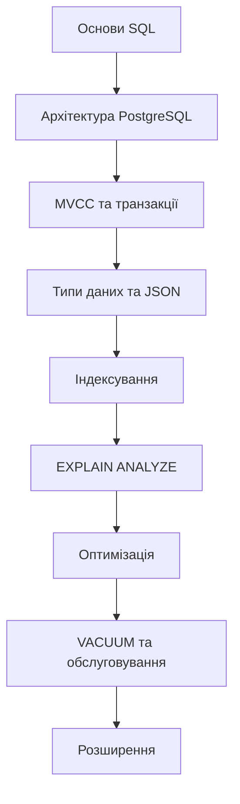

---
tags:
  - database
  - postgresql
  - sql
  - mvcc
  - moc
aliases:
  - PostgreSQL MOC
  - PostgreSQL Map of Content
  - Postgres
created: 2025-01-17
topic: Databases
---

# 🐘 PostgreSQL - Map of Content

> Об'єктно-реляційна СУБД з 35+ роками розробки, що підтримує ACID, MVCC та розширену екосистему

## 🎯 Швидкий старт

PostgreSQL — це потужна open-source СУБД, яка поєднує надійність традиційних реляційних баз з гнучкістю NoSQL підходів. Завдяки архітектурі MVCC, розширюваності та підтримці складних типів даних, PostgreSQL став стандартом для сучасних застосунків.

**Актуальна версія**: PostgreSQL 18 (2025)

## 📚 Структура знань

### 1️⃣ Фундаментальні концепції
- [[PostgreSQL - Architecture and MVCC|Архітектура та MVCC]]
- [[PostgreSQL - Transaction Isolation|Транзакції та рівні ізоляції]]
- [[PostgreSQL - Process Model|Модель процесів та підключень]]

### 2️⃣ Робота з даними
- [[PostgreSQL - Data Types|Типи даних (JSON, Arrays, Custom)]]

### 3️⃣ Індексування та продуктивність
- [[PostgreSQL - Index Types|Типи індексів (B-tree, GIN, GiST, BRIN)]]
- [[PostgreSQL - EXPLAIN Guide|EXPLAIN ANALYZE: аналіз запитів]]

### 4️⃣ Обслуговування та налаштування
- [[PostgreSQL - VACUUM Guide|VACUUM та Autovacuum]]
- [[PostgreSQL - Performance Tuning|Загальна оптимізація продуктивності]]

### 5️⃣ Екосистема розширень
- [[PostgreSQL - Extensions|Огляд розширень (PostGIS, TimescaleDB, pgvector)]]

## 🔑 Ключові переваги

**MVCC (Multi-Version Concurrency Control)**
- Читання не блокує запис, запис не блокує читання
- Висока паралельність без традиційних локів
- Snapshot Isolation для узгодженості даних

**Розширюваність**
- Custom типи даних, функції, операторы
- Процедурні мови (PL/pgSQL, PL/Python, PL/V8)
- Багата екосистема розширень

**Надійність**
- Повна підтримка ACID
- Write-Ahead Logging (WAL)
- Point-in-time Recovery (PITR)

## 🎓 Шлях навчання

**Для новачків** → Почніть з [[PostgreSQL - Architecture and MVCC|Архітектури]] та [[PostgreSQL - Data Types|Типів даних]]

**Для досвідчених** → Фокус на [[PostgreSQL - EXPLAIN Guide|EXPLAIN ANALYZE]], [[PostgreSQL - VACUUM Guide|VACUUM]] та [[PostgreSQL - Performance Tuning|Performance Tuning]]

## 📖 Корисні ресурси

- [Офіційна документація PostgreSQL 18](https://www.postgresql.org/docs/18/)
- [PostgreSQL Wiki](https://wiki.postgresql.org/)
- [PostgreSQL Performance](https://www.postgresql.org/docs/18/performance-tips.html)

## 🏷️ Теги

#database #postgresql #sql #mvcc #performance #acid

---

**Останнє оновлення**: 2025-01-17
**Джерело**: PostgreSQL 18 Official Documentation
