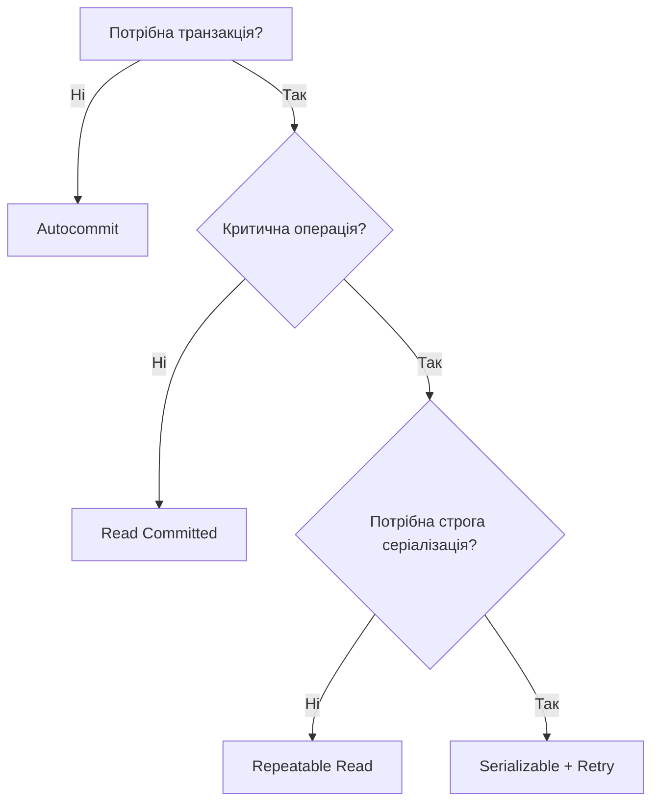

---
tags:
  - postgresql
  - transactions
  - isolation
  - acid
  - concurrency
  - serializable
aliases:
  - PostgreSQL Транзакції
  - PostgreSQL Transaction Isolation
  - Рівні ізоляції PostgreSQL
created: 2025-01-17
topic: PostgreSQL Fundamentals
---

# 🔒 PostgreSQL - Transaction Isolation

> Як PostgreSQL гарантує узгодженість даних при паралельних транзакціях

## 🎯 Огляд

**Рівень ізоляції транзакції** визначає, які аномалії можуть виникнути при паралельному виконанні транзакцій. PostgreSQL підтримує 4 рівні ізоляції згідно SQL стандарту, але реалізує лише **3 унікальні**.

## 📊 Рівні ізоляції в PostgreSQL

| SQL Стандарт | PostgreSQL | Dirty Read | Non-repeatable Read | Phantom Read | Serialization Anomaly |
|--------------|------------|------------|---------------------|--------------|----------------------|
| Read Uncommitted | **Read Committed** | ❌ Неможливо | ✅ Можливо | ✅ Можливо | ✅ Можливо |
| Read Committed | **Read Committed** | ❌ Неможливо | ✅ Можливо | ✅ Можливо | ✅ Можливо |
| Repeatable Read | **Repeatable Read** | ❌ Неможливо | ❌ Неможливо | ❌ **Неможливо!** | ✅ Можливо |
| Serializable | **Serializable** | ❌ Неможливо | ❌ Неможливо | ❌ Неможливо | ❌ Неможливо |

**⚠️ Важливо**: PostgreSQL **не має справжнього Read Uncommitted** — він працює як Read Committed.

**🎁 Бонус**: PostgreSQL Repeatable Read **блокує phantom reads**, хоча стандарт це не вимагає!

## 🔍 Типи аномалій

### 1. Dirty Read (Брудне читання)

```sql
-- Транзакція A
BEGIN;
UPDATE accounts SET balance = balance - 100 WHERE id = 1;
-- Ще не COMMIT!

-- Транзакція B
BEGIN;
SELECT balance FROM accounts WHERE id = 1;  -- Бачить зміни A?
```

**В PostgreSQL**: ❌ НЕМОЖЛИВО на всіх рівнях ізоляції  
Транзакція B ніколи не побачить uncommitted зміни A завдяки MVCC.

### 2. Non-repeatable Read (Неповторюване читання)

```sql
-- Транзакція A
BEGIN;
SELECT balance FROM accounts WHERE id = 1;  -- Отримує 1000

-- Транзакція B (в цей час)
BEGIN;
UPDATE accounts SET balance = balance + 500 WHERE id = 1;
COMMIT;

-- Транзакція A (продовжує)
SELECT balance FROM accounts WHERE id = 1;  -- Отримує 1500 або 1000?
COMMIT;
```

| Рівень ізоляції | Результат другого SELECT |
|-----------------|-------------------------|
| **Read Committed** | 1500 (бачить нові зміни) ✅ |
| **Repeatable Read** | 1000 (snapshot ізольований) ❌ |
| **Serializable** | 1000 (snapshot ізольований) ❌ |

### 3. Phantom Read (Фантомне читання)

```sql
-- Транзакція A
BEGIN;
SELECT COUNT(*) FROM orders WHERE status = 'pending';  -- Отримує 5

-- Транзакція B
BEGIN;
INSERT INTO orders (status) VALUES ('pending');
COMMIT;

-- Транзакція A
SELECT COUNT(*) FROM orders WHERE status = 'pending';  -- 6 або 5?
COMMIT;
```

| Рівень ізоляції | Результат другого SELECT |
|-----------------|-------------------------|
| **Read Committed** | 6 (бачить новий рядок) ✅ |
| **Repeatable Read** | 5 (snapshot ізольований) ❌ |
| **Serializable** | 5 (snapshot ізольований) ❌ |

**💡 Особливість PostgreSQL**: Repeatable Read блокує phantom reads, хоча SQL стандарт це дозволяє!

### 4. Serialization Anomaly (Аномалія серіалізації)

Результат паралельного виконання **відрізняється** від будь-якого послідовного виконання.

**Класичний приклад**: Read-only транзакції бачать неузгоджений стан

```sql
-- Таблиці: accounts(id, balance), audit_log(total_sum)
-- Початковий стан: account1=100, account2=100, audit_log=200

-- Транзакція A (переказ)
BEGIN ISOLATION LEVEL REPEATABLE READ;
UPDATE accounts SET balance = balance - 50 WHERE id = 1;  -- 100 → 50
UPDATE accounts SET balance = balance + 50 WHERE id = 2;  -- 100 → 150
COMMIT;

-- Транзакція B (аудит, паралельно)
BEGIN ISOLATION LEVEL REPEATABLE READ;
SELECT SUM(balance) FROM accounts;  -- Може отримати 150!
-- (бачить тільки перший UPDATE через snapshot timing)
COMMIT;
```

**Рішення**: Використати `SERIALIZABLE` — транзакція B отримає помилку:
```
ERROR: could not serialize access due to read/write dependencies
```

## ⚙️ Налаштування рівня ізоляції

### Глобально (для всієї сесії)

```sql
-- Для поточної сесії
SET SESSION CHARACTERISTICS AS TRANSACTION ISOLATION LEVEL REPEATABLE READ;

-- Для всієї БД (postgresql.conf)
default_transaction_isolation = 'repeatable read'
```

### Для конкретної транзакції

```sql
BEGIN ISOLATION LEVEL SERIALIZABLE;
-- запити...
COMMIT;

-- Або окремо
BEGIN;
SET TRANSACTION ISOLATION LEVEL REPEATABLE READ;
-- запити...
COMMIT;
```

### Перевірка поточного рівня

```sql
SHOW transaction_isolation;
-- або
SELECT current_setting('transaction_isolation');
```

## 🎚️ Детальний розгляд рівнів

### 1️⃣ Read Committed (дефолт)

**Поведінка**:
- Кожен запит бачить snapshot **на момент початку запиту** (не транзакції!)
- Бачить всі committed зміни інших транзакцій

```sql
BEGIN;  -- T1: Початок транзакції
SELECT * FROM products WHERE id = 1;  -- Snapshot #1

-- (інша транзакція змінює продукт і робить COMMIT)

SELECT * FROM products WHERE id = 1;  -- Snapshot #2 (нові дані!)
COMMIT;
```

**Використання**:
- ✅ Дефолт для більшості застосунків
- ✅ Мінімальний overhead
- ✅ Підходить для OLTP (багато коротких транзакцій)

**Обережно**:
- ⚠️ Lost updates без додаткового locking
- ⚠️ Phantom reads можливі

### 2️⃣ Repeatable Read

**Поведінка**:
- Один snapshot **на всю транзакцію**
- Всі запити бачать однакові дані (як на початку транзакції)

```sql
BEGIN;  -- T1: Створюється snapshot
SELECT * FROM products WHERE id = 1;  -- Версія #1

-- (інша транзакція змінює продукт і робить COMMIT)

SELECT * FROM products WHERE id = 1;  -- Все ще версія #1!
UPDATE products SET price = 100 WHERE id = 1;  -- ⚠️ Може бути помилка!
COMMIT;
```

**Помилка при конфлікті**:
```
ERROR: could not serialize access due to concurrent update
```

**Використання**:
- ✅ Звіти та аналітика (потрібен узгоджений snapshot)
- ✅ Критичні бізнес-операції (інвентаризація, бухгалтерія)
- ✅ Міграції даних

**Обережно**:
- ⚠️ Потреба в retry logic при serialization failures
- ⚠️ Більший overhead ніж Read Committed

### 3️⃣ Serializable (найсуворіший)

**Поведінка**:
- Гарантує, що результат паралельних транзакцій = результат послідовного виконання
- Використовує **Serializable Snapshot Isolation (SSI)**
- Моніторинг read/write залежностей між транзакціями

```sql
-- Транзакція A
BEGIN ISOLATION LEVEL SERIALIZABLE;
SELECT SUM(balance) FROM accounts;  -- Зчитує дані
COMMIT;

-- Транзакція B (паралельно)
BEGIN ISOLATION LEVEL SERIALIZABLE;
UPDATE accounts SET balance = balance + 100 WHERE id = 1;
COMMIT;  -- Може отримати помилку, якщо є конфлікт!
```

**Помилка серіалізації**:
```
ERROR: could not serialize access due to read/write dependencies among transactions
DETAIL: Reason code: Canceled on identification as a pivot, during commit attempt.
HINT: The transaction might succeed if retried.
```

**Використання**:
- ✅ Фінансові транзакції (переказі між рахунками)
- ✅ Системи бронювання (квитки, готелі)
- ✅ Критичні операції, де помилки неприпустимі

**Обережно**:
- ⚠️ **Обов'язково** потрібен retry logic!
- ⚠️ Більше serialization failures ніж Repeatable Read
- ⚠️ Overhead на моніторинг залежностей

## 🔄 Retry Logic для Serializable

```python
import psycopg2
from psycopg2 import errorcodes

def transfer_money_serializable(from_id, to_id, amount):
    max_retries = 3
    for attempt in range(max_retries):
        try:
            with psycopg2.connect(DSN) as conn:
                conn.set_isolation_level(
                    psycopg2.extensions.ISOLATION_LEVEL_SERIALIZABLE
                )
                with conn.cursor() as cur:
                    # Перевірка балансу
                    cur.execute(
                        "SELECT balance FROM accounts WHERE id = %s",
                        (from_id,)
                    )
                    balance = cur.fetchone()[0]
                    
                    if balance < amount:
                        raise ValueError("Insufficient funds")
                    
                    # Переказ
                    cur.execute(
                        "UPDATE accounts SET balance = balance - %s WHERE id = %s",
                        (amount, from_id)
                    )
                    cur.execute(
                        "UPDATE accounts SET balance = balance + %s WHERE id = %s",
                        (amount, to_id)
                    )
                    
                conn.commit()
                return  # Успіх!
                
        except psycopg2.Error as e:
            if e.pgcode == errorcodes.SERIALIZATION_FAILURE:
                if attempt < max_retries - 1:
                    # Exponential backoff
                    time.sleep(0.1 * (2 ** attempt))
                    continue
            raise
    
    raise Exception(f"Failed after {max_retries} retries")
```

## 🎯 Вибір рівня ізоляції

### Швидка рекомендація



### Детальна таблиця

| Сценарій | Рівень | Причина |
|----------|--------|---------|
| Простий CRUD | Read Committed | Мінімальний overhead, дефолт |
| Звіти, аналітика | Repeatable Read | Узгоджений snapshot |
| Фінансові операції | Serializable | Строга узгодженість |
| High-load OLTP | Read Committed | Мінімум конфліктів |
| Inventory management | Repeatable Read / Serializable | Залежить від критичності |
| Read-only транзакції | Repeatable Read | Узгоджений вигляд даних |

## 🛠️ Додаткові інструменти

### SELECT FOR UPDATE (Песимістичне блокування)

```sql
BEGIN;
SELECT * FROM products 
WHERE id = 1 
FOR UPDATE;  -- Блокує рядок для інших транзакцій

-- Тепер можна безпечно оновити
UPDATE products SET stock = stock - 1 WHERE id = 1;
COMMIT;
```

**Варіанти**:
- `FOR UPDATE` — ексклюзивний lock
- `FOR SHARE` — shared lock (блокує UPDATE, дозволяє SELECT)
- `FOR UPDATE NOWAIT` — помилка замість очікування
- `FOR UPDATE SKIP LOCKED` — пропустити заблоковані рядки

### Advisory Locks (Application-level locks)

```sql
-- Отримати application-level lock
SELECT pg_advisory_lock(12345);

-- Критична секція
UPDATE shared_resource SET value = value + 1;

-- Звільнити lock
SELECT pg_advisory_unlock(12345);
```

## 📊 Моніторинг та відлагодження

### Перевірка блокувань

```sql
SELECT 
    pid,
    usename,
    application_name,
    state,
    query,
    wait_event_type,
    wait_event
FROM pg_stat_activity
WHERE wait_event IS NOT NULL;
```

### Статистика конфліктів

```sql
SELECT 
    datname,
    confl_tablespace,
    confl_lock,
    confl_snapshot,
    confl_bufferpin,
    confl_deadlock
FROM pg_stat_database_conflicts;
```

## 🔗 Пов'язані теми

- [[PostgreSQL - Architecture and MVCC|MVCC механізм]]
- [[PostgreSQL - Performance Tuning|Оптимізація продуктивності]]
- [[PostgreSQL - Locking|Блокування та deadlocks]]

## 📚 Додаткові ресурси

- [PostgreSQL Transaction Isolation](https://www.postgresql.org/docs/18/transaction-iso.html)
- [SSI in PostgreSQL](https://wiki.postgresql.org/wiki/SSI)
- [Isolation Levels Comparison](https://www.postgresql.org/docs/18/mvcc-intro.html)

## 🏷️ Теги

#postgresql #transactions #isolation #acid #concurrency #serializable

---

**Останнє оновлення**: 2025-01-17  
**Версія**: PostgreSQL 18
